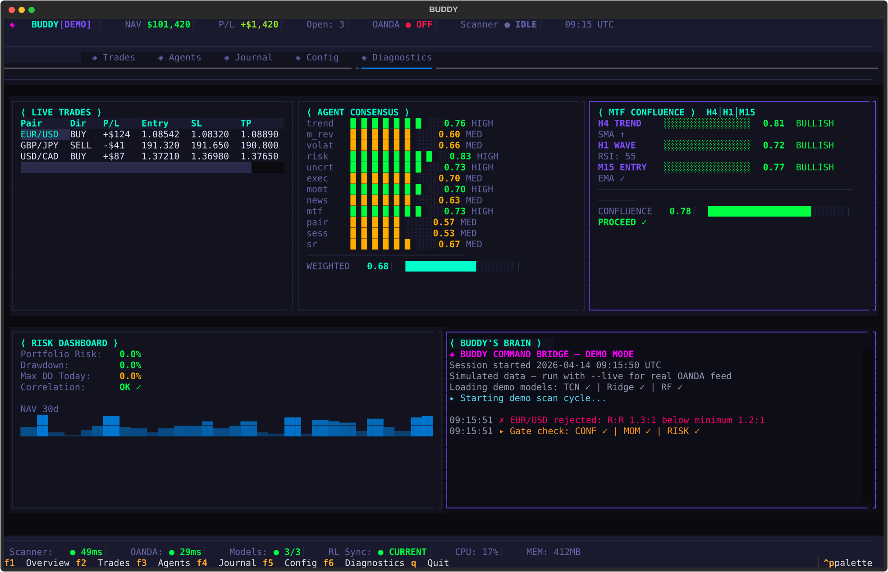
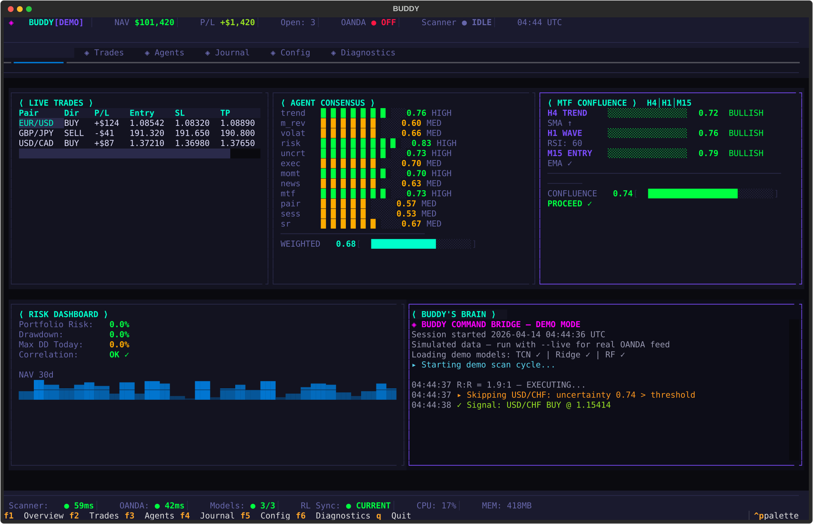
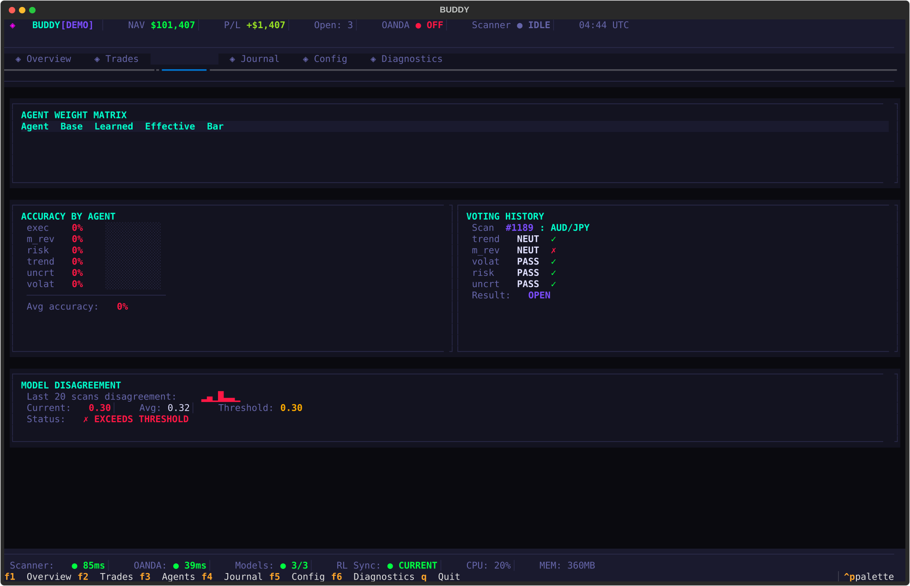

<div align="center">

# ⟨ BUDDY//2046 ⟩

### The Cyberpunk Command Bridge for Autonomous FX Trading

**An ML-driven, multi-pair forex engine — 15-agent consensus, ATR-governed execution, and a self-improving learning loop, with a deterministic Claude-free runtime.**

<br/>


<br/>



</div>

---

> [!WARNING]
> **Experimental trading software. Not financial advice.** Live trading can lose real money.
> Buddy ships **halted and demo-only** by default. Run everything on practice accounts first,
> and read every gate and execution path before you ever flip a live order.

---

## ◈ What Buddy Is

Buddy is the trading runtime inside **ML Engine** — an autonomous research platform that scans
many FX pairs in a single pass, evaluates each setup through a weighted **15-agent consensus**,
governs every trade with ATR-based risk rails, and learns from outcomes to retune its own weights,
rules, and thresholds.

The runtime is **deterministic and Claude-free** — no LLM sits in the per-scan or per-trade hot
path. Claude is used out-of-band for planning, post-mortems, and the autonomous dev loop, never
to make a live trading decision.

```text
   ┌─────────┐   ┌──────────┐   ┌────────┐   ┌───────────┐   ┌────────┐
   │  SCAN   │──▶│  AGENTS  │──▶│  GATES │──▶│  EXECUTE   │──▶│  OANDA │
   │ ensemble│   │ 15-vote  │   │ conf · │   │ ATR SL/TP  │   │  IBKR  │
   │ + feats │   │ consensus│   │ risk · │   │ regime-szd │   │        │
   └─────────┘   └──────────┘   │ momentm│   └───────────┘   └────────┘
        ▲                       └────────┘         │
        │                                          ▼
        └──── tune ◀── rules ◀── learnings ◀── RL feedback ◀── outcomes
```

---

## ◈ The Command Bridge

A neon Textual TUI — eight live screens spanning overview, agents, trades, journal, inbox,
config, and runtime control. Launch it:

```bash
./buddy --demo     # synthetic data, safe to explore
./buddy --live     # connects to your configured broker (halted until you say go)
```

<div align="center">


</div>

---

## ◈ The ML Stack

Buddy is an ensemble of specialized heads, each validated with walk-forward + purged k-fold and
a hard **10% train/val ship-gate** that quarantines any overfit model before it can go live.

| Head | Model | Role |
|------|-------|------|
| **Direction** (primary) | Tiny Transformer (d_model=16) + EMA + EWC + replay | Directional signal |
| Direction (baseline) | sklearn HistGradientBoosting | Hybrid voter |
| **Volatility regime** | TCN (dilated causal Conv1D), dual-head | LOW/NORMAL/HIGH/EXTREME |
| Momentum / Risk / Confidence | LightGBM | Setup scoring |
| Meta-labeler | XGBoost on triple-barrier labels | Trade filter |
| **Position sizer** | PPO (stable-baselines3) | Regime-aware sizing |
| Agent weights | EMA-damped multiplicative bandit | Consensus learning |
| Calibration | Platt + Isotonic | Confidence honesty |

---

## ◈ The 15-Agent Consensus

Every setup is judged by a weighted council. Fall below the regime-aware threshold and the trade
is blocked. **`devil_advocate` runs last and can veto an otherwise-passing setup.**

| Agent | Weight | Reads |
|-------|:------:|-------|
| `trend` | 1.15 | SMA crossover + ADX — `passed=False` is a **hard veto** |
| `risk_sentinel` | 1.25 | Drawdown ratio + portfolio risk |
| `devil_advocate` | 1.30 | Adversarial bear-case — **runs last, can veto** |
| `uncertainty` · `multi_timeframe` | 1.10 | Model disagreement · H1/H4/D1 confluence |
| `execution_quality` · `momentum` | 1.05 | Spread/liquidity · MACD + ROC |
| `volatility` · `support_resistance` | 1.00 | ATR regime · swing pivots |
| `news_risk` · `order_flow` | 0.95 | NFP/CPI/FOMC scan · OANDA book signal |
| `mean_reversion` · `pair_performance` | 0.90 / 0.85 | RSI pullback · per-pair win rate |
| `session_timing` | 0.80 | Forex session overlap |

Weights adapt from every closed trade and persist to `trained_data/models/agent_weights.json`.

---

## ◈ Safety Rails (non-negotiable)

- **R:R ≥ 1.2:1** on every trade — no exceptions.
- **ATR-based SL/TP only** — `SL = ATR × atr_sl_multiplier`, never hardcoded pips.
- **Drawdown guardian** runs every scan cycle · max portfolio risk **15% of NAV**.
- **Correlation filter** before execution — prevents double exposure.
- **Halt > break** — the system favors staying halted over unhalting on ambiguous validation.
- **Tiered self-heal autonomy** — corrective actions are graded by blast radius; only trivially
  reversible ones auto-apply.

---

## ◈ Quick Start

```bash
# 1. Environment
python -m venv .venv && source .venv/bin/activate
pip install -r requirements.txt

# 2. Credentials (practice account first!)
export OANDA_API_KEY="..."  export OANDA_ACCOUNT_ID="..."

# 3. See the bridge
./buddy --demo

# 4. Dry scan (no orders)
python main.py scan --dry-run

# 5. Single-pair inference
python main.py scan --pair EUR_USD --dry-run

# 6. Train a model (price-only H1 direction)
python scripts/train_single_model_m1.py --instrument EUR_USD --model transformer --granularity H1
```

### Core commands

| Command | Does |
|---------|------|
| `python main.py scan [--dry-run] [--pair X]` | Run the scanner |
| `python main.py status` | Runtime + portfolio snapshot |
| `python main.py journal` / `learn` | Inspect outcomes · trigger learning |
| `python main.py retrain-all` / `train-rl-sizer` | Model maintenance |
| `./buddy [--live\|--demo]` | Launch the Command Bridge TUI |

---

## ◈ Autonomous Systems

- **Tier 7 control loop** — `incident → propose → gate → soak → promote → close`, deterministic
  (no LLM in the loop), with shadow→canary→live staged deployment and a Constitution guard.
- **Self-improving learning loop** — extracts a learning from every closed trade; promotes a
  pattern to a rule after 3+ observations.
- **Ralph** — a build-time autonomous dev loop that implements PRD stories iteratively
  (`scripts/ralph.sh`, `.claude/ralph/prd.json`). Never part of the trading runtime.

---

## ◈ Governed Evidence Lifecycle

Model claims are only as good as the process that produced them. The `src/evidence/` package is a
**tamper-evident, signature-governed evidence spine** that turns "a model scored well" into an
independently reproducible, disposable artifact — so a result can never be narrated around.

Every claim flows through one immutable chain:

```text
one exact dataset ─▶ one signed job ─▶ one isolated run ─▶ one immutable package
                        ─▶ one independently reproduced verdict ─▶ one governed disposition
```

**Foundation (Phases A–F) — shipped & self-contained:**

| Layer | Module | Guarantee |
|-------|--------|-----------|
| Contracts | `evidence/contracts/` | Pydantic strict contracts — manifests, gate results, envelopes |
| Canonical + hash | `evidence/{canonical,hashing}.py` | Deterministic JSON v1 + content digests |
| Signing | `evidence/signing.py` | Ed25519 signed envelopes + trust store |
| Store + events | `evidence/{store,event_store}.py` | Content-addressed store + append-only ledger |
| Indexes + import | `evidence/{indexes,importer}.py` | Current-state projection + independent import verdict |
| Transition policy | `evidence/transition_policy.py` | Authority registry — who may sign what, never the runtime |
| Data platform | `src/data_platform/` | Signed dataset manifests + forward-capture (Parquet/Arrow) |
| Gated harness | `src/research/gated_harness/` | Pre-registration, purged CPCV, cost/stress, significance |

**Phase I — risk-target vertical slice (shipped):** the first end-to-end lane through the whole
lifecycle. A producer trains the risk-target heads, packages signed evidence, and a **no-authority
worker** hands it to a local import authority that *independently replays the metrics* before
assigning a disposition. It fails closed — the slice stops at `QUARANTINED` / `REJECTED` and
**never promotes a champion, never touches `.claude/state.json`, never calls a broker.**

```bash
# Run the Phase I slice end-to-end on the cached daily FX panel (offline, research-only)
python scripts/run_risk_target_evidence_slice.py
python scripts/run_risk_target_evidence_slice.py --pairs EUR_USD USD_JPY --out /tmp/ev
```

Evidence is written under `trained_data/evidence/`; the dashboard exposes a read-only
`GET /api/risk_target_evidence` projection of the committed disposition state.

---

## ◈ Repo Map

```text
main.py                 thin CLI entrypoint
buddy / src/tui/        the Command Bridge TUI (Textual, 8 screens)
src/scanner/            engine · agents · gates · execution · automation
src/training/           trainers, walk-forward validation, meta-labeling, RL
src/brokers/            broker abstraction + OANDA & IBKR clients
trained_data/           models, journals, adaptive state, diagnostics
.claude/                rules, learnings, brain, Ralph PRD loop, operator memory
docs/                   strategy, architecture, incidents, session handoffs
```

---

## ◈ Honesty Doctrine

Buddy is built around a hard verification culture (`.claude/rules/honesty.md`): every status
claim names its source, causal claims carry calibrated confidence, and findings are verified
from disk — not memory. In that spirit, the honest current status:

> **Edge is research-grade, not proven.** Price-only intraday direction caps near ~52% balanced
> accuracy across tested pairs; news fusion and daily carry/trend factors have so far shown no
> deployable lift at this data scale. The engineering — the measurement harness, ship-gate, and
> risk rails — is real and reusable; the profitable signal is still an open question. See
> `docs/strategy.md` and the dated session handoffs for the full, unvarnished record.

---

<div align="center">

**⟨ BUDDY//2046 ⟩** · halt-safe · Claude-free runtime · evidence over vibes

</div>
