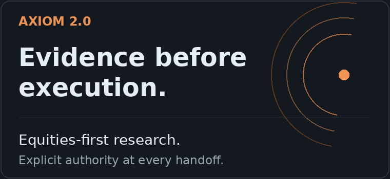
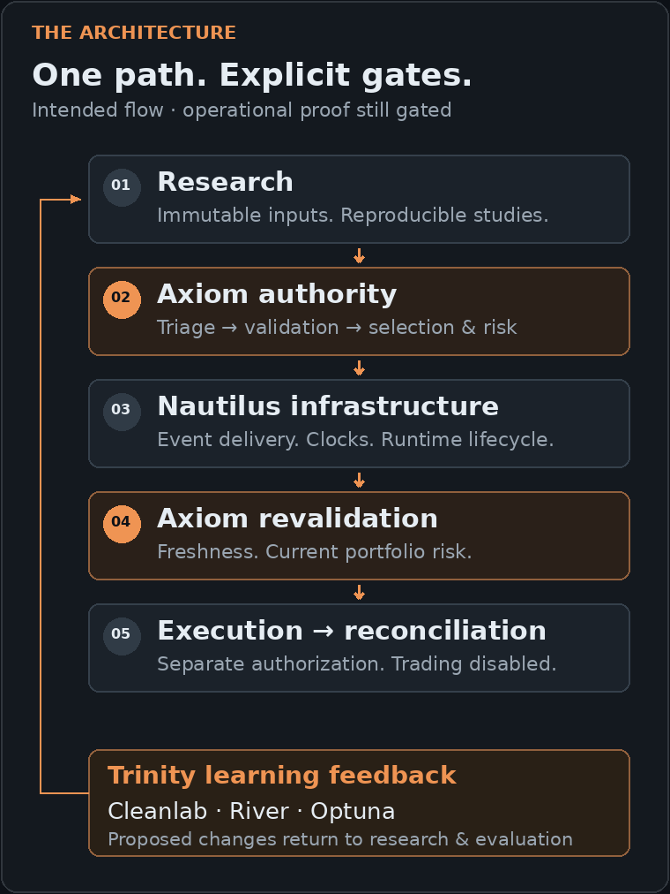

<picture>
  <source media="(max-width: 600px)" srcset="docs/assets/axiom2/hero-mobile.png">
  
</picture>

[Architecture map](#architecture-map) · [Field guide](#field-guide) · [Build and verify](#build-and-verify)

**Experimental · Non-capital · Trading disabled.** Production eligibility has not been established.

## Architecture map

<picture>
  <source media="(max-width: 600px)" srcset="docs/assets/axiom2/workflow-mobile.png">
  
</picture>

Axiom owns decisions. Nautilus supplies runtime mechanics. Trinity returns proposed improvements to evaluation. The complete chain is still being qualified.

## Field guide

Open only what you need.

<details>
<summary>01 / Evidence and research</summary>

- **Robinhood MCP:** supported observations and broker truth. Full custom-list coverage still needs proof.
- **EdgarTools / SEC:** issuer and filing evidence with provenance and publication timing.
- **OpenBB:** financial data with explicit provider, schema, time, and revision contracts.
- **Pandera:** approved, pending schema-validation integration; it does not replace point-in-time or admission checks.

Phase 1 freezes a LightGBM ranker, five paired feature arms, top-five equal weights, a five-session policy, fixed costs, and purged walk-forward evaluation. The six-strategy historical comparison and experimental filing study are separate research paths, not promotion evidence.

[Research protocol][next-experiment] · [Qualified orchestrator][orchestrator]

</details>

<details>
<summary>02 / Decisions and authority</summary>

Axiom owns evidence integrity, promotion, portfolio/risk, and execution/reconciliation. Nautilus supplies clocks, events, and runtime lifecycle; it does not decide which candidate may trade. An authorized intent must use the sole execution gateway; Axiom then reconciles order outcomes. Any candidate-policy `READY` state is revocable and carries no order authority.

Trinity feeds proposed improvements back into evaluation: **Cleanlab** audits data/labels, **River** learns incrementally from attributable outcomes, and **Optuna** runs bounded experiments. An integrated learning loop and measured improvement are not established. Proposals must pass Axiom evaluation and promotion before use.

[Architecture][design] · [Runtime boundary][nautilus-plan]

</details>

<details>
<summary>03 / Current proof and remaining gates</summary>

Snapshot from the reviewed README, **11 October 2026**.

- Research/execution contracts have scoped development checks; empirical source qualification and promotion remain gated.
- The private dashboard/backend is deployed; the full owner-action → hosted job → durable result → monitoring chain is still being qualified.
- Limited genuine Robinhood history and a local six-arm comparison do not prove full watchlist coverage or hosted completion.
- Native Linux Nautilus smoke/lifecycle checks do not certify source-admitted material events, the complete cloud workflow, or the separate Mac workflow.
- Trinity artifact custody does not establish an integrated learning loop or improvement.

No current empirical result clears the full promotion and capital path. [Verification scope][orchestrator]

</details>

<details>
<summary>04 / The route forward</summary>

1. Qualify real inputs and point-in-time membership.
2. Evaluate the frozen candidate after costs; preserve failed trials.
3. Prove the full non-capital product and monitoring flow.
4. Verify cloud and Mac runtime workflows separately.
5. Establish shadow/risk/reconciliation evidence and explicit capital authorization.

[Research plan][research-plan] · [Execution plan][execution-plan]

</details>

## Build and verify

[Design][design] · [Research][research-plan] · [Execution][execution-plan] · [Runtime][nautilus-plan]

<details>
<summary>05 / Set up the research environment</summary>

The repository is in migration. Later Axiom 2.0 modules are on development branches; these links pin reviewed checkpoints.

For a focused research test selection, use Python 3.11 and the [qualified research checkpoint][research-tree]:

```bash
git clone https://github.com/Raynergy-svg/ml_engine.git
cd ml_engine
git fetch origin codex/axiom-2-phase1-qualified-orchestrator
git switch --detach 798d2f2e0cc160a6d39466dd33adce3bc841c006
python3.11 -m venv .venv
source .venv/bin/activate
python -m pip install -r requirements-axiom2-research.txt
OMP_NUM_THREADS=1 OPENBLAS_NUM_THREADS=1 PYTEST_DISABLE_PLUGIN_AUTOLOAD=1 \
  python -m pytest tests/axiom2/research -q
```

This runs tests, not an empirical campaign. Real runs require an audited source bundle, the existing registry, and authorized service context. Nautilus uses a **separate Python 3.12+ environment** and a pinned build; follow its [configuration][nautilus-config] and [verification record][nautilus-verification].

</details>

<details>
<summary>06 / Legacy research</summary>

BUDDY, FX/OANDA, multi-agent voting, RL sizing, and older harvesters remain legacy research. Their launch commands and ship gates are outside the active Axiom 2.0 default architecture. [Legacy baseline][legacy-baseline]

</details>

[design]: https://github.com/Raynergy-svg/ml_engine/blob/42eeba9580ab1a2e8b3f3adbe5ec929c6e4f2731/docs/superpowers/specs/2026-09-29-axiom-2-equities-first-design.md
[research-plan]: https://github.com/Raynergy-svg/ml_engine/blob/42eeba9580ab1a2e8b3f3adbe5ec929c6e4f2731/docs/superpowers/plans/2026-09-29-axiom-2-research-kernel.md
[execution-plan]: https://github.com/Raynergy-svg/ml_engine/blob/13e09688eca977e448c44e18fae3ec064c8e5a4e/docs/superpowers/plans/2026-10-01-axiom-2-execution-kernel.md
[next-experiment]: https://github.com/Raynergy-svg/ml_engine/blob/798d2f2e0cc160a6d39466dd33adce3bc841c006/docs/axiom2/NEXT_RESEARCH_EXPERIMENT_2026-10-01.md
[orchestrator]: https://github.com/Raynergy-svg/ml_engine/blob/798d2f2e0cc160a6d39466dd33adce3bc841c006/docs/axiom2/PHASE1_DEVELOPMENT_ORCHESTRATOR_2026-10-05.md
[research-verification]: https://github.com/Raynergy-svg/ml_engine/blob/798d2f2e0cc160a6d39466dd33adce3bc841c006/docs/axiom2/RESEARCH_KERNEL_VERIFICATION.md
[research-tree]: https://github.com/Raynergy-svg/ml_engine/tree/798d2f2e0cc160a6d39466dd33adce3bc841c006
[nautilus-plan]: https://github.com/Raynergy-svg/ml_engine/blob/13e09688eca977e448c44e18fae3ec064c8e5a4e/docs/superpowers/plans/2026-10-06-axiom2-nautilus-runtime.md
[nautilus-config]: https://github.com/Raynergy-svg/ml_engine/blob/13e09688eca977e448c44e18fae3ec064c8e5a4e/config/axiom2/nautilus_runtime.json
[nautilus-verification]: https://github.com/Raynergy-svg/ml_engine/blob/13e09688eca977e448c44e18fae3ec064c8e5a4e/docs/axiom2/NAUTILUS_RUNTIME_VERIFICATION_2026-10-06.md
[nautilus-bindings]: https://github.com/Raynergy-svg/ml_engine/blob/13e09688eca977e448c44e18fae3ec064c8e5a4e/docs/axiom2/NAUTILUS_OPERATIONAL_BINDINGS_PLAN_2026-10-07.md
[axiom-source]: https://github.com/Raynergy-svg/ml_engine/tree/13e09688eca977e448c44e18fae3ec064c8e5a4e/src/axiom2
[axiom-config]: https://github.com/Raynergy-svg/ml_engine/tree/13e09688eca977e448c44e18fae3ec064c8e5a4e/config/axiom2
[legacy-baseline]: https://github.com/Raynergy-svg/ml_engine/blob/798d2f2e0cc160a6d39466dd33adce3bc841c006/docs/axiom2/FX_BASELINE_MANIFEST.md
