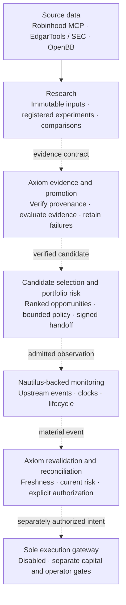

# Axiom 2.0

### Equities-first research · Evidence-governed decisions · Deterministic runtime

Axiom 2.0 is the next-generation research and control architecture in ML Engine. It turns immutable market observations and reproducible experiments into reviewable candidates, then applies explicit evidence, portfolio-risk, and execution gates.

The initial execution scope is liquid US equities and broad-market/sector ETFs, long-only, during regular market hours. Research agents are replaceable. Axiom retains decision authority; NautilusTrader supplies event and runtime mechanics.

[Architecture](#architecture) · [Roadmap](#roadmap) · [Current status](#current-status) · [Get started](#get-started) · [Documentation](#documentation)

> [!WARNING]
> Experimental, non-capital software. Trading is disabled and no current strategy is established as production-eligible. Test passes, historical comparisons, deployed screens, and candidate readiness do not authorize orders or demonstrate a profitable edge.

## Architecture

The intended product flow is **Research → Axiom evidence triage → candidate selection and risk → Nautilus monitoring → Axiom revalidation**. The diagram shows the target contract boundaries; the complete operational chain is still being qualified.


```mermaid
flowchart TD
    S["Source data<br/>Robinhood MCP · EdgarTools / SEC · OpenBB"]
    R["Research<br/>Immutable inputs · registered experiments · comparisons"]
    A["Axiom evidence and promotion<br/>Verify provenance · evaluate evidence · retain failures"]
    C["Candidate selection and portfolio risk<br/>Ranked opportunities · bounded policy · signed handoff"]
    N["Nautilus-backed monitoring<br/>Upstream events · clocks · lifecycle"]
    V["Axiom revalidation and reconciliation<br/>Freshness · current risk · explicit authorization"]
    G["Sole execution gateway<br/>Disabled · separate capital and operator gates"]

    S --> R
    R -. evidence contract .-> A
    A -. verified candidate .-> C
    C -. admitted observation .-> N
    N -. material event .-> V
    V -. separately authorized intent .-> G
```

**Axiom owns four authorities:** evidence integrity, promotion, portfolio/risk, and execution/reconciliation. Research, learning, and runtime workers cannot promote themselves or obtain an alternative broker-order path.

**Nautilus is a pinned upstream dependency.** Its clocks, event delivery, and lifecycle support the runtime; Axiom owns observation admission, candidate policy, freshness, wakeups, and revalidation. An Axiom candidate-policy `READY` state is revocable and carries no order authority. See the [runtime boundary][nautilus-plan].

**“Harvester” describes the candidate-selection stage, with explicit contracts.** The active Phase-1 path uses `FrozenResearchCandidate`, signed promotion evidence, `RankedOpportunity`, and `RiskDecision`. Rank scores alone are not expected-net-edge evidence. A separate experimental paper harvester is a different research contract. Neither a historical comparison nor a paper candidate is automatically a promoted model or an admitted Nautilus observation. The legacy harvester's ten-year ship gate is not an Axiom 2.0 prerequisite.

## Research and data

- **Robinhood:** use the existing official MCP connection for supported observations and broker truth. Operational discovery is intended to cover all of the owner's custom lists, with unsupported instruments disclosed. A small verification basket is not the watchlist or a point-in-time research universe.
- **EdgarTools + public SEC data:** filing and issuer evidence, with accession identity, document provenance, publication timing, and revision history.
- **OpenBB:** financial data under explicit provider, schema, timestamp, and revision contracts. Importing a library or fetching metadata does not establish a complete financial/filing analysis.
- **Immutable evidence:** preserve exact source bytes, dataset and code identities, temporal availability, experiment attempts, cost assumptions, and signed dispositions. Today's ingestion time cannot substitute for historical knowability.
- **Pandera:** incoming-table validation is an approved, pending integration, with common and stock/ETF/crypto-specific contracts. Mixed-asset coverage must be proven where supported; crypto must not be coerced into an equity calendar. Schema checks complement Axiom's authoritative point-in-time, provenance, and admission rules.

The frozen Phase-1 study uses a **LightGBM cross-sectional ranker** and five paired arms: price-only, price plus volume/liquidity, price plus relative strength, price plus market/sector regime, and all four families. It retains top-five equal weights, a five-session holding/rebalance policy, fixed costs and parameters, and purged walk-forward evaluation. The [qualified orchestrator][orchestrator] documents admission and unchanged gates.

The dashboard's **six-strategy historical comparison** and the experimental **financial/filing research path** are separate studies. They do not replace the Phase-1 protocol or supply its missing source audit, sealed-holdout evidence, or promotion decision.

### Learning: the Trinity

| Component | Intended role |
| --- | --- |
| Cleanlab | Audit data and label quality |
| River | Incremental learning from attributable outcomes |
| Optuna | Bounded, recorded parameter experiments |

Trinity is a separately maintained workstream sharing evidence contracts with Axiom. Its components have distinct roles; verified artifact custody is separate from learner execution, continuation, or improvement. Proposed changes must pass evaluation and Axiom's promotion policy before use. No automatic live application is implied.

## Roadmap

1. **Establish the equity research kernel.** Versioned proposals, temporal and universe contracts, reproducible features/labels, registered trials, and signed evidence.
2. **Qualify real research inputs.** Prove point-in-time membership, issuer identity, availability, adjustments, calendar coverage, and complete outcomes before empirical fitting.
3. **Evaluate a frozen candidate.** Compare against simple baselines after costs; retain failed trials, ablations, and selection history. Open a genuine final holdout only with separate authorization.
4. **Prove the non-capital product flow.** Connect an actual dashboard action to the real cloud job, source-informed analysis, durable result, Axiom handoff, and Nautilus monitoring.
5. **Verify each runtime environment.** Complete cloud lifecycle, recovery, custody, and material-event proof, then separately establish the Mac workflow. One environment's success does not certify the other.
6. **Earn execution eligibility.** Establish shadow evidence, current portfolio/risk and reconciliation, operational isolation, and explicit operator/capital authorization before any controlled broker exercise.

The [equities-first design][design], [research plan][research-plan], and [execution plan][execution-plan] define the architecture. The [next experiment][next-experiment] and [development orchestrator][orchestrator] define the scoped empirical work. Broader legacy roadmaps are historical context.

## Current status

Status snapshot: **11 October 2026**. Implementation, tests, deployment, and operational proof are tracked separately.

| Area | Established | Still gated |
| --- | --- | --- |
| Axiom research and execution contracts | Implemented with scoped synthetic, adversarial, and integration checks in development checkpoints | Qualified empirical Phase-1 inputs, a current promoted candidate, and operational capital eligibility |
| Private dashboard/backend | Deployed with finite research/capture contracts and default-closed policy | Complete owner-action → hosted job → durable result workflow; locally reviewed queue updates are not yet deployed |
| Historical data and comparison | Genuine limited Robinhood history admitted; a six-arm comparison ran locally on preserved historical data | Hosted comparison completion, full custom-list coverage, and broader research-source qualification |
| EdgarTools / OpenBB research | SDK and fixture checks; separate financial/filing path implemented and tested experimentally | Complete real source-body acquisition, joint consumer proof, issuer/PIT/revision checks, and out-of-sample evaluation |
| Nautilus runtime | Native Linux smoke/lifecycle and synthetic/raw-observation mechanics verified | Genuine source-admitted material events, complete cloud workflow, and separate Mac proof |
| Trinity | Separate learning roles and artifact-custody interface | A verified integrated learning loop and measured improvement |

No current empirical result clears the full promotion and capital path. Synthetic controls, local paper outcomes, and software-verification receipts remain labeled by their actual scope.

## Get started

**This repository is in migration.** The default branch still contains the legacy implementation; later Axiom 2.0 modules are in development branches. Links below pin reviewed checkpoints so they do not imply those changes are already merged.

For the isolated research test environment, use the [qualified Phase-1 checkpoint][research-tree] (Python 3.11):

```bash
git clone https://github.com/Raynergy-svg/ml_engine.git
cd ml_engine
git fetch origin codex/axiom-2-phase1-qualified-orchestrator
git switch --detach 798d2f2e0cc160a6d39466dd33adce3bc841c006

python3.11 -m venv .venv
source .venv/bin/activate
python -m pip install -r requirements-axiom2-research.txt

OMP_NUM_THREADS=1 OPENBLAS_NUM_THREADS=1 PYTEST_DISABLE_PLUGIN_AUTOLOAD=1 \
  python -m pytest tests/axiom2/research -q
```

This runs a focused research test selection, not the complete scoped gate or an empirical campaign. The [orchestrator verification record][orchestrator] provides the broader command and its recorded result. Real runs require the existing registry, independently audited source bundle, and authorized service context; do not fabricate them to make a test run.

Nautilus uses a **separate Python 3.12+ environment** and an exact upstream source/build identity. Follow its [pinned configuration][nautilus-config] and [verification record][nautilus-verification]; the research environment above does not install or qualify Nautilus.

## Documentation

| Start here | Purpose |
| --- | --- |
| [Equities-first design][design] | Scope, authority boundaries, data truth, and migration sequence |
| [Research kernel plan][research-plan] · [verification][research-verification] | Proposals, experiments, candidate freeze, and signed promotion |
| [Execution kernel plan][execution-plan] | Portfolio/risk, broker-neutral intents, shadow lifecycle, and reconciliation |
| [Next research experiment][next-experiment] · [qualified orchestrator][orchestrator] | Frozen hypothesis, five-arm protocol, source admission, and test scope |
| [Nautilus integration][nautilus-plan] · [operational bindings][nautilus-bindings] | Runtime mechanics, durable observations, and remaining operational seams |
| [Axiom source][axiom-source] · [contracts/configuration][axiom-config] | Versioned development modules and explicit boundaries |

### Legacy compatibility

BUDDY, the FX/OANDA scanner, multi-agent voting, RL sizing, and older harvester experiments remain available as reproducible legacy research. They are outside the active Axiom 2.0 default architecture. Their credentials, launch commands, metrics, and ship gates must not be imported as equity-runtime prerequisites. See the [legacy baseline][legacy-baseline].

---

**Evidence before promotion. Explicit authority before execution.**

[design]: docs/superpowers/specs/2026-09-29-axiom-2-equities-first-design.md
[research-plan]: docs/superpowers/plans/2026-09-29-axiom-2-research-kernel.md
[execution-plan]: https://github.com/Raynergy-svg/ml_engine/blob/13e09688eca977e448c44e18fae3ec064c8e5a4e/docs/superpowers/plans/2026-10-01-axiom-2-execution-kernel.md
[next-experiment]: https://github.com/Raynergy-svg/ml_engine/blob/798d2f2e0cc160a6d39466dd33adce3bc841c006/docs/axiom2/NEXT_RESEARCH_EXPERIMENT_2026-10-01.md
[orchestrator]: https://github.com/Raynergy-svg/ml_engine/blob/798d2f2e0cc160a6d39466dd33adce3bc841c006/docs/axiom2/PHASE1_DEVELOPMENT_ORCHESTRATOR_2026-10-05.md
[research-verification]: https://github.com/Raynergy-svg/ml_engine/blob/798d2f2e0cc160a6d39466dd33adce3bc841c006/docs/axiom2/RESEARCH_KERNEL_VERIFICATION.md
[research-tree]: https://github.com/Raynergy-svg/ml_engine/tree/798d2f2e0cc160a6d39466dd33adce3bc841c006
[nautilus-plan]: https://github.com/Raynergy-svg/ml_engine/blob/13e09688eca977e448c44e18fae3ec064c8e5a4e/docs/superpowers/plans/2026-10-06-axiom2-nautilus-runtime.md
[nautilus-config]: https://github.com/Raynergy-svg/ml_engine/blob/13e09688eca977e448c44e18fae3ec064c8e5a4e/config/axiom2/nautilus_runtime.json
[nautilus-verification]: https://github.com/Raynergy-svg/ml_engine/blob/13e09688eca977e448c44e18fae3ec064c8e5a4e/docs/axiom2/NAUTILUS_RUNTIME_VERIFICATION_2026-10-06.md
[nautilus-bindings]: https://github.com/Raynergy-svg/ml_engine/blob/13e09688eca977e448c44e18fae3ec064c8e5a4e/docs/axiom2/NAUTILUS_OPERATIONAL_BINDINGS_PLAN_2026-10-07.md
[axiom-source]: https://github.com/Raynergy-svg/ml_engine/tree/13e09688eca977e448c44e18fae3ec064c8e5a4e/src/axiom2
[axiom-config]: https://github.com/Raynergy-svg/ml_engine/tree/13e09688eca977e448c44e18fae3ec064c8e5a4e/config/axiom2
[legacy-baseline]: https://github.com/Raynergy-svg/ml_engine/blob/798d2f2e0cc160a6d39466dd33adce3bc841c006/docs/axiom2/FX_BASELINE_MANIFEST.md
