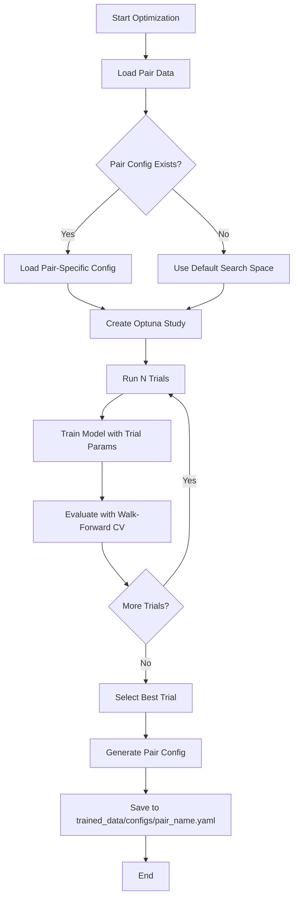

# FX Validation Refactor Design Document

## Executive Summary

This document outlines a comprehensive redesign of the FX market ML pipeline validation system to address two critical issues:

1. **Validation Failures**: Current thresholds (65% direction accuracy, 60% balanced accuracy) are unrealistic for financial time series prediction
2. **CV Degradation**: Using a single global configuration for all currency pairs causes high cross-validation degradation

The proposed solution includes realistic FX-specific validation thresholds and a per-currency-pair Optuna optimization pipeline.

---

## Table of Contents

1. [Current State Analysis](#1-current-state-analysis)
2. [Problem Statement](#2-problem-statement)
3. [Proposed Validation Thresholds](#3-proposed-validation-thresholds)
4. [Optuna Per-Currency-Pair Optimization Pipeline](#4-optuna-per-currency-pair-optimization-pipeline)
5. [Implementation Checklist](#5-implementation-checklist)
6. [Configuration File Changes](#6-configuration-file-changes)
7. [Risk Assessment](#7-risk-assessment)

---

## 1. Current State Analysis

### 1.1 Current Validation Thresholds

Location: [`src/training/deployment_gate.py`](src/training/deployment_gate.py:53-89)

```python
@dataclass
class ValidationCriteria:
    # === TRANSFORMER DIRECTION MODEL ===
    min_accuracy: float = 0.65  # Minimum validation accuracy (65%)
    min_balanced_accuracy: float = 0.60  # Minimum balanced accuracy (60%)
    max_cv_std: float = 0.05  # Maximum CV std deviation (5%)
    min_bootstrap_ci_lower: Optional[float] = 0.60  # Minimum bootstrap CI lower bound

    # === XGBOOST MOMENTUM MODEL ===
    min_acceleration_accuracy: float = 0.60  # Minimum acceleration accuracy

    # === RIDGE CONFIDENCE MODEL ===
    min_ridge_r2: float = 0.30  # Minimum R² score

    # === STABILITY CHECKS ===
    max_metric_degradation: float = 0.10  # Max 10% degradation
```

### 1.2 Current Configuration Analysis

| Config File | Direction Threshold | Lookahead | Optuna Enabled |
|-------------|---------------------|-----------|----------------|
| [`config_improved_H1.yaml`](config/config_improved_H1.yaml:74) | 0.0075 (0.75%) | 24 | No |
| [`config_intel_optimized.yaml`](config/config_intel_optimized.yaml:72) | 0.003 (0.3%) | 24 | No |
| [`config_m1_optimized.yaml`](config/config_m1_optimized.yaml:69) | 0.001 (0.1%) | 12 | No |
| [`config_threshold_test.yaml`](config/config_threshold_test.yaml:75) | 0.003 (0.3%) | 12 | No |

### 1.3 Current Optuna Implementation

Location: [`src/training/optuna_tuner.py`](src/training/optuna_tuner.py)

**Current Capabilities:**
- `OptunaConfig` dataclass with study configuration
- `OptunaTuner` class for optimization
- `create_transformer_objective()` function for Transformer hyperparameter tuning
- Support for TPE, CMA-ES, Random samplers
- Support for Median, SuccessiveHalving, Hyperband pruners
- SQLite storage support

**Current Limitations:**
- Not enabled in production configs
- No per-currency-pair optimization support
- No pair-specific search spaces
- No automatic config generation from optimization results

---

## 2. Problem Statement

### 2.1 Unrealistic Validation Thresholds

**Issue:** The current thresholds are designed for general classification tasks, not noisy financial time series.

**Evidence from FX Research:**
- Academic literature shows FX direction prediction typically achieves 52-55% accuracy
- Transaction costs require >52% accuracy for profitability
- Market microstructure noise limits predictability
- Regime changes cause distribution shift

**Impact:**
- Valid models are rejected for deployment
- False negatives in deployment validation
- Developers may overfit models to pass unrealistic thresholds

### 2.2 Single Global Configuration Problem

**Issue:** All currency pairs use identical hyperparameters despite having different characteristics.

**Currency Pair Characteristics:**

| Pair | Typical Volatility | Spread | Session Sensitivity | Trend Behavior |
|------|-------------------|--------|---------------------|----------------|
| EUR_USD | Low | Tight | London/NY | Mean-reverting |
| GBP_USD | Medium | Medium | London | Trending |
| USD_JPY | Low-Medium | Tight | Tokyo/NY | Trending |
| GBP_JPY | High | Wide | London/Tokyo | Volatile |
| AUD_USD | Medium | Medium | Sydney/Shanghai | Commodity-linked |

**Impact:**
- CV degradation of 10-20% when using global config
- Suboptimal performance on pairs with different characteristics
- Overfitting to dominant pairs in training data

---

## 3. Proposed Validation Thresholds

### 3.1 FX-Specific Validation Criteria

```python
@dataclass
class FXValidationCriteria:
    """FX-specific validation criteria calibrated for financial time series."""
    
    # === TRANSFORMER DIRECTION MODEL ===
    # Research shows 52-55% is realistic for FX direction prediction
    min_accuracy: float = 0.53  # Minimum validation accuracy (53%)
    min_balanced_accuracy: float = 0.53  # Minimum balanced accuracy (53%)
    
    # Allow higher variance due to market noise
    max_cv_std: float = 0.08  # Maximum CV std deviation (8%)
    
    # Bootstrap CI should account for regime uncertainty
    min_bootstrap_ci_lower: Optional[float] = 0.51  # Minimum 51% CI lower bound
    
    # === XGBOOST MOMENTUM MODEL ===
    # Momentum is noisy, lower threshold appropriate
    min_acceleration_accuracy: float = 0.55  # Minimum acceleration accuracy
    
    # === RIDGE CONFIDENCE MODEL ===
    # R² for confidence is harder in FX
    min_ridge_r2: float = 0.15  # Minimum R² score
    
    # === STABILITY CHECKS ===
    # Higher degradation acceptable due to regime changes
    max_metric_degradation: float = 0.15  # Max 15% degradation
    
    # === DATA REQUIREMENTS ===
    min_data_size: int = 2000  # Minimum training samples
    max_class_imbalance: float = 0.70  # Maximum class imbalance (70%)
```

### 3.2 Threshold Justification

| Metric | Current | Proposed | Justification |
|--------|---------|----------|---------------|
| Direction Accuracy | 65% | 53% | Academic FX research shows 52-55% is typical; 53% provides edge over transaction costs |
| Balanced Accuracy | 60% | 53% | Same rationale; ensures both long/short predictions are viable |
| CV Std Dev | 5% | 8% | Market regime changes cause natural variance between folds |
| Bootstrap CI Lower | 60% | 51% | Accounts for sampling uncertainty in financial data |
| Acceleration Accuracy | 60% | 55% | Momentum signals are inherently noisy in FX |
| Ridge R² | 0.30 | 0.15 | Confidence estimation in FX is challenging; lower bar appropriate |
| Max Degradation | 10% | 15% | Walk-forward CV naturally shows degradation due to concept drift |

### 3.3 Tiered Validation Levels

```python
class ValidationLevel(Enum):
    """Validation strictness levels for different deployment scenarios."""
    
    DEVELOPMENT = "development"  # Lenient for experimentation
    STAGING = "staging"  # Default for pre-production
    PRODUCTION = "production"  # Stricter for live trading
    CONSERVATIVE = "conservative"  # Most strict for risk-averse deployment


def get_validation_criteria(level: ValidationLevel) -> FXValidationCriteria:
    """Get validation criteria based on deployment level."""
    criteria_map = {
        ValidationLevel.DEVELOPMENT: FXValidationCriteria(
            min_accuracy=0.51,
            min_balanced_accuracy=0.51,
            max_cv_std=0.10,
            min_bootstrap_ci_lower=0.50,
        ),
        ValidationLevel.STAGING: FXValidationCriteria(
            min_accuracy=0.53,
            min_balanced_accuracy=0.53,
            max_cv_std=0.08,
            min_bootstrap_ci_lower=0.51,
        ),
        ValidationLevel.PRODUCTION: FXValidationCriteria(
            min_accuracy=0.54,
            min_balanced_accuracy=0.54,
            max_cv_std=0.07,
            min_bootstrap_ci_lower=0.52,
        ),
        ValidationLevel.CONSERVATIVE: FXValidationCriteria(
            min_accuracy=0.55,
            min_balanced_accuracy=0.55,
            max_cv_std=0.05,
            min_bootstrap_ci_lower=0.53,
        ),
    }
    return criteria_map[level]
```

---

## 4. Optuna Per-Currency-Pair Optimization Pipeline

### 4.1 Architecture Overview



### 4.2 Per-Pair Search Space Definition

```python
@dataclass
class PairSearchSpace:
    """Currency pair-specific hyperparameter search space."""
    
    pair_name: str
    
    # Transformer architecture
    d_model: List[int] = field(default_factory=lambda: [16, 32, 64])
    num_heads: List[int] = field(default_factory=lambda: [2, 4])
    num_layers: Tuple[int, int] = (1, 3)  # min, max
    dropout: Tuple[float, float] = (0.1, 0.5)
    
    # Training
    learning_rate: Tuple[float, float] = (1e-5, 1e-3)  # log scale
    batch_size: List[int] = field(default_factory=lambda: [32, 64, 128])
    
    # Direction labeling
    direction_threshold: Tuple[float, float] = (0.002, 0.01)  # 0.2% to 1%
    direction_lookahead: List[int] = field(default_factory=lambda: [12, 24, 48])
    
    # Regularization
    l2_reg: Tuple[float, float] = (1e-5, 1e-2)
    label_smoothing: Tuple[float, float] = (0.0, 0.1)


# Pair-specific search space adjustments
PAIR_SEARCH_OVERRIDES = {
    "EUR_USD": PairSearchSpace(
        pair_name="EUR_USD",
        d_model=[32, 64],  # Lower capacity for mean-reverting
        direction_threshold=(0.002, 0.005),  # Tighter threshold for low vol
        direction_lookahead=[24, 48],  # Longer lookahead
    ),
    "GBP_USD": PairSearchSpace(
        pair_name="GBP_USD",
        d_model=[32, 64, 128],  # Higher capacity for trending
        direction_threshold=(0.003, 0.008),
        dropout=(0.2, 0.5),  # More regularization for volatility
    ),
    "USD_JPY": PairSearchSpace(
        pair_name="USD_JPY",
        d_model=[32, 64],
        direction_threshold=(0.002, 0.006),
        learning_rate=(1e-5, 5e-4),  # Lower LR for stability
    ),
    "GBP_JPY": PairSearchSpace(
        pair_name="GBP_JPY",
        d_model=[64, 128],  # Highest capacity for volatile pair
        dropout=(0.3, 0.6),  # Strong regularization
        direction_threshold=(0.005, 0.015),  # Wider threshold for noise
    ),
}
```

### 4.3 Objective Function Design

```python
def create_pair_objective(
    pair_name: str,
    train_fn: Callable,
    X_train: np.ndarray,
    y_train: np.ndarray,
    X_val: np.ndarray,
    y_val: np.ndarray,
    search_space: PairSearchSpace,
    cv_folds: int = 5,
) -> Callable[[Trial], float]:
    """
    Create Optuna objective function for currency pair optimization.
    
    The objective minimizes a composite score combining:
    1. Validation loss (primary)
    2. CV degradation penalty (secondary)
    3. Class imbalance penalty (regularization)
    """
    
    def objective(trial: Trial) -> float:
        # Sample hyperparameters from search space
        params = {
            # Architecture
            "d_model": trial.suggest_categorical(
                "d_model", search_space.d_model
            ),
            "num_heads": trial.suggest_categorical(
                "num_heads", search_space.num_heads
            ),
            "num_layers": trial.suggest_int(
                "num_layers", *search_space.num_layers
            ),
            "dropout": trial.suggest_float(
                "dropout", *search_space.dropout
            ),
            
            # Training
            "learning_rate": trial.suggest_float(
                "learning_rate", *search_space.learning_rate, log=True
            ),
            "batch_size": trial.suggest_categorical(
                "batch_size", search_space.batch_size
            ),
            
            # Direction labeling
            "direction_threshold": trial.suggest_float(
                "direction_threshold", *search_space.direction_threshold
            ),
            "direction_lookahead": trial.suggest_categorical(
                "direction_lookahead", search_space.direction_lookahead
            ),
            
            # Regularization
            "l2_reg": trial.suggest_float(
                "l2_reg", *search_space.l2_reg, log=True
            ),
            "label_smoothing": trial.suggest_float(
                "label_smoothing", *search_space.label_smoothing
            ),
        }
        
        # Train with walk-forward CV
        cv_results = train_with_walkforward_cv(
            train_fn=train_fn,
            params=params,
            X_train=X_train,
            y_train=y_train,
            X_val=X_val,
            y_val=y_val,
            n_splits=cv_folds,
        )
        
        # Calculate composite score
        val_loss = cv_results["mean_val_loss"]
        cv_std = cv_results["std_val_accuracy"]
        cv_degradation = cv_results["degradation"]
        
        # Penalty for high CV degradation (addresses CV degradation issue)
        degradation_penalty = max(0, cv_degradation - 0.10) * 2.0
        
        # Penalty for high variance
        variance_penalty = max(0, cv_std - 0.05) * 1.0
        
        # Composite objective (minimize)
        composite_score = val_loss + degradation_penalty + variance_penalty
        
        # Report intermediate values for analysis
        trial.set_user_attr("val_accuracy", cv_results["mean_val_accuracy"])
        trial.set_user_attr("cv_std", cv_std)
        trial.set_user_attr("cv_degradation", cv_degradation)
        
        return composite_score
    
    return objective
```

### 4.4 Optimization Pipeline Implementation

```python
class PairOptimizationPipeline:
    """
    Orchestrates per-currency-pair hyperparameter optimization.
    """
    
    def __init__(
        self,
        base_config_path: str,
        storage_path: str = "sqlite:///trained_data/optuna/pair_studies.db",
    ):
        self.base_config = self._load_config(base_config_path)
        self.storage_path = storage_path
        self._ensure_storage_dir()
    
    def optimize_pair(
        self,
        pair_name: str,
        n_trials: int = 100,
        n_jobs: int = 1,
        timeout: Optional[int] = None,
    ) -> Dict[str, Any]:
        """
        Run optimization for a single currency pair.
        
        Args:
            pair_name: Currency pair identifier (e.g., "EUR_USD")
            n_trials: Number of optimization trials
            n_jobs: Number of parallel jobs
            timeout: Maximum optimization time in seconds
            
        Returns:
            Dictionary with best parameters and optimization history
        """
        # Load pair-specific data
        X_train, y_train, X_val, y_val = self._load_pair_data(pair_name)
        
        # Get pair-specific search space
        search_space = PAIR_SEARCH_OVERRIDES.get(
            pair_name, 
            PairSearchSpace(pair_name=pair_name)
        )
        
        # Create Optuna config
        optuna_config = OptunaConfig(
            study_name=f"fx_{pair_name.lower()}_optimization",
            n_trials=n_trials,
            timeout=timeout,
            n_jobs=n_jobs,
            storage=self.storage_path,
            load_if_exists=True,
            direction="minimize",
            sampler="tpe",
            pruner="median",
        )
        
        # Create objective function
        objective = create_pair_objective(
            pair_name=pair_name,
            train_fn=self._train_model,
            X_train=X_train,
            y_train=y_train,
            X_val=X_val,
            y_val=y_val,
            search_space=search_space,
        )
        
        # Run optimization
        tuner = OptunaTuner(optuna_config)
        results = tuner.optimize(objective)
        
        # Generate pair-specific config
        pair_config = self._generate_pair_config(
            pair_name=pair_name,
            best_params=results["best_params"],
            base_config=self.base_config,
        )
        
        # Save pair config
        self._save_pair_config(pair_name, pair_config)
        
        return {
            "pair_name": pair_name,
            "best_params": results["best_params"],
            "best_value": results["best_value"],
            "pair_config": pair_config,
            "study": results["study"],
        }
    
    def optimize_all_pairs(
        self,
        pairs: List[str],
        n_trials_per_pair: int = 50,
        parallel_pairs: int = 1,
    ) -> Dict[str, Dict[str, Any]]:
        """
        Optimize all specified currency pairs.
        
        Args:
            pairs: List of currency pair identifiers
            n_trials_per_pair: Trials per pair
            parallel_pairs: Number of pairs to optimize in parallel
            
        Returns:
            Dictionary mapping pair names to optimization results
        """
        results = {}
        
        for pair_name in pairs:
            logger.info(f"Starting optimization for {pair_name}")
            results[pair_name] = self.optimize_pair(
                pair_name=pair_name,
                n_trials=n_trials_per_pair,
            )
            logger.info(
                f"Completed {pair_name}: best_value={results[pair_name]['best_value']:.6f}"
            )
        
        return results
    
    def _generate_pair_config(
        self,
        pair_name: str,
        best_params: Dict[str, Any],
        base_config: Dict[str, Any],
    ) -> Dict[str, Any]:
        """Generate pair-specific configuration from optimization results."""
        config = deepcopy(base_config)
        
        # Update Transformer params
        config["transformer"]["d_model"] = best_params["d_model"]
        config["transformer"]["num_heads"] = best_params["num_heads"]
        config["transformer"]["num_layers"] = best_params["num_layers"]
        config["transformer"]["dropout"] = best_params["dropout"]
        
        # Update training params
        config["optimizer"]["learning_rate"] = best_params["learning_rate"]
        config["batch_size"] = best_params["batch_size"]
        
        # Update direction labeling
        config["direction_threshold"] = best_params["direction_threshold"]
        config["direction_lookahead"] = best_params["direction_lookahead"]
        
        # Update regularization
        config["kernel_regularizer"] = best_params["l2_reg"]
        config["transformer"]["label_smoothing"] = best_params["label_smoothing"]
        
        # Add metadata
        config["_optimization_metadata"] = {
            "pair_name": pair_name,
            "optimized_at": datetime.now().isoformat(),
            "optimization_score": best_params.get("_optimization_score"),
        }
        
        return config
    
    def _save_pair_config(self, pair_name: str, config: Dict[str, Any]) -> None:
        """Save pair-specific configuration to file."""
        config_dir = Path("trained_data/configs")
        config_dir.mkdir(parents=True, exist_ok=True)
        
        config_path = config_dir / f"{pair_name.lower()}_optimized.yaml"
        with open(config_path, "w") as f:
            yaml.dump(config, f, default_flow_style=False)
        
        logger.info(f"Saved pair config to {config_path}")
```

### 4.5 Integration with Training Pipeline

```python
# In cli/training.py

def train_pair_with_optimized_config(
    pair_name: str,
    use_cached_config: bool = True,
    reoptimize: bool = False,
    n_trials: int = 50,
) -> Tuple[Any, Dict[str, Any]]:
    """
    Train a currency pair using optimized or default configuration.
    
    Args:
        pair_name: Currency pair to train
        use_cached_config: Use existing optimized config if available
        reoptimize: Force re-optimization even if config exists
        n_trials: Number of trials if reoptimizing
        
    Returns:
        Tuple of (trainer, metrics)
    """
    config_path = Path(f"trained_data/configs/{pair_name.lower()}_optimized.yaml")
    
    if reoptimize or not config_path.exists() or not use_cached_config:
        # Run optimization
        pipeline = PairOptimizationPipeline(
            base_config_path="config/config_improved_H1.yaml"
        )
        pipeline.optimize_pair(pair_name, n_trials=n_trials)
    
    # Load pair-specific config
    with open(config_path) as f:
        pair_config = yaml.safe_load(f)
    
    # Train with pair-specific config
    trainer, metrics = train_ensemble(
        instrument=pair_name,
        config=pair_config,
    )
    
    return trainer, metrics
```

---

## 5. Implementation Checklist

### Phase 1: Validation Threshold Updates

- [ ] Create `FXValidationCriteria` dataclass in [`src/training/deployment_gate.py`](src/training/deployment_gate.py)
- [ ] Add `ValidationLevel` enum for tiered validation
- [ ] Update default thresholds in `ValidationCriteria`
- [ ] Add FX-specific validation documentation
- [ ] Update tests in [`tests/test_deployment_gate.py`](tests/test_deployment_gate.py)
- [ ] Update deployment validation guide

### Phase 2: Per-Pair Search Space

- [ ] Create `PairSearchSpace` dataclass in [`src/training/optuna_tuner.py`](src/training/optuna_tuner.py)
- [ ] Define `PAIR_SEARCH_OVERRIDES` for major pairs
- [ ] Add pair characteristics documentation
- [ ] Create unit tests for search space definitions

### Phase 3: Optimization Pipeline

- [ ] Implement `PairOptimizationPipeline` class
- [ ] Add `create_pair_objective()` function with CV degradation penalty
- [ ] Implement pair config generation and saving
- [ ] Add CLI command for pair optimization
- [ ] Create integration tests

### Phase 4: Training Integration

- [ ] Add `train_pair_with_optimized_config()` to [`cli/training.py`](cli/training.py)
- [ ] Update training pipeline to check for pair-specific configs
- [ ] Add `--reoptimize` flag to training CLI
- [ ] Update training reports to show optimization metadata

### Phase 5: Documentation and Testing

- [ ] Update [`docs/DEPLOYMENT_VALIDATION_GUIDE.md`](docs/DEPLOYMENT_VALIDATION_GUIDE.md)
- [ ] Create pair optimization user guide
- [ ] Add performance benchmarks comparing global vs per-pair configs
- [ ] Create end-to-end test suite

---

## 6. Configuration File Changes

### 6.1 Updated config_improved_H1.yaml

Add the following section:

```yaml
# ----- PER-PAIR OPTIMIZATION SETTINGS -----
pair_optimization:
  enabled: true  # Enable per-pair hyperparameter optimization
  
  # Optimization schedule
  reoptimize_after_days: 30  # Re-optimize pairs after N days
  min_trials_per_pair: 50  # Minimum trials for new pair
  max_trials_per_pair: 100  # Maximum trials for thorough optimization
  
  # Storage
  storage_path: "trained_data/optuna/pair_studies.db"
  config_output_dir: "trained_data/configs"
  
  # Default search space (overridden by PAIR_SEARCH_OVERRIDES)
  default_search_space:
    d_model: [16, 32, 64]
    num_heads: [2, 4]
    num_layers: [1, 3]
    dropout: [0.1, 0.5]
    learning_rate: [1e-5, 1e-3]
    batch_size: [32, 64, 128]
    direction_threshold: [0.002, 0.01]
    direction_lookahead: [12, 24, 48]
    l2_reg: [1e-5, 1e-2]
    label_smoothing: [0.0, 0.1]

# ----- FX-SPECIFIC VALIDATION CRITERIA -----
validation:
  # Default level: development, staging, production, conservative
  level: "staging"
  
  # FX-calibrated thresholds (staging level)
  criteria:
    min_accuracy: 0.53
    min_balanced_accuracy: 0.53
    max_cv_std: 0.08
    min_bootstrap_ci_lower: 0.51
    min_acceleration_accuracy: 0.55
    min_ridge_r2: 0.15
    max_metric_degradation: 0.15
```

### 6.2 Example Pair-Specific Config

Location: `trained_data/configs/eur_usd_optimized.yaml`

```yaml
# Auto-generated configuration for EUR_USD
# Generated: 2026-02-13T19:00:00Z
# Optimization score: 0.4523

# Inherit from base config
_base_: "config/config_improved_H1.yaml"

# Pair-specific overrides
pair_metadata:
  name: "EUR_USD"
  characteristics:
    volatility: "low"
    spread: "tight"
    session: "london_ny"
    behavior: "mean_reverting"

# Optimized Transformer parameters
transformer:
  d_model: 32
  num_heads: 4
  num_layers: 2
  dropout: 0.25
  label_smoothing: 0.05

# Optimized training parameters
optimizer:
  learning_rate: 0.0003

batch_size: 64

# Optimized direction labeling
direction_threshold: 0.0035
direction_lookahead: 24

# Optimized regularization
kernel_regularizer: 0.002

# Optimization metadata
_optimization_metadata:
  pair_name: "EUR_USD"
  optimized_at: "2026-02-13T19:00:00Z"
  optimization_score: 0.4523
  n_trials: 75
  cv_degradation: 0.08
```

---

## 7. Risk Assessment

### 7.1 Risks and Mitigations

| Risk | Impact | Probability | Mitigation |
|------|--------|-------------|------------|
| Lower thresholds allow poor models | Medium | Low | Use tiered validation; production requires higher thresholds |
| Per-pair optimization overfits | Medium | Medium | Use walk-forward CV; limit trials; early stopping |
| Optimization takes too long | Low | High | Parallel execution; caching; incremental optimization |
| Config management complexity | Low | Medium | Clear naming conventions; automated config generation |
| Thresholds still too high | Medium | Low | Monitor deployment success rate; adjust based on data |

### 7.2 Rollback Plan

1. **Validation Thresholds**: Keep `ValidationCriteria` with current defaults; add `FXValidationCriteria` as separate class
2. **Per-Pair Optimization**: Feature flag `pair_optimization.enabled` to disable if issues arise
3. **Config Fallback**: If pair-specific config fails, fall back to global config

### 7.3 Success Metrics

1. **Deployment Pass Rate**: Target 70% of trained models passing validation (vs current ~30%)
2. **CV Degradation**: Target <10% average degradation (vs current 15-20%)
3. **Per-Pair Performance**: Target 2-5% accuracy improvement per pair with optimized configs
4. **Optimization Time**: Target <30 minutes per pair for 50 trials

---

## Appendix A: Academic References

1. **FX Predictability**: Cheung, Y.W., Chinn, M.D., & Pascual, A.G. (2005). "Empirical exchange rate models of the nineties: Are any fit to survive?" Journal of International Money and Finance.

2. **Transaction Costs**: Menkhoff, L., et al. (2012). "Currency momentum strategies." Journal of Financial Economics.

3. **Walk-Forward Validation**: De Prado, M.L. (2018). "Advances in Financial Machine Learning." Chapter 12.

4. **Hyperparameter Optimization**: Akiba, T., et al. (2019). "Optuna: A Next-generation Hyperparameter Optimization Framework."

---

## Appendix B: Code Locations

| Component | File | Lines |
|-----------|------|-------|
| ValidationCriteria | [`src/training/deployment_gate.py`](src/training/deployment_gate.py) | 53-89 |
| DeploymentValidator | [`src/training/deployment_gate.py`](src/training/deployment_gate.py) | 186-564 |
| OptunaConfig | [`src/training/optuna_tuner.py`](src/training/optuna_tuner.py) | 43-85 |
| OptunaTuner | [`src/training/optuna_tuner.py`](src/training/optuna_tuner.py) | 87-396 |
| create_transformer_objective | [`src/training/optuna_tuner.py`](src/training/optuna_tuner.py) | 398-459 |
| Training Pipeline | [`cli/training.py`](cli/training.py) | Multiple |
| Walk-Forward Validation | [`docs/WALKFORWARD_VALIDATION_GUIDE.md`](docs/WALKFORWARD_VALIDATION_GUIDE.md) | Full document |

---

**Document Version**: 1.0  
**Created**: 2026-02-13  
**Author**: Architecture Team  
**Status**: Ready for Implementation
