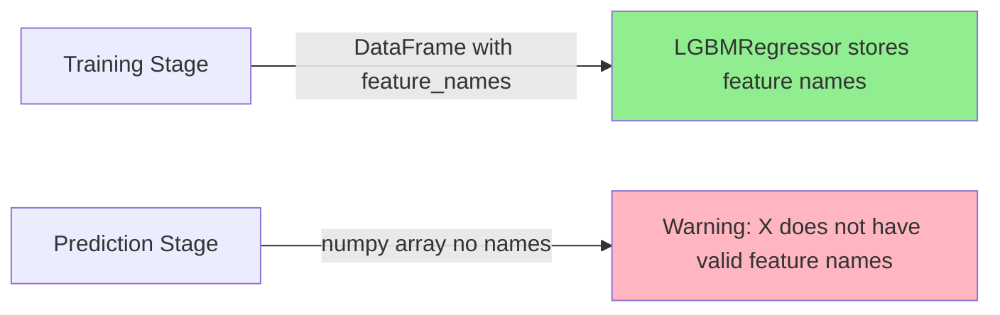

# LGBMRegressor Feature Name Mismatch - Debugging Guide

## Problem Description

**UserWarning:**
```
UserWarning: X does not have valid feature names, but LGBMRegressor was fitted with feature names
```

This warning occurs when there's a mismatch between the data format used during **training** vs **prediction** with LightGBM models.

---

## Root Cause Analysis

### Why This Happens

LightGBM (via sklearn's [`LGBMRegressor`](src/training/modular_trainers.py:4596)) stores **feature names internally** when trained with a pandas DataFrame that has column names. When you later predict with a **numpy array** (which has no column names), sklearn detects the mismatch and issues a warning.

### The Mismatch Pattern



### Current Code Analysis

In [`RidgeTrainer.predict()`](src/training/modular_trainers.py:4808-4835):

```python
# Line 4814-4816: Scaled as numpy array
X_scaled = self.scaler.transform(X)

# Line 4824-4826: Partial fix - converts to DataFrame only for LightGBM
if model_type == 'lightgbm' and self.feature_names is not None:
    import pandas as pd
    X_last = pd.DataFrame(X_last, columns=self.feature_names)
```

**Issue:** The training stage ([`train()`](src/training/modular_trainers.py:4683-4806)) uses **numpy arrays** throughout, but LightGBM internally expects feature names when available.

---

## Solution 1: Use pandas DataFrame with Feature Names (Recommended)

### Fix in Training Stage

Modify the [`RidgeTrainer.train()`](src/training/modular_trainers.py:4683-4806) method to use DataFrames:

```python
def train(
    self,
    X_train: np.ndarray,
    y_train: np.ndarray,
    X_val: np.ndarray,
    y_val: np.ndarray,
    feature_names: Optional[list] = None,
) -> Dict[str, float]:
    """Train LightGBM for confidence scoring (falls back to ElasticNet if unavailable)."""
    from sklearn.model_selection import TimeSeriesSplit
    from sklearn.preprocessing import StandardScaler
    import pandas as pd
    
    # Save feature names for inference
    self.feature_names = feature_names
    self.n_features = X_train.shape[-1]
    
    # Scale features
    self.scaler = StandardScaler()
    X_train_scaled = self.scaler.fit_transform(X_train)
    X_val_scaled = self.scaler.transform(X_val)
    
    # === FIX: Convert to DataFrame with feature names ===
    # This ensures LightGBM stores feature names consistently
    if self.feature_names is not None:
        X_train_df = pd.DataFrame(X_train_scaled, columns=self.feature_names)
        X_val_df = pd.DataFrame(X_val_scaled, columns=self.feature_names)
    else:
        # Fallback: generate default feature names
        self.feature_names = [f'feature_{i}' for i in range(X_train_scaled.shape[1])]
        X_train_df = pd.DataFrame(X_train_scaled, columns=self.feature_names)
        X_val_df = pd.DataFrame(X_val_scaled, columns=self.feature_names)
    
    # Try LightGBM first (GPU-accelerated)
    lgbm_model = _create_lgbm_regressor(
        n_estimators=100,
        learning_rate=0.1,
        max_depth=6,
        num_leaves=31,
    )
    
    if lgbm_model is not None:
        # Use LightGBM
        logger.info("Training LightGBM (Confidence) - GPU-accelerated...")
        
        self.model = lgbm_model
        self.model.fit(
            X_train_df,  # Use DataFrame with feature names
            y_train,
            eval_set=[(X_val_df, y_val)],  # Use DataFrame with feature names
        )
        
        self.is_trained = True
        self._model_type = 'lightgbm'
        
        # ... rest of training code
```

### Fix in Prediction Stage

The [`RidgeTrainer.predict()`](src/training/modular_trainers.py:4808-4835) method already has a partial fix, but it should be more robust:

```python
def predict(self, X: np.ndarray) -> Dict[str, Any]:
    """Predict confidence score (0-100)."""
    if not self.is_trained:
        raise RuntimeError("Model not trained")
    
    import pandas as pd
    
    # Scale
    if X.ndim == 1:
        X = X.reshape(1, -1)
    X_scaled = self.scaler.transform(X)
    
    # Get last row for prediction
    X_last = X_scaled[-1:] if len(X_scaled) > 1 else X_scaled
    
    # === FIX: Always use DataFrame for LightGBM ===
    # This prevents the sklearn UserWarning about missing feature names
    model_type = getattr(self, '_model_type', 'elasticnet')
    if model_type == 'lightgbm':
        # Ensure feature_names are available
        if self.feature_names is None:
            # Generate default feature names if not set
            self.feature_names = [f'feature_{i}' for i in range(X_last.shape[1])]
        
        # Convert to DataFrame with feature names
        X_last = pd.DataFrame(X_last, columns=self.feature_names)
    
    confidence = float(self.model.predict(X_last)[0])
    
    # Clamp to 0-100
    confidence = max(0.0, min(100.0, confidence))
    
    return {
        'confidence': confidence,
    }
```

---

## Solution 2: Disable Feature Name Check (Alternative)

If you prefer to suppress the warning without modifying data structures, you can:

### Option A: Suppress Warning Globally

```python
import warnings
from sklearn.exceptions import DataConversionWarning

# Suppress the specific warning
warnings.filterwarnings('ignore', 
                      message='X does not have valid feature names',
                      category=UserWarning)

# Now your prediction code won't show the warning
confidence = float(self.model.predict(X_last)[0])
```

### Option B: Disable Feature Name Check in LightGBM

```python
def _create_lgbm_regressor(**kwargs) -> Any:
    """Create LightGBM regressor with GPU→CPU fallback."""
    try:
        from lightgbm import LGBMRegressor
    except ImportError:
        logger.warning("LightGBM not installed, falling back to ElasticNetCV")
        return None
    
    import warnings
    import platform
    
    # Default hyperparameters optimized for confidence scoring
    default_params = {
        'n_estimators': 100,
        'learning_rate': 0.1,
        'max_depth': 6,
        'num_leaves': 31,
        'n_jobs': -1,
        'random_state': 42,
        'verbose': -1,
        # === FIX: Disable feature name check ===
        'feature_name': 'auto',  # Let LightGBM handle feature names automatically
        'categorical_feature': 'auto',  # Auto-detect categorical features
    }
    default_params.update(kwargs)
    
    # ... rest of the function
```

### Option C: Use numpy Arrays Consistently

Train the model with numpy arrays (no feature names) so LightGBM doesn't expect them:

```python
def train(self, X_train: np.ndarray, y_train: np.ndarray, 
          X_val: np.ndarray, y_val: np.ndarray,
          feature_names: Optional[list] = None) -> Dict[str, float]:
    """Train LightGBM for confidence scoring."""
    from sklearn.model_selection import TimeSeriesSplit
    from sklearn.preprocessing import StandardScaler
    
    # Save feature names for inference
    self.feature_names = feature_names
    self.n_features = X_train.shape[-1]
    
    # Scale features
    self.scaler = StandardScaler()
    X_train_scaled = self.scaler.fit_transform(X_train)
    X_val_scaled = self.scaler.transform(X_val)
    
    # Try LightGBM first (GPU-accelerated)
    lgbm_model = _create_lgbm_regressor(
        n_estimators=100,
        learning_rate=0.1,
        max_depth=6,
        num_leaves=31,
    )
    
    if lgbm_model is not None:
        # === FIX: Use numpy arrays (no feature names) ===
        # This prevents LightGBM from storing feature names
        self.model = lgbm_model
        self.model.fit(
            X_train_scaled,  # numpy array - no feature names stored
            y_train,
            eval_set=[(X_val_scaled, y_val)],
        )
        
        self.is_trained = True
        self._model_type = 'lightgbm'
        
        # ... rest of training code
```

Then in [`predict()`](src/training/modular_trainers.py:4808-4835):

```python
def predict(self, X: np.ndarray) -> Dict[str, Any]:
    """Predict confidence score (0-100)."""
    if not self.is_trained:
        raise RuntimeError("Model not trained")
    
    # Scale
    if X.ndim == 1:
        X = X.reshape(1, -1)
    X_scaled = self.scaler.transform(X)
    
    # Get last row for prediction
    X_last = X_scaled[-1:] if len(X_scaled) > 1 else X_scaled
    
    # No DataFrame conversion needed - model was trained with numpy arrays
    confidence = float(self.model.predict(X_last)[0])
    
    # Clamp to 0-100
    confidence = max(0.0, min(100.0, confidence))
    
    return {
        'confidence': confidence,
    }
```

---

## Complete Working Example

Here's a complete, standalone example demonstrating the fix:

```python
import numpy as np
import pandas as pd
from lightgbm import LGBMRegressor
from sklearn.preprocessing import StandardScaler
from sklearn.model_selection import train_test_split

# Generate sample data
np.random.seed(42)
n_samples = 1000
n_features = 10

X = np.random.randn(n_samples, n_features)
y = np.random.randn(n_samples)

feature_names = [f'feature_{i}' for i in range(n_features)]

# Split data
X_train, X_test, y_train, y_test = train_test_split(
    X, y, test_size=0.2, random_state=42
)

# Scale features
scaler = StandardScaler()
X_train_scaled = scaler.fit_transform(X_train)
X_test_scaled = scaler.transform(X_test)

# === TRAINING: Use DataFrame with feature names ===
X_train_df = pd.DataFrame(X_train_scaled, columns=feature_names)
X_test_df = pd.DataFrame(X_test_scaled, columns=feature_names)

# Train LightGBM
model = LGBMRegressor(
    n_estimators=100,
    learning_rate=0.1,
    max_depth=6,
    verbose=-1,
)
model.fit(X_train_df, y_train)

# === PREDICTION: Use DataFrame with feature names ===
# This prevents the sklearn UserWarning
X_new = np.random.randn(5, n_features)
X_new_scaled = scaler.transform(X_new)
X_new_df = pd.DataFrame(X_new_scaled, columns=feature_names)

# Predict - no warning!
predictions = model.predict(X_new_df)
print(f"Predictions: {predictions}")
```

---

## Comparison of Solutions

| Solution | Pros | Cons |
|----------|-------|-------|
| **DataFrame with feature names** | - Best practice<br>- Preserves feature information<br>- Enables feature importance analysis<br>- No warnings | - Requires code changes in both train and predict<br>- Slight overhead for DataFrame conversion |
| **Suppress warning** | - Minimal code change<br>- Quick fix | - Doesn't address root cause<br>- May hide real issues<br>- Not recommended for production |
| **Use numpy arrays consistently** | - Simple and consistent<br>- No DataFrame overhead | - Loses feature name information<br>- Harder to debug feature importance<br>- May cause issues with categorical features |

---

## Best Practices

1. **Always use the same data format** for training and prediction
2. **Store feature names** in your model class for consistent use
3. **Validate feature names** match between training and prediction
4. **Log warnings** for debugging but fix root causes in production

---

## Implementation Checklist

- [ ] Modify [`RidgeTrainer.train()`](src/training/modular_trainers.py:4683-4806) to use DataFrames with feature names
- [ ] Ensure [`RidgeTrainer.predict()`](src/training/modular_trainers.py:4808-4835) consistently uses DataFrames
- [ ] Update [`_create_lgbm_regressor()`](src/training/modular_trainers.py:4582-4654) if needed
- [ ] Test with both numpy arrays and pandas DataFrames
- [ ] Verify no sklearn UserWarning appears during prediction
- [ ] Add unit tests for feature name consistency

---

## References

- [LightGBM Documentation - Feature Names](https://lightgbm.readthedocs.io/en/latest/Parameters.html#feature_name)
- [sklearn Feature Name Validation](https://scikit-learn.org/stable/modules/generated/sklearn.utils.validation.check_array.html)
- [pandas DataFrame Documentation](https://pandas.pydata.org/docs/reference/api/pandas.DataFrame.html)
