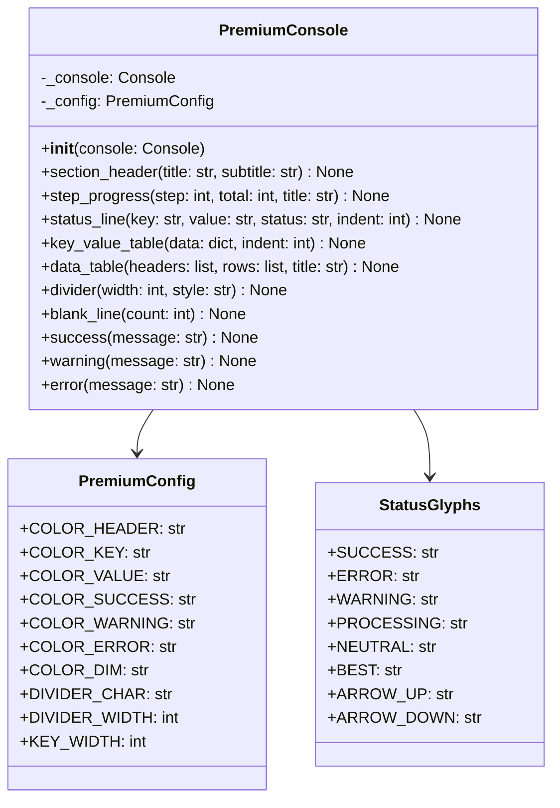

# Premium Output Module Design Document

## Overview

This document defines the architecture and API for a new `PremiumOutput` module that provides a clean, borderless CLI output system. The module replaces existing `Panel()` usage and ASCII art borders with a minimalist, typography-driven design.

### Design Philosophy

- **NO ASCII Borders**: Eliminate all box-drawing characters (`╭`, `─`, `│`, `╯`, `+`, `|`, `═`, `╔`, `╠`, `╚`)
- **Minimalist Hierarchy**: Use whitespace, indentation, and text styling instead of visual containers
- **Typography-First**: Headers use uppercase bold with color + underline; content uses clean alignment
- **Status Glyphs**: Unicode symbols (✓, ✗, ⚡, ⚙, ⚠) for status indication

---

## Target Output Format

### Before (Current)

```
╔═══════════════════════════════════════════════════════════╗
║              DRY RUN MODE (--execute not set)             ║
╚═══════════════════════════════════════════════════════════╝
```

### After (Premium)

```
DRY RUN MODE
──────────────────────────────────────
  Mode:      Simulation (--execute not set)
  Status:    ✓ All gates passed
```

---

## Architecture

### Module Structure

```
src/utils/premium_output.py
├── PremiumConfig          # Style constants and color palette
├── PremiumConsole         # Main console wrapper class
├── StatusGlyphs          # Unicode status indicators
└── Helper Functions      # Factory and utility functions
```

### Class Diagram



---

## API Design

### PremiumConfig Class

```python
@dataclass
class PremiumConfig:
    """Style constants for premium output formatting."""
    
    # Color Palette
    COLOR_HEADER: str = "bold cyan"           # Main section headers
    COLOR_SUBHEADER: str = "bold blue"        # Subsection headers
    COLOR_KEY: str = "cyan"                   # Dictionary keys
    COLOR_VALUE: str = "white"                # Default values
    VALUE_COLORS: dict = field(default_factory=lambda: {
        "success": "bold green",
        "good": "green", 
        "warning": "yellow",
        "error": "red",
        "dim": "dim",
        "accent": "magenta",
    })
    
    # Layout Constants
    DIVIDER_CHAR: str = "─"                   # Single line divider
    DIVIDER_WIDTH: int = 50                   # Default divider width
    KEY_WIDTH: int = 16                       # Key column width for alignment
    INDENT_UNIT: int = 2                      # Spaces per indent level
    
    # Typography
    HEADER_TRANSFORM: callable = str.upper    # Transform for headers
    UNDERLINE_HEADERS: bool = True            # Add underline to headers
```

### StatusGlyphs Class

```python
class StatusGlyphs:
    """Unicode status indicators for consistent visual language."""
    
    # Primary status indicators
    SUCCESS: ClassVar[str] = "✓"              # Success/completed
    ERROR: ClassVar[str] = "✗"                # Error/failed
    WARNING: ClassVar[str] = "⚠"              # Warning/caution
    PROCESSING: ClassVar[str] = "⚙"           # Processing/in-progress
    PENDING: ClassVar[str] = "○"              # Pending/waiting
    
    # Secondary indicators
    BEST: ClassVar[str] = "★"                 # Best result
    GOOD: ClassVar[str] = "●"                 # Good/positive
    NEUTRAL: ClassVar[str] = "─"              # Neutral/spacer
    ARROW_UP: ClassVar[str] = "↑"             # Improvement
    ARROW_DOWN: ClassVar[str] = "↓"           # Decrease
    ARROW_RIGHT: ClassVar[str] = "→"          # Continuation
    
    # Step/section indicators
    STEP: ClassVar[str] = "⚙"                 # Step prefix
    CHEVRON: ClassVar[str] = "›"              # Sub-item prefix
    BULLET: ClassVar[str] = "•"               # List bullet
```

### PremiumConsole Class

```python
class PremiumConsole:
    """
    Premium CLI output formatter with borderless, typography-driven design.
    
    Wraps rich.Console to provide a clean, modern output aesthetic.
    """
    
    def __init__(self, console: Console = None, config: PremiumConfig = None):
        """
        Initialize premium console.
        
        Args:
            console: Rich Console instance (creates new if None)
            config: PremiumConfig instance (uses defaults if None)
        """
        ...
    
    # =========================================================================
    # HEADER METHODS
    # =========================================================================
    
    def section_header(
        self,
        title: str,
        subtitle: str = None,
        color: str = None,
        underline: bool = True
    ) -> None:
        """
        Print a main section header with underline divider.
        
        Output:
            SECTION TITLE
            ──────────────────────────────────────
            Optional subtitle text here
        
        Args:
            title: Section title (auto-uppercased)
            subtitle: Optional subtitle text
            color: Header color (default: cyan)
            underline: Whether to show underline divider
        """
        ...
    
    def step_progress(
        self,
        step: int,
        total: int,
        title: str,
        status: str = "processing"
    ) -> None:
        """
        Print step progress header (e.g., "⚙ STEP 1/4: NEURAL NETWORK").
        
        Output:
            ⚙ STEP 1/4: NEURAL NETWORK
            
        Args:
            step: Current step number
            total: Total number of steps
            title: Step title (auto-uppercased)
            status: Status glyph type (processing, success, error, warning)
        """
        ...
    
    # =========================================================================
    # STATUS METHODS
    # =========================================================================
    
    def status_line(
        self,
        key: str,
        value: str,
        status: str = "neutral",
        indent: int = 1,
        value_style: str = None
    ) -> None:
        """
        Print a status line with aligned key-value pair and status glyph.
        
        Output:
            ✓ Architecture:   Transformer (Directional)
            ⚠ Warning:        Overfitting detected (Gap: 20.6%)
        
        Args:
            key: Label/key text
            value: Value text
            status: Status type (success, error, warning, processing, neutral)
            indent: Indentation level (1 = 2 spaces)
            value_style: Optional style override for value
        """
        ...
    
    def status_block(
        self,
        items: List[Dict[str, Any]],
        indent: int = 1
    ) -> None:
        """
        Print multiple status lines as a block.
        
        Output:
            ✓ Architecture:   Transformer (Directional)
            ✓ Status:         Training complete (Best Acc: 52.4%)
            ⚠ Warning:        Overfitting detected (Gap: 20.6%)
        
        Args:
            items: List of dicts with keys: key, value, status, value_style
            indent: Indentation level for all items
        """
        ...
    
    # =========================================================================
    # TABLE METHODS
    # =========================================================================
    
    def key_value_table(
        self,
        data: Dict[str, Any],
        title: str = None,
        indent: int = 1,
        key_styles: Dict[str, str] = None
    ) -> None:
        """
        Print aligned key-value pairs.
        
        Output:
            Instrument:    NZD_USD
            Granularity:   H1
            Candles:       18,000
        
        Args:
            data: Dictionary of key-value pairs
            title: Optional title above the table
            indent: Indentation level
            key_styles: Optional dict mapping keys to value styles
        """
        ...
    
    def data_table(
        self,
        headers: List[str],
        rows: List[List[Any]],
        title: str = None,
        column_widths: List[int] = None,
        header_style: str = "bold cyan"
    ) -> None:
        """
        Print a borderless data table with aligned columns.
        
        Output:
            PERFORMANCE METRICS
            ────────────────────────────────────────────
            Component         Metric               Value
            Transformer       Validation Acc       52.4%
            Gradient Boost    Momentum MAE         0.0248
            Random Forest     Drawdown MAE        18.3 bps
        
        Args:
            headers: Column header texts
            rows: List of row data lists
            title: Optional table title
            column_widths: Optional column widths (auto-calculated if None)
            header_style: Style for column headers
        """
        ...
    
    # =========================================================================
    # UTILITY METHODS
    # =========================================================================
    
    def divider(
        self,
        width: int = None,
        char: str = None,
        style: str = "dim"
    ) -> None:
        """
        Print a horizontal divider line.
        
        Output:
            ──────────────────────────────────────
        
        Args:
            width: Divider width (default: config.DIVIDER_WIDTH)
            char: Divider character (default: config.DIVIDER_CHAR)
            style: Rich style string
        """
        ...
    
    def blank_line(self, count: int = 1) -> None:
        """Print one or more blank lines."""
        ...
    
    def indent(self, level: int = 1) -> str:
        """Return indent string for given level."""
        ...
    
    # =========================================================================
    # CONVENIENCE METHODS
    # =========================================================================
    
    def success(self, message: str, indent: int = 0) -> None:
        """Print success message with ✓ glyph."""
        ...
    
    def warning(self, message: str, indent: int = 0) -> None:
        """Print warning message with ⚠ glyph."""
        ...
    
    def error(self, message: str, indent: int = 0) -> None:
        """Print error message with ✗ glyph."""
        ...
    
    def info(self, message: str, indent: int = 0) -> None:
        """Print info message with • glyph."""
        ...
    
    # =========================================================================
    # FORMATTING HELPERS
    # =========================================================================
    
    def format_metric(
        self,
        value: float,
        metric_type: str = "default",
        thresholds: Dict[str, float] = None
    ) -> str:
        """
        Format a metric value with appropriate color based on thresholds.
        
        Args:
            value: Metric value
            metric_type: Type of metric (accuracy, loss, mae, r2)
            thresholds: Optional custom thresholds
            
        Returns:
            Formatted rich markup string
        """
        ...
    
    def format_duration(self, seconds: float) -> str:
        """Format duration in human-readable form (e.g., '2m 30s')."""
        ...
    
    def format_number(self, value: int | float, format_type: str = "default") -> str:
        """Format number with appropriate separators and precision."""
        ...
```

---

## Usage Examples

### Example 1: API Configuration Section

```python
from src.utils.premium_output import PremiumConsole

console = PremiumConsole()

# Current Panel() approach:
# console.print(Panel(
#     f"[bold]Fetching Live Market Data[/bold]\n\n"
#     f"  Instrument:  {instrument}\n"
#     f"  Granularity: {granularity}",
#     title="OANDA API",
#     border_style="blue"
# ))

# New Premium approach:
console.section_header("OANDA API")
console.key_value_table({
    "Instrument": "NZD_USD",
    "Granularity": "H1", 
    "Candles": "18,000",
})
```

**Output:**
```
OANDA API
──────────────────────────────────────
  Instrument:    NZD_USD
  Granularity:   H1
  Candles:       18,000
```

### Example 2: Training Step Progress

```python
console = PremiumConsole()

# Step header with status lines
console.step_progress(1, 4, "Neural Network")
console.blank_line()
console.status_line("Architecture", "Transformer (Directional)", status="success")
console.status_line("Status", "Training complete (Best Acc: 52.4%)", status="success")
console.status_line("Warning", "Overfitting detected (Gap: 20.6%)", status="warning")
```

**Output:**
```
⚙ STEP 1/4: NEURAL NETWORK

  ✓ Architecture:   Transformer (Directional)
  ✓ Status:         Training complete (Best Acc: 52.4%)
  ⚠ Warning:        Overfitting detected (Gap: 20.6%)
```

### Example 3: Performance Metrics Table

```python
console = PremiumConsole()

console.section_header("Performance Metrics")
console.data_table(
    headers=["Component", "Metric", "Value"],
    rows=[
        ["Transformer", "Validation Acc", "52.4%"],
        ["Gradient Boost", "Momentum MAE", "0.0248"],
        ["Random Forest", "Drawdown MAE", "18.3 bps"],
    ]
)
```

**Output:**
```
PERFORMANCE METRICS
────────────────────────────────────────────────
Component         Metric               Value
Transformer       Validation Acc       52.4%
Gradient Boost    Momentum MAE         0.0248
Random Forest     Drawdown MAE        18.3 bps
```

### Example 4: Training Session Header

```python
console = PremiumConsole()

# Complex header with multiple sections
console.section_header("Training Session Started", subtitle="2024-01-15 14:30:00")
console.blank_line()

# Side-by-side data tables (simulated with indentation)
console.key_value_table({
    "Model": "Transformer",
    "Task": "Direction Prediction",
    "Instrument": "NZD_USD (H1)",
}, title="Data")

console.blank_line()

console.key_value_table({
    "Epochs": "100",
    "Batch Size": "64",
    "Learning Rate": "1.0e-03",
    "Loss": "BCE",
}, title="Config")
```

**Output:**
```
TRAINING SESSION STARTED
────────────────────────────────────────────────
2024-01-15 14:30:00

  Data
  ────────────────────────────
  Model:          Transformer
  Task:           Direction Prediction
  Instrument:     NZD_USD (H1)

  Config
  ────────────────────────────
  Epochs:         100
  Batch Size:     64
  Learning Rate:  1.0e-03
  Loss:           BCE
```

### Example 5: Dry Run Mode Banner

```python
console = PremiumConsole()

# Before:
# console.print("[bold cyan]╔═══════════════════════════════════════════════════════════╗[/bold cyan]")
# console.print("[bold cyan]║              DRY RUN MODE (--execute not set)             ║[/bold cyan]")
# console.print("[bold cyan]╚═══════════════════════════════════════════════════════════╝[/bold cyan]")

# After:
console.section_header("Dry Run Mode", color="yellow")
console.key_value_table({
    "Mode": "Simulation (--execute not set)",
    "Status": "✓ All gates passed",
})
```

**Output:**
```
DRY RUN MODE
──────────────────────────────────────
  Mode:    Simulation (--execute not set)
  Status:  ✓ All gates passed
```

### Example 6: Epoch Progress Display

```python
console = PremiumConsole()

# Print epoch header
console.section_header("Training Progress", underline=True)

# Epoch data row
epoch_data = {
    "Epoch": "4/100",
    "Loss": "0.5234",
    "Acc": "51.2%",
    "Val Loss": "0.4891 ↓",
    "Val Acc": "52.4% ↑",
    "LR": "1.0e-03",
    "Time": "12.3s",
    "Status": "★ Best"
}

console.key_value_table(epoch_data, indent=0)
```

**Output:**
```
TRAINING PROGRESS
────────────────────────────────────────────────
Epoch:      4/100       Val Loss:   0.4891 ↓
Loss:       0.5234      Val Acc:    52.4% ↑
Acc:        51.2%       Time:       12.3s
LR:         1.0e-03     Status:     ★ Best
```

---

## Migration Guide

### Pattern 1: Simple Panel → section_header + key_value_table

**Before:**
```python
console.print(Panel(
    f"[bold]Market Data Retrieved Successfully[/bold]\n\n"
    f"  Instrument:  {instrument}\n"
    f"  Candles:     {count:,}",
    border_style="blue"
))
```

**After:**
```python
console.section_header("Market Data Retrieved")
console.key_value_table({
    "Instrument": instrument,
    "Candles": f"{count:,}",
})
```

### Pattern 2: Bordered ASCII Box → section_header

**Before:**
```python
console.print("[bold cyan]════════════════════════════════════════════════════════════[/bold cyan]")
console.print("[bold cyan]  BUDDY ALL-PAIRS EXECUTION MODE[/bold cyan]")
console.print("[bold cyan]════════════════════════════════════════════════════════════[/bold cyan]")
```

**After:**
```python
console.section_header("Buddy All-Pairs Execution Mode")
```

### Pattern 3: Panel with Title → section_header + content

**Before:**
```python
console.print(Panel(
    table,
    title="[bold]Model Performance[/bold]",
    border_style="green"
))
```

**After:**
```python
console.section_header("Model Performance", color="green")
console.data_table(headers, rows)
```

### Pattern 4: Step Panel → step_progress

**Before:**
```python
console.print(Panel(
    info_table,
    title=f"[bold cyan]📊 Step {step}: {model_name}[/bold cyan]",
    subtitle=f"[dim]{purpose}[/dim]",
    border_style="cyan",
))
```

**After:**
```python
console.step_progress(step, total_steps, model_name)
console.key_value_table({
    "Features": features_desc,
    "Output": output_desc,
    "Purpose": purpose,
})
```

### Pattern 5: Result Panel → status_block

**Before:**
```python
console.print(Panel(
    f"[bold green]✓ Training Successful[/bold green]\n\n"
    f"  Validation Accuracy: {val_acc:.4f}\n"
    f"  Best Epoch: {best_epoch}",
    border_style="green"
))
```

**After:**
```python
console.section_header("Training Complete", color="green")
console.status_block([
    {"key": "Validation Accuracy", "value": f"{val_acc:.4f}", "status": "success"},
    {"key": "Best Epoch", "value": str(best_epoch), "status": "neutral"},
])
```

### Pattern 6: Column Separator with │ → whitespace alignment

**Before:**
```python
header.append("  │  ", style="dim")
row.append("  │  ", style="dim")
```

**After:**
```python
# Use data_table() with proper column alignment
console.data_table(
    headers=["Epoch", "Loss", "Acc", "Val Loss", "Val Acc"],
    rows=[[epoch, loss, acc, val_loss, val_acc]],
)
```

### Automated Migration Script (Future)

A migration script can be created to automatically convert common patterns:

```python
# scripts/migrate_to_premium_output.py (future implementation)
# 
# Patterns to detect and convert:
# 1. Panel(...) with border_style → section_header() + key_value_table()
# 2. ═══/━━━ borders → section_header()
# 3. │ column separators → data_table()
# 4. ╔/╠/╚ box characters → section_header()
```

---

## Color Palette Reference

### Primary Colors

| Name | Rich Style | Hex | Usage |
|------|-----------|-----|-------|
| Header | `bold cyan` | `#00D7FF` | Main section headers |
| Subheader | `bold blue` | `#0000FF` | Subsection headers |
| Key | `cyan` | `#00FFFF` | Dictionary keys, labels |
| Value | `white` | `#FFFFFF` | Default values |
| Dim | `dim` | `#808080` | Secondary info, dividers |

### Semantic Colors

| Name | Rich Style | Hex | Usage |
|------|-----------|-----|-------|
| Success | `bold green` | `#00FF00` | Success messages, good metrics |
| Good | `green` | `#008000` | Acceptable values |
| Warning | `yellow` | `#FFFF00` | Warnings, caution states |
| Error | `red` | `#FF0000` | Errors, failures |
| Accent | `magenta` | `#FF00FF` | Highlights, special items |

### Metric Threshold Colors

```python
# Accuracy thresholds
ACCURACY_EXCELLENT = 0.70  # bold green
ACCURACY_GOOD = 0.55       # green
ACCURACY_FAIR = 0.50       # yellow
ACCURACY_POOR = 0.00       # red

# Loss thresholds (lower is better)
LOSS_EXCELLENT = 0.3       # bold green
LOSS_GOOD = 0.5            # green
LOSS_FAIR = 0.7            # yellow
LOSS_POOR = 1.0            # red
```

---

## Implementation Notes

### Rich Library Integration

The module wraps `rich.Console` and uses these Rich features:

- `rich.console.Console` - Main output handling
- `rich.text.Text` - Styled text construction
- `rich.table.Table` - Borderless tables with `box=None`
- `rich.style.Style` - Style definitions

### Performance Considerations

- Minimize string operations in hot paths
- Cache calculated column widths
- Use `rich.Console.print()` directly for simple outputs
- Batch multiple status lines with `status_block()`

### Backward Compatibility

The module provides a fallback mode for non-Rich environments:

```python
class PremiumConsole:
    def __init__(self, console=None, config=None):
        if console is None:
            try:
                from rich.console import Console
                console = Console()
                self._rich_available = True
            except ImportError:
                self._rich_available = False
        ...
```

### Testing Strategy

Unit tests should verify:

1. Output format matches expected patterns
2. Color coding applies correctly based on thresholds
3. Alignment works with various key/value lengths
4. Unicode glyphs render correctly
5. Fallback mode produces readable plain text

---

## File Location

```
src/utils/premium_output.py
```

### Dependencies

```python
# Required
from dataclasses import dataclass, field
from typing import Dict, List, Any, ClassVar, Optional, Callable

# Optional (with fallback)
from rich.console import Console
from rich.text import Text
from rich.table import Table
from rich.style import Style
```

---

## Summary

The `PremiumOutput` module provides:

1. **`PremiumConsole`** - Main class wrapping Rich Console with borderless output methods
2. **`section_header()`** - Clean headers with underline dividers
3. **`step_progress()`** - Step indicators with ⚙ glyph
4. **`status_line()`** / **`status_block()`** - Status items with ✓, ✗, ⚠ glyphs
5. **`key_value_table()`** - Aligned key-value pairs
6. **`data_table()`** - Borderless tabular data
7. **`divider()`** - Subtle section separators

This design enables a clean migration from existing `Panel()` and ASCII border patterns while maintaining visual hierarchy through typography and whitespace.
