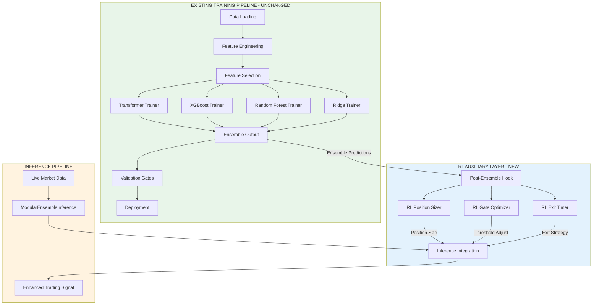
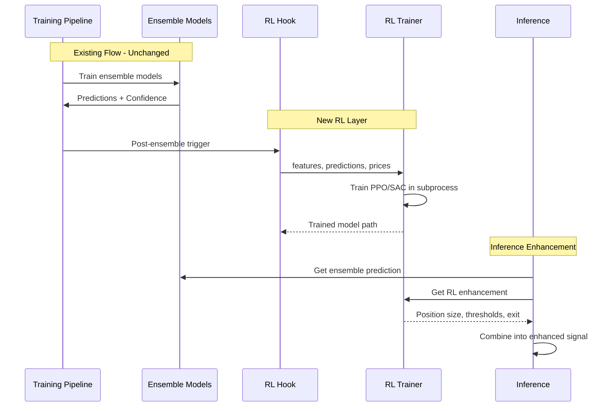
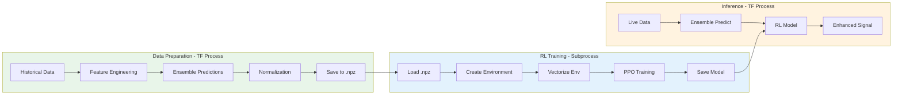
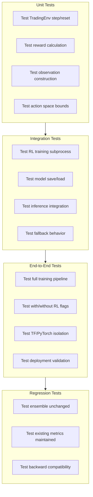

# RL Integration Strategy

**Document Purpose**: Comprehensive integration strategy for reinforcement learning components that preserves existing model training methodology.

**Date**: February 2026  
**Status**: Strategy Document  
**Version**: 1.0

---

## Table of Contents

1. [Executive Summary](#1-executive-summary)
2. [Design Principles](#2-design-principles)
3. [Architecture Overview](#3-architecture-overview)
4. [Reward Modeling Integration](#4-reward-modeling-integration)
5. [Policy Gradient Integration](#5-policy-gradient-integration)
6. [Implementation Phases](#6-implementation-phases)
7. [Code Structure Proposal](#7-code-structure-proposal)
8. [Configuration Schema](#8-configuration-schema)
9. [Testing and Validation](#9-testing-and-validation)
10. [Risk Assessment Matrix](#10-risk-assessment-matrix)
11. [Appendix: Interface Definitions](#appendix-interface-definitions)

---

## 1. Executive Summary

### 1.1 Strategy Overview

This document defines a **non-invasive RL integration strategy** that adds reinforcement learning capabilities to the ML trading engine without modifying the core training pipeline. The approach follows three fundamental principles:

| Principle | Description | Implementation |
|-----------|-------------|----------------|
| **Preservation** | Zero changes to Transformer/ensemble training | Post-ensemble hooks only |
| **Auxiliary** | RL as optional enhancement layer | Feature flags, graceful fallbacks |
| **Reversibility** | System works without RL | Default disabled, subprocess isolation |

### 1.2 Key Findings from Analysis

Based on the analysis documents:

1. **Existing RL Infrastructure**: The codebase already has a mature PPO-based position sizer ([`rl_position_sizing.py`](../rl_position_sizing.py)) with proven patterns for:
   - Lazy imports to avoid startup penalty
   - Subprocess isolation for TF/PyTorch compatibility
   - Graceful fallbacks when dependencies unavailable

2. **Integration Points Identified**: Five clean integration points with varying risk levels:
   - **Point A**: Pre-training data preparation (LOW risk)
   - **Point B**: Post-ensemble training (LOW risk) ← **Primary recommendation**
   - **Point C**: Inference pipeline (MEDIUM risk)
   - **Point D**: Online retraining loop (MEDIUM risk)
   - **Point E**: Deployment validation (LOW risk)

3. **Protected Components**: Clear identification of components that must not be modified:
   - Transformer architecture and loss functions
   - EMA/EWC/Replay Buffer mechanisms
   - Feature engineering pipeline
   - Model metadata and checkpoint formats

### 1.3 Recommended Approach

**Tier 1: Post-Ensemble RL Layer** (Immediate)

```
┌─────────────────────────────────────────────────────────────────┐
│                    EXISTING PIPELINE - UNCHANGED                 │
│  Data → Features → Transformer → XGBoost → RF → Ridge → Ensemble│
└───────────────────────────────┬─────────────────────────────────┘
                                │
                                ▼
┌─────────────────────────────────────────────────────────────────┐
│                    NEW RL AUXILIARY LAYER                        │
│  ┌─────────────────┐  ┌─────────────────┐  ┌─────────────────┐  │
│  │ RL Position     │  │ RL Gate         │  │ RL Exit         │  │
│  │ Sizer (PPO)     │  │ Optimizer (SAC) │  │ Timer (PPO)     │  │
│  │ [EXISTS]        │  │ [PLANNED]       │  │ [PLANNED]       │  │
│  └─────────────────┘  └─────────────────┘  └─────────────────┘  │
└─────────────────────────────────────────────────────────────────┘
```

---

## 2. Design Principles

### 2.1 Core Principles

#### P1: Zero Modification to Training Pipeline

The existing training pipeline in [`cli/training.py`](../cli/training.py) and [`src/training/trainers/transformer_trainer.py`](../src/training/trainers/transformer_trainer.py) must remain unchanged:

```python
# PROTECTED - Do NOT modify:
# - transformer_trainer.py:_build_model()
# - transformer_trainer.py:_create_loss_function()
# - transformer_trainer.py:train()
# - modular_trainers.py:EMACallback, EWCPenalty, ReplayBuffer
# - cli/training.py:make_sequence_dataset()
```

#### P2: RL as Optional Enhancement

All RL features must be toggleable:

```yaml
# config.yaml
rl_integration:
  enabled: false  # Default off - system works without RL
  position_sizing:
    enabled: true
    fallback_pct: 0.01  # 1% if RL unavailable
  gate_optimization:
    enabled: false
  exit_timing:
    enabled: false
```

#### P3: Subprocess Isolation for Framework Conflicts

TensorFlow (main system) and PyTorch (stable-baselines3) cannot coexist in the same process on macOS without conflicts. Use the existing subprocess pattern:

```python
# From cli/training_ops.py:train_rl_sizer()
# Pattern: Generate data with TF, train RL in subprocess
cmd = [python_exe, str(script_path), "--data", str(data_file)]
process = subprocess.Popen(cmd, ...)
```

### 2.2 Integration Patterns

| Pattern | Use Case | Risk | Example |
|---------|----------|------|---------|
| **Post-Ensemble Hook** | Training RL after ensemble | LOW | [`_train_rl_position_sizer_if_ready()`](../cli/training.py) |
| **Inference Wrapper** | Enhancing signals at inference | MEDIUM | `RLInferenceIntegration.enhance()` |
| **Subprocess Training** | TF/PyTorch isolation | LOW | [`train_rl_sizer()`](../cli/training_ops.py) |
| **Callback Integration** | Epoch-level RL updates | MEDIUM | `RLIntegrationCallback` (proposed) |

---

## 3. Architecture Overview

### 3.1 Component Diagram



### 3.2 Data Flow Architecture



### 3.3 Component Responsibilities

| Component | File | Responsibility | Modified |
|-----------|------|----------------|----------|
| **Post-Ensemble Hook** | [`cli/training.py`](../cli/training.py) | Trigger RL training after ensemble | Extended |
| **RL Position Sizer** | [`rl_position_sizing.py`](../rl_position_sizing.py) | PPO-based position sizing | Existing |
| **RL Gate Optimizer** | `src/training/rl/gate_optimizer.py` | SAC-based threshold adaptation | New |
| **RL Exit Timer** | `src/training/rl/exit_timer.py` | PPO-based exit timing | New |
| **Inference Integration** | `src/core/rl_inference_integration.py` | Combine RL with ensemble | New |

---

## 4. Reward Modeling Integration

### 4.1 Overview

Reward modeling uses ensemble predictions to create a reward signal for RL agents. The existing [`TradingEnv`](../rl_position_sizing.py:149) already implements a sophisticated reward function.

### 4.2 Existing Reward Structure

From [`rl_position_sizing.py:_calculate_reward()`](../rl_position_sizing.py:259):

```python
def _calculate_reward(self, pnl: float) -> float:
    """
    Reward = Base_P/L + Sharpe_Adjustment - Drawdown_Penalty + Win_Rate_Bonus
    """
    # 1. Base reward: normalized P/L
    reward = pnl / self.initial_balance * 100
    
    # 2. Sharpe component: reward consistency
    if len(self.trade_history) > 5:
        sharpe = np.mean(returns) / np.std(returns)
        reward += self.config.sharpe_weight * sharpe
    
    # 3. Drawdown penalty
    if drawdown > 0.05:
        reward -= self.config.drawdown_penalty * drawdown * 100
    
    # 4. Win rate bonus
    if win_rate > 0.5:
        reward += self.config.win_rate_bonus * (win_rate - 0.5) * 10
    
    return reward
```

### 4.3 Reward Model Training Pipeline

**Proposed Extension**: Train a separate reward model using ensemble predictions as features.

```python
# Proposed: src/training/rl/reward_model.py

@dataclass
class RewardModelConfig:
    """Configuration for reward model training."""
    use_ensemble_predictions: bool = True
    include_risk_metrics: bool = True
    reward_horizon_bars: int = 24  # H1 bars = 24 hours
    normalize_rewards: bool = True

class EnsembleRewardModel:
    """
    Learns to predict optimal rewards from ensemble outputs.
    
    Uses historical trade outcomes to learn a reward function that
    incorporates ensemble confidence, momentum, and risk signals.
    """
    
    def __init__(self, config: Optional[RewardModelConfig] = None):
        self.config = config or RewardModelConfig()
        self.model = None  # Ridge regression or small neural net
    
    def train(
        self,
        ensemble_predictions: np.ndarray,  # [direction_prob, confidence, momentum, risk]
        actual_returns: np.ndarray,         # Realized P/L
        risk_adjusted_returns: np.ndarray,  # Sharpe-adjusted returns
    ) -> Dict[str, Any]:
        """Train reward model on historical data."""
        # Construct features from ensemble predictions
        features = self._construct_features(ensemble_predictions)
        
        # Target: risk-adjusted returns
        targets = risk_adjusted_returns
        
        # Train simple model (Ridge for interpretability)
        from sklearn.linear_model import Ridge
        self.model = Ridge(alpha=1.0)
        self.model.fit(features, targets)
        
        return {"r2_score": self.model.score(features, targets)}
    
    def predict_reward(
        self,
        ensemble_predictions: np.ndarray,
    ) -> float:
        """Predict reward for current ensemble output."""
        features = self._construct_features(ensemble_predictions)
        return self.model.predict(features.reshape(1, -1))[0]
```

### 4.4 Integration Point

```python
# Extension to TradingEnv in rl_position_sizing.py

class TradingEnv(gym.Env):
    def __init__(
        self,
        features: np.ndarray,
        ensemble_predictions: np.ndarray,
        prices: np.ndarray,
        config: Optional[RLConfig] = None,
        reward_model: Optional[EnsembleRewardModel] = None,  # NEW
    ):
        self.reward_model = reward_model
        # ... existing init code ...
    
    def _calculate_reward(self, pnl: float) -> float:
        """Calculate shaped reward with optional learned component."""
        # Base reward (existing logic)
        base_reward = super()._calculate_reward(pnl)
        
        # Add learned reward if available
        if self.reward_model is not None:
            ensemble_pred = self.ensemble_predictions[self.current_step]
            learned_reward = self.reward_model.predict_reward(ensemble_pred)
            return base_reward + 0.3 * learned_reward  # Weight learned component
        
        return base_reward
```

### 4.5 Configuration

```yaml
# config/config_improved_H1.yaml extension

rl_integration:
  reward_model:
    enabled: false  # Phase 2 feature
    use_ensemble_predictions: true
    include_risk_metrics: true
    reward_horizon_bars: 24
    weight_in_env: 0.3  # 30% weight in total reward
```

---

## 5. Policy Gradient Integration

### 5.1 Existing PPO Implementation

The codebase uses PPO (Proximal Policy Optimization) via stable-baselines3:

```python
# From rl_position_sizing.py:532
self.model = PPO(
    "MlpPolicy",           # Standard MLP policy network
    vec_env,               # Vectorized environment
    learning_rate=3e-4,
    n_steps=2048,
    batch_size=64,
    n_epochs=10,
    gamma=0.99,
    gae_lambda=0.95,
    verbose=0,
    device="cpu",          # Force CPU for TF compatibility
)
```

### 5.2 State/Action Space Design

#### Current State Space (Position Sizer)

```python
# Observation vector dimension: n_features + 6
observation = np.concatenate([
    market_features,          # Shape: (n_features,)
    [direction_prob, confidence],  # Ensemble predictions: (2,)
    [equity_pct, drawdown, daily_pnl_pct, win_rate],  # Account: (4,)
])
```

#### Proposed State Space Extensions

| Component | Current | Proposed Extension | Purpose |
|-----------|---------|-------------------|---------|
| Market Features | ✅ n_features | + Regime one-hot (5) | Market context |
| Ensemble Predictions | ✅ 2 | + All 4 model outputs | Full ensemble signal |
| Account State | ✅ 4 | + Position duration | Time-based decisions |
| Risk Metrics | ❌ | + VaR, ATR percentile | Risk awareness |

```python
# Proposed extended observation space
class ExtendedTradingEnv(TradingEnv):
    def _get_observation(self) -> np.ndarray:
        # Existing components
        base_obs = super()._get_observation()
        
        # Extended components
        regime_onehot = self._get_regime_onehot()  # 5 classes
        all_model_outputs = self._get_all_model_outputs()  # 4 values
        position_duration = min(self.bars_held / 24.0, 1.0)  # Normalized
        var_estimate = self._calculate_var()  # Single value
        
        return np.concatenate([
            base_obs,
            regime_onehot,
            all_model_outputs,
            [position_duration, var_estimate],
        ])
```

### 5.3 Action Space Design

#### Current Actions (Position Sizer)

```python
# Discrete: 6 position size levels
POSITION_LEVELS = [0.0, 0.01, 0.03, 0.05, 0.07, 0.10]
action_space = spaces.Discrete(6)
```

#### Proposed Action Spaces by Component

| Component | Action Type | Space | Values |
|-----------|-------------|-------|--------|
| **Position Sizer** | Discrete | 6 | [0%, 1%, 3%, 5%, 7%, 10%] |
| **Gate Optimizer** | Continuous | 4 | [confidence_thresh, momentum_thresh, risk_thresh, meta_thresh] |
| **Exit Timer** | Discrete | 3 | [HOLD, TAKE_PROFIT, STOP_LOSS] |

### 5.4 Policy Network Architecture

```python
# Proposed: Custom policy for trading-specific architecture

from stable_baselines3.common.policies import ActorCriticPolicy

class TradingPolicy(ActorCriticPolicy):
    """
    Custom policy with trading-specific architecture.
    
    - Separate encoders for market features vs account state
    - Attention mechanism for temporal patterns
    - Risk-aware value function
    """
    
    def __init__(self, *args, **kwargs):
        super().__init__(*args, **kwargs)
        
        # Market feature encoder (larger)
        self.market_encoder = nn.Sequential(
            nn.Linear(n_features, 64),
            nn.ReLU(),
            nn.Linear(64, 32),
        )
        
        # Account state encoder (smaller)
        self.account_encoder = nn.Sequential(
            nn.Linear(6, 16),
            nn.ReLU(),
        )
        
        # Combined processor
        self.combined = nn.Sequential(
            nn.Linear(48, 32),
            nn.ReLU(),
        )
```

### 5.5 Training Data Flow



---

## 6. Implementation Phases

### 6.1 Phase 1: Low-Risk Extensions

**Goal**: Extend existing RL infrastructure with minimal changes.

| Task | File | Risk | Effort |
|------|------|------|--------|
| Document RL position sizer usage | `docs/RL_POSITION_SIZER_GUIDE.md` | LOW | Small |
| Add RL config to YAML | `config/config_improved_H1.yaml` | LOW | Small |
| Create RL training CLI improvements | `cli/training_ops.py` | LOW | Medium |
| Add RL metrics to TensorBoard | `src/training/rl/tensorboard_callback.py` | LOW | Small |

**Specific Changes**:

```yaml
# Add to config/config_improved_H1.yaml

rl_integration:
  enabled: true
  
  position_sizing:
    enabled: true
    timesteps: 500_000
    learning_rate: 3e-4
    fallback_pct: 0.01
    
  # Existing hook in training.py
  auto_train_after_ensemble: true
```

```python
# Extension to cli/training_ops.py

def train_rl_sizer(
    config_path: str = DEFAULT_CONFIG_PATH,
    *,
    timesteps: int = 500_000,
    # NEW: Additional configuration options
    use_extended_obs: bool = False,
    use_learned_reward: bool = False,
    **kwargs: Any,
) -> None:
    """
    Train RL position sizing agent using PPO.
    
    NEW in Phase 1:
    - Extended observation space option
    - Learned reward model option
    - TensorBoard logging
    """
```

### 6.2 Phase 2: Medium-Risk Additions

**Goal**: Add new RL components following established patterns.

| Task | File | Risk | Effort |
|------|------|------|--------|
| Create RL gate optimizer | `src/training/rl/gate_optimizer.py` | MEDIUM | Medium |
| Create gate threshold environment | `src/training/rl/environments/gate_env.py` | MEDIUM | Medium |
| Create RL exit timer | `src/training/rl/exit_timer.py` | MEDIUM | Medium |
| Create exit timing environment | `src/training/rl/environments/exit_env.py` | MEDIUM | Medium |
| Create inference integration | `src/core/rl_inference_integration.py` | MEDIUM | Large |

**New Files Structure**:

```
src/training/rl/
├── __init__.py
├── position_sizer.py       # Moved from rl_position_sizing.py
├── gate_optimizer.py       # NEW: SAC-based threshold optimizer
├── exit_timer.py           # NEW: PPO-based exit timing
├── reward_model.py         # NEW: Learned reward function
├── environments/
│   ├── __init__.py
│   ├── trading_env.py      # Moved from rl_position_sizing.py
│   ├── gate_env.py         # NEW: Gate threshold environment
│   └── exit_env.py         # NEW: Exit timing environment
└── utils/
    ├── __init__.py
    ├── lazy_imports.py     # Lazy import utilities
    └── tensorboard.py      # TensorBoard callbacks
```

**Gate Optimizer Interface**:

```python
# src/training/rl/gate_optimizer.py

@dataclass
class GateOptimizerConfig:
    """Configuration for RL gate threshold optimizer."""
    # Environment
    observation_window: int = 60
    n_thresholds: int = 4  # confidence, momentum, risk, meta
    
    # SAC hyperparameters
    total_timesteps: int = 100_000
    learning_rate: float = 3e-4
    buffer_size: int = 100_000
    batch_size: int = 256
    
    # Threshold bounds
    confidence_bounds: Tuple[float, float] = (0.5, 0.8)
    momentum_bounds: Tuple[float, float] = (0.1, 0.5)
    risk_bounds: Tuple[float, float] = (0.01, 0.05)
    meta_bounds: Tuple[float, float] = (0.5, 0.7)


class GateThresholdEnv(gym.Env):
    """
    Environment for learning adaptive gate thresholds.
    
    Observation:
        - Recent prediction accuracy
        - Current market regime
        - Volatility percentile
        - Current threshold values
        
    Action (Continuous):
        - [confidence_thresh, momentum_thresh, risk_thresh, meta_thresh]
        
    Reward:
        - Sharpe ratio of filtered signals
        - Penalty for too few/many signals
    """
    
    def __init__(
        self,
        features: np.ndarray,
        ensemble_predictions: np.ndarray,
        prices: np.ndarray,
        config: Optional[GateOptimizerConfig] = None,
    ):
        super().__init__()
        self.config = config or GateOptimizerConfig()
        
        # Observation: accuracy metrics + regime + thresholds
        obs_dim = 10 + 5 + 4  # accuracy_history + regime_onehot + thresholds
        self.observation_space = spaces.Box(
            low=-np.inf, high=np.inf, shape=(obs_dim,), dtype=np.float32
        )
        
        # Action: 4 continuous threshold values
        self.action_space = spaces.Box(
            low=np.array([0.5, 0.1, 0.01, 0.5]),
            high=np.array([0.8, 0.5, 0.05, 0.7]),
            dtype=np.float32,
        )


class RLGateOptimizer:
    """
    RL-based gate threshold optimizer using SAC.
    
    Learns to adapt confidence, momentum, risk, and meta-labeling
    thresholds based on market conditions.
    """
    
    def __init__(self, config: Optional[GateOptimizerConfig] = None):
        self.config = config or GateOptimizerConfig()
        self.model = None
        self.scaler = None
        self._is_trained = False
    
    def train(
        self,
        features: np.ndarray,
        ensemble_predictions: np.ndarray,
        prices: np.ndarray,
        **kwargs,
    ) -> Dict[str, Any]:
        """Train SAC model for gate optimization."""
        _ensure_sb3_imported()
        
        # Create environment
        env = GateThresholdEnv(features, ensemble_predictions, prices, self.config)
        vec_env = DummyVecEnv([lambda: env])
        
        # Create SAC model (continuous actions)
        self.model = SAC(
            "MlpPolicy",
            vec_env,
            learning_rate=self.config.learning_rate,
            buffer_size=self.config.buffer_size,
            batch_size=self.config.batch_size,
            verbose=0,
            device="cpu",
        )
        
        # Train
        self.model.learn(total_timesteps=self.config.total_timesteps)
        self._is_trained = True
        
        return {"timesteps": self.config.total_timesteps}
    
    def get_thresholds(
        self,
        features: np.ndarray,
        regime: str = "NORMAL",
    ) -> Dict[str, float]:
        """Get optimal thresholds for current market state."""
        if not self._is_trained:
            return self._default_thresholds()
        
        obs = self._construct_observation(features, regime)
        action, _ = self.model.predict(obs, deterministic=True)
        
        return {
            "confidence": action[0],
            "momentum": action[1],
            "risk": action[2],
            "meta": action[3],
        }
```

### 6.3 Phase 3: Future Considerations

**Goal**: Exploratory RL integration with higher risk/reward.

| Task | Description | Risk | Dependencies |
|------|-------------|------|--------------|
| RL for feature selection | Learn which features to use | HIGH | Phase 1, 2 |
| RL for hyperparameter optimization | Replace Optuna with RL | HIGH | Phase 1, 2 |
| Multi-agent RL | Separate agents for entry/exit | HIGH | Phase 1, 2 |
| RL for regime detection | Learn regime classification | MEDIUM | Phase 2 |

**Research Areas**:

1. **Meta-Learning with RL**: Use RL to learn how to adapt model parameters across market regimes
2. **Curriculum Learning**: Progressive difficulty in RL training environments
3. **Inverse RL**: Learn reward functions from expert trading demonstrations

---

## 7. Code Structure Proposal

### 7.1 Directory Structure

```
ml_engine/
├── src/
│   ├── training/
│   │   ├── trainers/
│   │   │   ├── transformer_trainer.py  # UNCHANGED
│   │   │   └── config.py               # UNCHANGED
│   │   ├── rl/                          # NEW DIRECTORY
│   │   │   ├── __init__.py
│   │   │   ├── position_sizer.py        # MOVED from rl_position_sizing.py
│   │   │   ├── gate_optimizer.py        # NEW
│   │   │   ├── exit_timer.py            # NEW
│   │   │   ├── reward_model.py          # NEW
│   │   │   ├── environments/
│   │   │   │   ├── __init__.py
│   │   │   │   ├── trading_env.py       # MOVED
│   │   │   │   ├── gate_env.py          # NEW
│   │   │   │   └── exit_env.py          # NEW
│   │   │   └── utils/
│   │   │       ├── __init__.py
│   │   │       ├── lazy_imports.py
│   │   │       └── tensorboard.py
│   │   └── ...                          # Other existing modules
│   ├── core/
│   │   ├── modular_inference.py         # UNCHANGED
│   │   └── rl_inference_integration.py  # NEW
│   └── ...
├── cli/
│   ├── training.py                      # EXTENDED: Add RL hooks
│   └── training_ops.py                  # EXTENDED: Add RL commands
├── config/
│   └── config_improved_H1.yaml          # EXTENDED: Add RL section
├── rl_position_sizing.py                # DEPRECATED: Move to src/training/rl/
└── train_rl_standalone.py              # KEEP: Subprocess entry point
```

### 7.2 File Modification Summary

| File | Action | Changes |
|------|--------|---------|
| [`rl_position_sizing.py`](../rl_position_sizing.py) | Deprecate | Move to `src/training/rl/`, keep import shim |
| [`cli/training.py`](../cli/training.py) | Extend | Add configuration passthrough to RL hooks |
| [`cli/training_ops.py`](../cli/training_ops.py) | Extend | Add new RL training commands |
| [`config/config_improved_H1.yaml`](../config/config_improved_H1.yaml) | Extend | Add `rl_integration` section |
| `src/core/modular_inference.py` | Extend | Add optional RL enhancement |

### 7.3 Import Shim for Backward Compatibility

```python
# rl_position_sizing.py (after refactoring)
"""
DEPRECATED: This module has been moved to src/training/rl/position_sizer.py

This file remains for backward compatibility and will be removed in a future version.
"""

import warnings
from src.training.rl.position_sizer import (
    RLPositionSizer,
    TradingEnv,
    RLConfig,
    POSITION_LEVELS,
)

warnings.warn(
    "Importing from rl_position_sizing is deprecated. "
    "Use 'from src.training.rl.position_sizer import ...' instead.",
    DeprecationWarning,
    stacklevel=2,
)

__all__ = ["RLPositionSizer", "TradingEnv", "RLConfig", "POSITION_LEVELS"]
```

---

## 8. Configuration Schema

### 8.1 Complete RL Configuration

```yaml
# =============================================================================
# RL INTEGRATION CONFIGURATION
# =============================================================================
# Comprehensive configuration for reinforcement learning components.
# All RL features are optional and disabled by default.

rl_integration:
  # Master switch - disables all RL when false
  enabled: false
  
  # =======================================================================
  # POSITION SIZING (PPO)
  # =======================================================================
  position_sizing:
    enabled: true
    model_path: "trained_data/models/rl_position_sizer.zip"
    scaler_path: "trained_data/models/rl_scaler.pkl"
    
    # Training settings
    timesteps: 500_000
    learning_rate: 3e-4
    n_steps: 2048
    batch_size: 64
    n_epochs: 10
    gamma: 0.99
    gae_lambda: 0.95
    
    # Environment settings
    sequence_length: 60
    max_position_pct: 0.10
    min_position_pct: 0.01
    
    # Reward shaping
    sharpe_weight: 0.1
    drawdown_penalty: 0.5
    win_rate_bonus: 0.2
    
    # Risk limits
    max_drawdown_pct: 0.10
    daily_loss_limit_pct: 0.03
    
    # Fallback when RL unavailable
    fallback_pct: 0.01
    
  # =======================================================================
  # GATE OPTIMIZATION (SAC)
  # =======================================================================
  gate_optimization:
    enabled: false  # Phase 2 feature
    model_path: "trained_data/models/sac_gate_thresholds.zip"
    
    # Training settings
    timesteps: 100_000
    learning_rate: 3e-4
    buffer_size: 100_000
    batch_size: 256
    
    # Threshold bounds [min, max]
    confidence_bounds: [0.5, 0.8]
    momentum_bounds: [0.1, 0.5]
    risk_bounds: [0.01, 0.05]
    meta_bounds: [0.5, 0.7]
    
    # Default thresholds (when RL not trained)
    default_thresholds:
      confidence: 0.60
      momentum: 0.20
      risk: 0.025
      meta: 0.55
      
  # =======================================================================
  # EXIT TIMING (PPO)
  # =======================================================================
  exit_timing:
    enabled: false  # Phase 2 feature
    model_path: "trained_data/models/ppo_optimal_exit.zip"
    
    # Training settings
    timesteps: 100_000
    learning_rate: 3e-4
    
    # Action space: [HOLD, TAKE_PROFIT, STOP_LOSS]
    hold_action: 0
    take_profit_action: 1
    stop_loss_action: 2
    
    # Exit thresholds
    min_profit_for_tp: 0.002  # 0.2%
    max_loss_for_sl: -0.003   # -0.3%
    max_bars_held: 24
    
  # =======================================================================
  # REWARD MODEL
  # =======================================================================
  reward_model:
    enabled: false  # Phase 2 feature
    use_ensemble_predictions: true
    include_risk_metrics: true
    reward_horizon_bars: 24
    normalize_rewards: true
    weight_in_env: 0.3
    
  # =======================================================================
  # INFERENCE INTEGRATION
  # =======================================================================
  inference:
    # How to combine RL with ensemble
    position_size_source: "rl"  # "rl", "fixed", "kelly"
    
    # RL enhancement weights
    threshold_adaptation_weight: 0.5
    exit_timing_confidence: 0.7
    
    # Graceful degradation
    fallback_on_error: true
    log_rl_decisions: true
```

### 8.2 Configuration Loading

```python
# src/training/rl/config.py

from dataclasses import dataclass, field
from typing import Dict, List, Optional, Tuple
from pathlib import Path
import yaml


@dataclass
class RLPositionSizingConfig:
    enabled: bool = True
    timesteps: int = 500_000
    learning_rate: float = 3e-4
    fallback_pct: float = 0.01
    model_path: str = "trained_data/models/rl_position_sizer.zip"
    # ... other fields


@dataclass
class RLGateOptimizationConfig:
    enabled: bool = False
    timesteps: int = 100_000
    default_thresholds: Dict[str, float] = field(
        default_factory=lambda: {
            "confidence": 0.60,
            "momentum": 0.20,
            "risk": 0.025,
            "meta": 0.55,
        }
    )
    # ... other fields


@dataclass
class RLIntegrationConfig:
    """Top-level RL integration configuration."""
    enabled: bool = False
    position_sizing: RLPositionSizingConfig = field(default_factory=RLPositionSizingConfig)
    gate_optimization: RLGateOptimizationConfig = field(default_factory=RLGateOptimizationConfig)
    exit_timing: "RLOptimalExitConfig" = field(default_factory=lambda: RLOptimalExitConfig())
    
    @classmethod
    def from_yaml(cls, path: str = "config/config_improved_H1.yaml") -> "RLIntegrationConfig":
        """Load configuration from YAML file."""
        with open(path) as f:
            data = yaml.safe_load(f)
        
        rl_data = data.get("rl_integration", {})
        
        return cls(
            enabled=rl_data.get("enabled", False),
            position_sizing=RLPositionSizingConfig(
                **rl_data.get("position_sizing", {})
            ),
            gate_optimization=RLGateOptimizationConfig(
                **rl_data.get("gate_optimization", {})
            ),
            # ... other components
        )
```

---

## 9. Testing and Validation

### 9.1 Test Strategy



### 9.2 Test File Structure

```
tests/
├── rl/
│   ├── __init__.py
│   ├── test_trading_env.py        # Unit tests for TradingEnv
│   ├── test_position_sizer.py     # Unit tests for RLPositionSizer
│   ├── test_gate_optimizer.py     # Unit tests for GateOptimizer
│   ├── test_exit_timer.py         # Unit tests for ExitTimer
│   ├── test_reward_model.py       # Unit tests for RewardModel
│   ├── test_inference_integration.py  # Integration tests
│   └── test_subprocess_training.py    # Subprocess isolation tests
└── regression/
    ├── test_ensemble_unchanged.py # Verify ensemble not affected
    └── test_backward_compat.py    # Import compatibility
```

### 9.3 Key Test Cases

```python
# tests/rl/test_position_sizer.py

import pytest
import numpy as np
from src.training.rl.position_sizer import (
    RLPositionSizer,
    TradingEnv,
    RLConfig,
)


class TestTradingEnv:
    """Unit tests for TradingEnv."""
    
    @pytest.fixture
    def env_data(self):
        n_samples = 1000
        n_features = 20
        return {
            "features": np.random.randn(n_samples, n_features),
            "predictions": np.column_stack([
                np.random.uniform(0.4, 0.6, n_samples),
                np.random.uniform(0.3, 0.7, n_samples),
            ]),
            "prices": 100 + np.cumsum(np.random.randn(n_samples) * 0.5),
        }
    
    def test_reset_returns_observation(self, env_data):
        """Test that reset returns valid observation."""
        env = TradingEnv(
            features=env_data["features"],
            ensemble_predictions=env_data["predictions"],
            prices=env_data["prices"],
        )
        obs, info = env.reset()
        
        assert obs is not None
        assert obs.shape == env.observation_space.shape
        assert isinstance(info, dict)
    
    def test_step_returns_valid_tuple(self, env_data):
        """Test that step returns valid (obs, reward, terminated, truncated, info)."""
        env = TradingEnv(
            features=env_data["features"],
            ensemble_predictions=env_data["predictions"],
            prices=env_data["prices"],
        )
        env.reset()
        
        action = env.action_space.sample()
        obs, reward, terminated, truncated, info = env.step(action)
        
        assert obs is not None
        assert isinstance(reward, (int, float))
        assert isinstance(terminated, bool)
        assert isinstance(truncated, bool)
        assert isinstance(info, dict)
    
    def test_max_drawdown_termination(self, env_data):
        """Test that environment terminates on max drawdown."""
        config = RLConfig(max_drawdown_pct=0.01)  # Very low threshold
        env = TradingEnv(
            features=env_data["features"],
            ensemble_predictions=env_data["predictions"],
            prices=env_data["prices"],
            config=config,
        )
        env.reset()
        
        # Take maximum position repeatedly to trigger drawdown
        terminated = False
        for _ in range(100):
            action = 5  # Max position
            _, _, terminated, _, _ = env.step(action)
            if terminated:
                break
        
        assert terminated, "Should terminate on max drawdown"


class TestRLPositionSizer:
    """Unit tests for RLPositionSizer."""
    
    def test_fallback_when_not_trained(self):
        """Test that untrained sizer returns fallback position."""
        sizer = RLPositionSizer()
        features = np.random.randn(20)
        prediction = np.array([0.5, 0.5])
        
        position = sizer.get_position_size(features, prediction, account_equity=10000)
        
        # Should return fallback (1% of equity)
        assert position == 100.0
    
    def test_load_missing_model_returns_false(self):
        """Test that loading missing model returns False."""
        sizer = RLPositionSizer()
        result = sizer.load(
            model_path=Path("/nonexistent/model.zip"),
            scaler_path=Path("/nonexistent/scaler.pkl"),
        )
        
        assert result is False
        assert not sizer._is_trained


# tests/rl/test_inference_integration.py

class TestRLInferenceIntegration:
    """Integration tests for RL inference."""
    
    def test_rl_disabled_system_works(self):
        """Test that system works with RL completely disabled."""
        from src.core.modular_inference import ModularEnsembleInference
        
        ensemble = ModularEnsembleInference(use_rl_sizer=False)
        # Should work without RL
        
    def test_rl_fallback_on_error(self):
        """Test that RL errors fall back gracefully."""
        from src.core.rl_inference_integration import RLInferenceIntegration
        
        integration = RLInferenceIntegration(config=RLIntegrationConfig(enabled=True))
        
        # Should not raise, should use fallback
        signal = integration.enhance(None)  # Invalid input
        
        assert signal is not None
```

### 9.4 Regression Test

```python
# tests/regression/test_ensemble_unchanged.py

import pytest
import hashlib
import ast


class TestEnsembleUnchanged:
    """Verify that RL integration does not modify ensemble training."""
    
    PROTECTED_FILES = [
        "src/training/trainers/transformer_trainer.py",
        "src/training/trainers/config.py",
        "src/training/modular_trainers.py",
        "src/data/feature_engineering.py",
    ]
    
    # Expected hashes of protected files (update when intentionally changing)
    EXPECTED_HASHES = {
        "src/training/trainers/transformer_trainer.py": "abc123...",
        # ... other hashes
    }
    
    def test_protected_files_not_modified(self):
        """Verify protected files have not been modified."""
        for file_path, expected_hash in self.EXPECTED_HASHES.items():
            with open(file_path, "rb") as f:
                content = f.read()
            
            actual_hash = hashlib.sha256(content).hexdigest()[:16]
            
            assert actual_hash == expected_hash, (
                f"Protected file {file_path} has been modified! "
                f"Expected hash {expected_hash}, got {actual_hash}"
            )
    
    def test_no_rl_imports_in_protected_files(self):
        """Verify protected files don't import RL modules."""
        rl_imports = [
            "stable_baselines3",
            "gymnasium",
            "src.training.rl",
        ]
        
        for file_path in self.PROTECTED_FILES:
            with open(file_path) as f:
                content = f.read()
            
            tree = ast.parse(content)
            
            for node in ast.walk(tree):
                if isinstance(node, ast.Import):
                    for alias in node.names:
                        assert alias.name not in rl_imports, (
                            f"Found RL import '{alias.name}' in protected file {file_path}"
                        )
```

---

## 10. Risk Assessment Matrix

### 10.1 Risk Categories

| Risk ID | Category | Description | Likelihood | Impact | Mitigation |
|---------|----------|-------------|------------|--------|------------|
| R1 | Framework Conflict | TF/PyTorch GPU deadlock | HIGH | HIGH | Subprocess isolation |
| R2 | Performance | RL training slow | MEDIUM | LOW | Progress callbacks, async |
| R3 | Memory | OOM during RL training | MEDIUM | MEDIUM | Batch sampling, cleanup |
| R4 | Compatibility | SB3 version mismatch | MEDIUM | MEDIUM | Version pinning, lazy imports |
| R5 | Integration | RL affects ensemble | LOW | HIGH | Protected files, regression tests |
| R6 | Deployment | RL model missing | MEDIUM | LOW | Fallback mechanisms |
| R7 | Overfitting | RL overfits to backtest | HIGH | MEDIUM | Walk-forward validation |
| R8 | Latency | RL inference slow | LOW | MEDIUM | Model optimization, caching |

### 10.2 Detailed Risk Analysis

#### R1: Framework Conflict (HIGH/HIGH)

**Description**: TensorFlow and PyTorch cannot coexist in the same process on macOS with GPU acceleration. This causes deadlocks or segfaults.

**Mitigation**:
1. **Subprocess Isolation**: All RL training runs in a separate process
2. **CPU-Only RL**: Force `device="cpu"` in stable-baselines3
3. **Environment Variables**: Set `CUDA_VISIBLE_DEVICES=""` before PyTorch imports

```python
# Mitigation code from rl_position_sizing.py
os.environ.setdefault("CUDA_VISIBLE_DEVICES", "")
os.environ.setdefault("PYTORCH_ENABLE_MPS_FALLBACK", "1")
```

**Verification**: Test suite includes `test_subprocess_training.py`

#### R5: Integration Affects Ensemble (LOW/HIGH)

**Description**: RL integration accidentally modifies ensemble training behavior.

**Mitigation**:
1. **Protected Files**: Explicit list of files that must not be modified
2. **Regression Tests**: Hash verification of protected files
3. **Code Review**: Require approval for changes to protected areas
4. **Feature Flags**: RL disabled by default

**Verification**: `tests/regression/test_ensemble_unchanged.py`

#### R7: RL Overfitting (HIGH/MEDIUM)

**Description**: RL agent overfits to historical data and performs poorly in live trading.

**Mitigation**:
1. **Walk-Forward Validation**: Train on [0, T], validate on [T, T+dt]
2. **Multiple Environments**: Train across different market regimes
3. **Regularization**: Dropout, entropy bonus in PPO
4. **Out-of-Sample Testing**: Hold out final 20% of data

```python
# Mitigation in environment
class TradingEnv(gym.Env):
    def __init__(self, ..., validation_mode: bool = False):
        if validation_mode:
            # Use unseen data slice
            self.features = features[train_split:]
```

### 10.3 Risk Mitigation Checklist

```markdown
## Pre-Deployment Checklist

- [ ] All regression tests pass
- [ ] RL training completed in subprocess
- [ ] Fallback mechanisms tested
- [ ] Model files saved and loadable
- [ ] Configuration validated
- [ ] Memory usage within limits
- [ ] Inference latency acceptable
- [ ] Walk-forward validation passed
- [ ] No imports of RL in protected files
```

---

## Appendix: Interface Definitions

### A.1 RLPositionSizer Interface

```python
class RLPositionSizer:
    """
    RL-based position sizer using PPO.
    
    Uses trained ensemble predictions + market features to determine
    optimal position size for each trade.
    """
    
    def __init__(self, config: Optional[RLConfig] = None):
        """Initialize position sizer with configuration."""
    
    def train(
        self,
        features: np.ndarray,
        ensemble_predictions: np.ndarray,
        prices: np.ndarray,
        *,
        eval_freq: int = 10000,
        verbose: int = 1,
        callback: Any = None,
    ) -> Dict[str, Any]:
        """
        Train RL position sizer.
        
        Args:
            features: Market features (n_samples, n_features)
            ensemble_predictions: Predictions (n_samples, 2) - [direction_prob, confidence]
            prices: Close prices (n_samples,)
            eval_freq: Evaluation frequency
            verbose: Verbosity level
            callback: Optional callback for progress tracking
            
        Returns:
            Training statistics dictionary
        """
    
    def get_position_size(
        self,
        features: np.ndarray,
        ensemble_prediction: np.ndarray,
        account_equity: float = 10000.0,
    ) -> float:
        """
        Get optimal position size for current market state.
        
        Args:
            features: Current market features (n_features,)
            ensemble_prediction: Current prediction [direction_prob, confidence]
            account_equity: Current account equity
            
        Returns:
            Position size in dollars (not percentage)
        """
    
    def save(self, model_path: Optional[Path] = None, scaler_path: Optional[Path] = None) -> None:
        """Save model and scaler to disk."""
    
    def load(self, model_path: Optional[Path] = None, scaler_path: Optional[Path] = None) -> bool:
        """Load model and scaler from disk. Returns True if successful."""
    
    @property
    def is_available(self) -> bool:
        """Check if RL position sizing is available."""
```

### A.2 RLInferenceIntegration Interface

```python
class RLInferenceIntegration:
    """
    Integrates RL components into the inference pipeline.
    
    Usage:
        ensemble = ModularEnsembleInference()
        rl_integration = RLInferenceIntegration()
        
        signal = ensemble.predict(df)
        enhanced_signal = rl_integration.enhance(signal)
    """
    
    def __init__(self, config: Optional[RLIntegrationConfig] = None):
        """Initialize with configuration."""
        self.config = config or RLIntegrationConfig()
        self._load_rl_components()
    
    def enhance(self, signal: TradingSignal) -> TradingSignal:
        """
        Apply RL enhancements to ensemble signal.
        
        Modifications:
        1. Adjust position size using RL sizer
        2. Adjust thresholds using RL gate optimizer
        3. Set exit strategy using RL exit timer
        
        Returns:
            Enhanced trading signal (or original if RL disabled/error)
        """
    
    def get_position_size(
        self,
        features: np.ndarray,
        ensemble_prediction: np.ndarray,
        account_equity: float,
    ) -> float:
        """Get position size from RL sizer with fallback."""
    
    def get_adaptive_thresholds(
        self,
        features: np.ndarray,
        regime: str,
    ) -> Dict[str, float]:
        """Get adaptive thresholds from RL gate optimizer."""
    
    def get_exit_decision(
        self,
        pnl: float,
        bars_held: int,
        features: np.ndarray,
    ) -> str:
        """Get exit decision from RL exit timer."""
```

### A.3 GateThresholdEnv Interface

```python
class GateThresholdEnv(gym.Env):
    """
    Gymnasium environment for RL-based gate threshold optimization.
    
    Observation Space (19 dimensions):
        - Prediction accuracy history (10): Rolling accuracy of last 10 predictions
        - Market regime one-hot (5): [STRONG_TREND, WEAK_TREND, CHOP, MEAN_REVERT, BREAKOUT]
        - Volatility percentile (1): Current ATR percentile
        - Current thresholds (4): [confidence, momentum, risk, meta]
        
    Action Space (4 dimensions, continuous):
        - confidence_threshold: [0.5, 0.8]
        - momentum_threshold: [0.1, 0.5]
        - risk_threshold: [0.01, 0.05]
        - meta_threshold: [0.5, 0.7]
        
    Reward:
        - Sharpe ratio of filtered signals
        - Penalty for too few signals (< 5% of bars)
        - Penalty for too many signals (> 30% of bars)
    """
    
    def __init__(
        self,
        features: np.ndarray,
        ensemble_predictions: np.ndarray,
        prices: np.ndarray,
        config: Optional[GateOptimizerConfig] = None,
    ):
        """Initialize gate threshold environment."""
    
    def step(self, action: np.ndarray) -> Tuple[np.ndarray, float, bool, bool, Dict]:
        """
        Execute one step with given threshold adjustments.
        
        Args:
            action: New threshold values [confidence, momentum, risk, meta]
            
        Returns:
            observation, reward, terminated, truncated, info
        """
    
    def reset(self, seed: Optional[int] = None, options: Optional[Dict] = None) -> Tuple[np.ndarray, Dict]:
        """Reset environment to initial state."""
```

---

## Document Status

| Section | Status | Last Updated |
|---------|--------|--------------|
| Executive Summary | Complete | 2026-02 |
| Design Principles | Complete | 2026-02 |
| Architecture Overview | Complete | 2026-02 |
| Reward Modeling | Complete | 2026-02 |
| Policy Gradient | Complete | 2026-02 |
| Implementation Phases | Complete | 2026-02 |
| Code Structure | Complete | 2026-02 |
| Configuration Schema | Complete | 2026-02 |
| Testing | Complete | 2026-02 |
| Risk Assessment | Complete | 2026-02 |

---

**Next Steps**:
1. Review strategy with team
2. Begin Phase 1 implementation
3. Create detailed task breakdown for each phase
4. Set up testing infrastructure

**References**:
- [`docs/RL_INTEGRATION_ARCHITECTURE_ANALYSIS.md`](RL_INTEGRATION_ARCHITECTURE_ANALYSIS.md)
- [`docs/EXISTING_RL_COMPONENTS_REVIEW.md`](EXISTING_RL_COMPONENTS_REVIEW.md)
- [`rl_position_sizing.py`](../rl_position_sizing.py)
- [`cli/training_ops.py`](../cli/training_ops.py)
