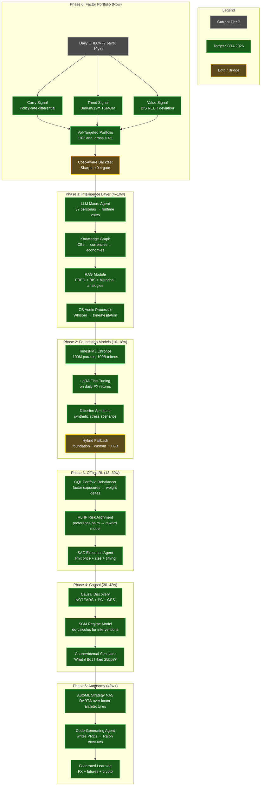

# Tier 7 → SOTA 2026: Architecture Evolution Diagram

```mermaid
flowchart TB
    subgraph LEGEND["Legend"]
        direction LR
        C["Current Tier 7"]:::current
        T["Target SOTA 2026"]:::target
        B["Both / Bridge"]:::both
    end

    subgraph PHASE0["Phase 0: Factor Portfolio (Now)"]
        direction TB
        P0_OHLCV["Daily OHLCV (7 pairs, 10y+)"]:::current
        P0_CARRY["Carry Signal<br/>Policy-rate differential"]:::target
        P0_TREND["Trend Signal<br/>3m/6m/12m TSMOM"]:::target
        P0_VALUE["Value Signal<br/>BIS REER deviation"]:::target
        P0_PORT["Vol-Targeted Portfolio<br/>10% ann, gross ≤ 4:1"]:::target
        P0_BACK["Cost-Aware Backtest<br/>Sharpe ≥ 0.4 gate"]:::both
    end

    subgraph PHASE1["Phase 1: Intelligence Layer (4–10w)"]
        direction TB
        P1_LLM["LLM Macro Agent<br/>37 personas → runtime votes"]:::target
        P1_KG["Knowledge Graph<br/>CBs → currencies → economies"]:::target
        P1_RAG["RAG Module<br/>FRED + BIS + historical analogies"]:::target
        P1_AUDIO["CB Audio Processor<br/>Whisper → tone/hesitation"]:::target
    end

    subgraph PHASE2["Phase 2: Foundation Models (10–18w)"]
        direction TB
        P2_FM["TimesFM / Chronos<br/>100M params, 100B tokens"]:::target
        P2_LORA["LoRA Fine-Tuning<br/>on daily FX returns"]:::target
        P2_DIFF["Diffusion Simulator<br/>synthetic stress scenarios"]:::target
        P2_HYB["Hybrid Fallback<br/>foundation + custom + XGB"]:::both
    end

    subgraph PHASE3["Phase 3: Offline RL (18–30w)"]
        direction TB
        P3_CQL["CQL Portfolio Rebalancer<br/>factor exposures → weight deltas"]:::target
        P3_RLHF["RLHF Risk Alignment<br/>preference pairs → reward model"]:::target
        P3_EXEC["SAC Execution Agent<br/>limit price + size + timing"]:::target
    end

    subgraph PHASE4["Phase 4: Causal (30–42w)"]
        direction TB
        P4_NOTEARS["Causal Discovery<br/>NOTEARS + PC + GES"]:::target
        P4_SCM["SCM Regime Model<br/>do-calculus for interventions"]:::target
        P4_SIM["Counterfactual Simulator<br/>'What if BoJ hiked 25bps?'"]:::target
    end

    subgraph PHASE5["Phase 5: Autonomy (42w+)"]
        direction TB
        P5_NAS["AutoML Strategy NAS<br/>DARTS over factor architectures"]:::target
        P5_CODE["Code-Generating Agent<br/>writes PRDs → Ralph executes"]:::target
        P5_FED["Federated Learning<br/>FX + futures + crypto"]:::target
    end

    P0_OHLCV --> P0_CARRY
    P0_OHLCV --> P0_TREND
    P0_OHLCV --> P0_VALUE
    P0_CARRY --> P0_PORT
    P0_TREND --> P0_PORT
    P0_VALUE --> P0_PORT
    P0_PORT --> P0_BACK

    P0_BACK --> P1_LLM
    P1_LLM --> P1_KG
    P1_KG --> P1_RAG
    P1_RAG --> P1_AUDIO

    P1_AUDIO --> P2_FM
    P2_FM --> P2_LORA
    P2_LORA --> P2_DIFF
    P2_DIFF --> P2_HYB

    P2_HYB --> P3_CQL
    P3_CQL --> P3_RLHF
    P3_RLHF --> P3_EXEC

    P3_EXEC --> P4_NOTEARS
    P4_NOTEARS --> P4_SCM
    P4_SCM --> P4_SIM

    P4_SIM --> P5_NAS
    P5_NAS --> P5_CODE
    P5_CODE --> P5_FED

    classDef current fill:#4a4a4a,stroke:#888,stroke-width:2px,color:#fff
    classDef target fill:#1a5c1a,stroke:#4caf50,stroke-width:2px,color:#fff
    classDef both fill:#5c4a1a,stroke:#ffc107,stroke-width:2px,color:#fff
```
