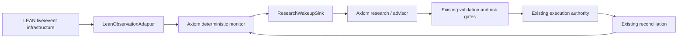
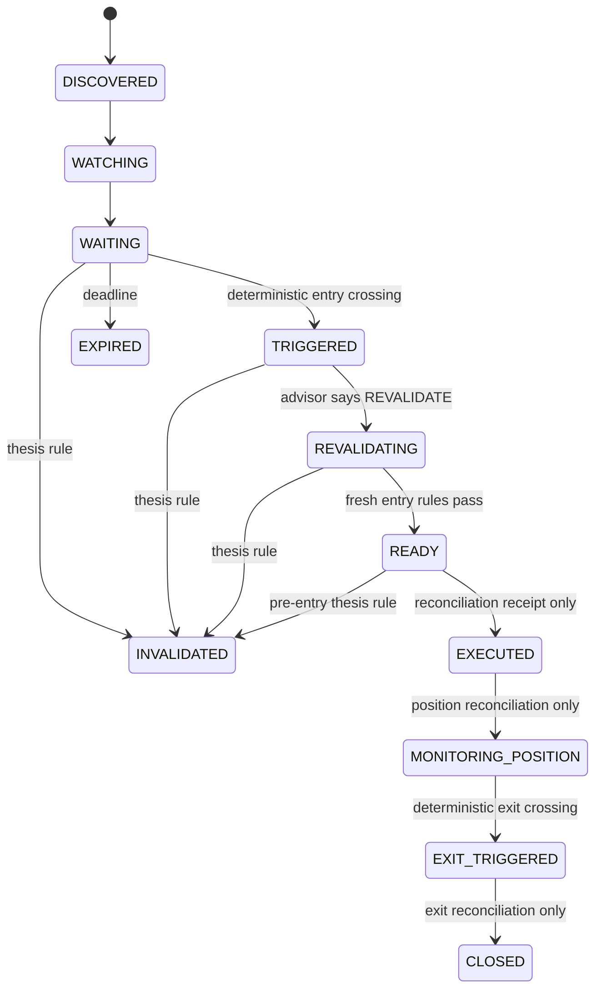

# Axiom 2.0 bounded LEAN monitoring slice

Status: bounded implementation from audited HEAD
64bf4d3780bc193bf122f830b1df04027ba8fe47.

This slice closes the continuous WAIT-state gap without creating a second
trading authority.

## Boundary

LEAN is the source of continuous delivery, subscriptions, consolidation,
scheduling, and connection signals. src/axiom2/monitoring/lean_adapter.py
accepts only a normalized LEAN envelope and emits one Axiom
MarketObservation. The adapter has no broker, portfolio, capital, approval,
or execution dependency.

The monitor owns candidate/thesis semantics, freshness, threshold materiality,
durable state, event idempotency, source watermarks, wakeup delivery facts,
and the transition guard that makes READY only an eligibility handoff to
Axiom's existing validation/risk pipeline.

ResearchWakeupSink is provider-neutral. TradingAgents is not currently
integrated; a future provider may implement the sink, but its response is
accepted only through apply_research_response and cannot transition directly
to execution.

## State machine

No monitor method submits, cancels, places, or routes an order. There is no
monitor-to-broker capability, and the monitor package is source-audited
against imports of src.axiom2.execution, src.axiom2.brokers, and legacy
execution adapters.

## Persistence and recovery

MonitorStore is a separate crash-safe operational journal. This is
intentional: EvidenceStore is the evidence/provenance authority,
ExecutionLifecycle is order-bound, and ShadowPortfolioLedger is
position/shadow-bound. Generalizing those stores with candidate lifecycle
events would blur their authority and transition contracts.

The monitor journal provides:

- canonical JSON receipts and SHA-256 digest chaining;
- immutable sequence-addressed files with directory and file fsync;
- event-ID idempotency and conflict detection;
- per-candidate source-sequence watermarks;
- verified receipt-time ordering;
- replay-derived projections, so restart does not trust process memory;
- durable material events before bounded wakeup delivery;
- recovery of pending wakeups after a crash.

Wakeups are at-least-once. The provider-neutral sink must deduplicate by
wakeup_id; successful delivery is itself journaled.

## Upstream LEAN integration and license

The external runtime is pinned to:

QuantConnect/Lean @ 80e7843f645673bcbeaab963049f76f20f6785e1

The adapter boundary is deliberately sidecar-compatible. At that revision the
mature upstream responsibilities to retain in LEAN are:

- SubscriptionManager for subscriptions;
- TradeBarConsolidator, consolidators, and DataConsolidated;
- ScheduledEvent and ScheduleManager;
- LiveTradingDataFeed and LiveSynchronizer;
- LiveTradingRealTimeHandler for live scheduling.

No LEAN source is copied into this repository and no Python reimplementation
of those mechanisms is introduced. The monitoring policy records the pin and
the exact Axiom adapter source digests in
config/axiom2/monitoring_boundary.json.

LEAN is Apache License 2.0, copyright QuantConnect and contributors. The
repository attribution is recorded in NOTICE; if LEAN binaries or source are
distributed with a deployment, that distribution must retain the upstream
Apache-2.0 license and notices.

## PoC meaning

The bounded tests exercise:

1. a plausible candidate that stays in durable WAITING;
2. stale/negative observations that invalidate it without an order;
3. a positive crossing followed by fresh revalidation to READY;
4. the proof boundary where no order is placed and only reconciliation can
   advance the state.

This is not a claim that a live LEAN process or TradingAgents deployment is
complete. The remaining integration work is wiring a deployed LEAN sidecar's
actual callback/subscription process to LeanObservationAdapter and selecting
a concrete advisor provider. Both remain outside this bounded slice.
