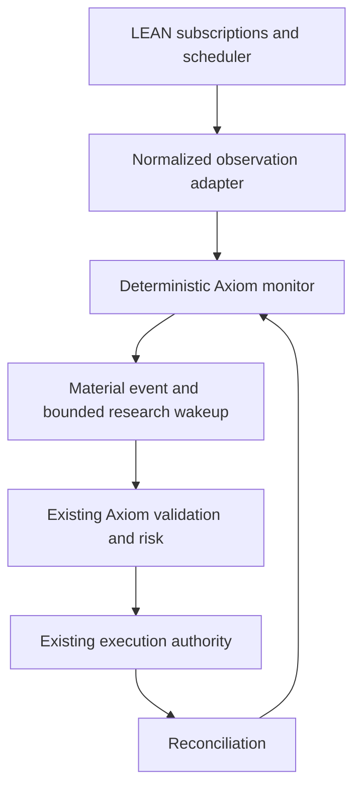
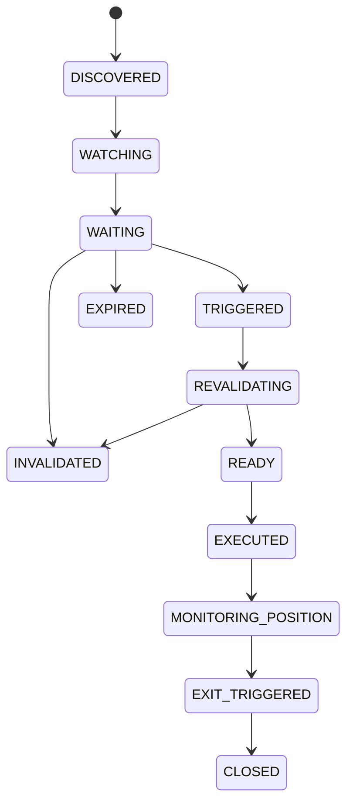

# Axiom 2.0 LEAN Monitoring Integration Design

> Status: approved design; implementation starts only after the accompanying implementation plan is reviewed.

## Scope

This slice closes the continuous market-monitoring and wait-state gap without changing Axiom research, promotion, portfolio/risk, approval, execution, reconciliation, or evidence authority. It starts from `64bf4d3780bc193bf122f830b1df04027ba8fe47` on branch `codex/axiom2-lean-monitoring-2026-10-06`.

LEAN is an upstream live/event infrastructure boundary. Axiom receives normalized observations and owns candidate semantics, durable state, materiality, freshness, research wakeups, revalidation, and reconciliation-driven position monitoring.

## Authority boundary

The monitor has no broker-write dependency, no order API, and no call path to `ExecutionAuthority.submit`. `READY` means only that a fresh monitor revalidation may be sent to the existing Axiom validation/risk pipeline. It is not execution authorization.

TradingAgents is not currently integrated in this repository. The provider-neutral wakeup interface is the integration point; a future TradingAgents advisor may consume the wakeup and return a typed research response. The response cannot create an order, authorize capital, or transition directly to execution.

## Lifecycle

State transitions are deterministic and serialized by the monitor store. Position entry is accepted only from a typed reconciliation receipt; the monitor cannot self-report execution.

## Contracts

Planned monitoring contracts:

- `CandidateRegistration`: candidate identity, instrument, thesis version/digest, expiry, freshness policy, deterministic price/volume entry conditions, deterministic invalidation conditions, and exit conditions.
- `MarketObservation`: candidate/instrument, source event ID, source sequence/watermark, source and receive timestamps, price, volume, connection state, and normalized source digest.
- `MaterialEvent`: accepted event ID, candidate, event kind, triggering observation digest, prior/new monitor states, and reason.
- `ResearchWakeup`: bounded material-event handoff containing candidate identity, event digest, state version, and no execution capability.
- `ResearchResponse`: provider-neutral advisor result bound to the wakeup ID and candidate version. It can request revalidation or invalidate; it cannot authorize execution.
- `ReconciliationReceipt`: externally produced execution/position/close fact. It is the only input that can advance `READY` to `EXECUTED` or `EXIT_TRIGGERED` to `CLOSED`.

Initial deterministic material conditions are price crossing, volume crossing, stale/freshness failure, connection loss/reconnect, thesis invalidation, entry trigger, and post-entry exit trigger.

## Persistence decision

Existing Axiom journals were audited before implementation:

- `ExecutionLifecycle` is bound to broker-neutral order intents, authorization, provider checkpoints, and execution lifecycle states. Generalizing it would give the monitor an execution-shaped authority and blur the no-order boundary.
- `ShadowPortfolioLedger` is bound to hypothetical account/position evolution and shadow fills. Candidate/thesis events are not shadow fills or portfolio observations.
- `EvidenceStore` and its typed event streams enforce research/disposition evidence authority. Adding operational candidate events as evidence events would either weaken existing transition policy or falsely make monitoring a promotion/execution evidence source.

Therefore the slice will reuse existing canonicalization, hashing, digest, locking, atomic-write, and replay conventions, but place candidate state in a separate operational `MonitorStore`. It is not evidence, promotion, risk, execution, or reconciliation authority. The design explicitly avoids a second order journal.

`MonitorStore` requirements:

- one append-only immutable event history with monotonic global sequence and per-source watermarks;
- canonical payload digest and previous-digest chain verification;
- event-ID idempotency and conflicting duplicate rejection;
- deterministic replay into candidate projections;
- atomic create/fsync and process locking;
- out-of-order and malformed observations rejected without state mutation;
- durable pending wakeups, so a crash before advisor delivery is recovered on restart;
- delivery receipts deduplicated by wakeup ID and candidate version.

## LEAN integration

Upstream pin: `QuantConnect/Lean@80e7843f645673bcbeaab963049f76f20f6785e1`.

The Axiom repository will not copy LEAN feed, scheduler, consolidator, or trading code. A narrow adapter consumes events emitted by an externally supplied LEAN runtime/sidecar:

- `SubscriptionManager.Add` and `AddConsolidator` provide subscriptions and consolidated data;
- `ConsolidatorBase.DataConsolidated` and `TradeBarConsolidator` provide event-driven price/volume bars;
- `ScheduledEvent` and `ScheduleManager` provide freshness, session, and recovery sweeps;
- `LiveTradingDataFeed`, `LiveSynchronizer`, and `LiveTradingRealTimeHandler` remain the upstream live delivery/reconnect/scheduling implementation;
- the adapter forwards normalized observations and connectivity events only; it does not expose `QCAlgorithm` order methods.

The vertical slice proves the adapter contract with deterministic LEAN-shaped event fixtures. It does not claim a live LEAN process is currently running; live completeness requires a deployed LEAN sidecar connected to an approved source and an observed restart.

## Safety and failure containment

- No monitoring module imports `src.axiom2.execution`, `src.axiom2.brokers`, legacy execution, or broker SDK modules.
- The monitor returns revalidation facts, never order intents.
- Freshness is checked again immediately before `READY`; stale observations cannot trigger or revalidate.
- Invalidation wins over a concurrent revalidation under the same store lock.
- Duplicate and replayed observations cannot produce duplicate triggers or wakeups.
- A disconnected source blocks trigger/revalidation progress until a newer connected observation arrives.
- A future advisor or LLM receives only `ResearchWakeup` and returns only `ResearchResponse`.
- Reconciliation, not the monitor or advisor, authorizes the state transition into `EXECUTED`.
- Existing `ExecutionAuthority` remains unchanged and deny-only.

## Tests

The implementation must add deterministic tests for identical-event replay, restart replay, source ordering, stale-to-fresh recovery, exactly-once triggers, invalidation races, disconnect/reconnect, crash before wakeup, duplicate advisor/reconciliation receipts, expiration, post-entry exit, malformed events, and direct-access attempts.

A boundary test will inspect the monitoring package imports and fail if broker-write adapters or production execution modules are reachable from it. An authority test will attempt `monitor -> ExecutionAuthority.submit` and require the existing blocked receipt without any monitor-created order path.

## License and attribution

LEAN is Apache License 2.0, Copyright 2014 QuantConnect Corporation. No LEAN source is vendored in this slice. The repository will record the pinned upstream revision and add an attribution entry to `NOTICE`. If a deployable LEAN sidecar is redistributed, its bundle must carry the upstream Apache 2.0 license and applicable notices; any copied/modified upstream file would require a prominent modification notice and retained attribution notices.

## Remaining gaps after this slice

- A live deployed LEAN sidecar and approved market-data connection are not established by synthetic adapter tests.
- Current Robinhood read-only contracts still lack complete provider snapshot, settlement, calendar, and approval facts.
- TradingAgents remains an unimplemented advisor provider.
- Existing Axiom execution remains intentionally disabled and capital remains unauthorized.
- Live operational identity, secret, network-egress, and provider-side idempotency proofs remain outside this bounded slice.