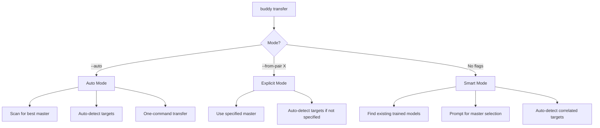
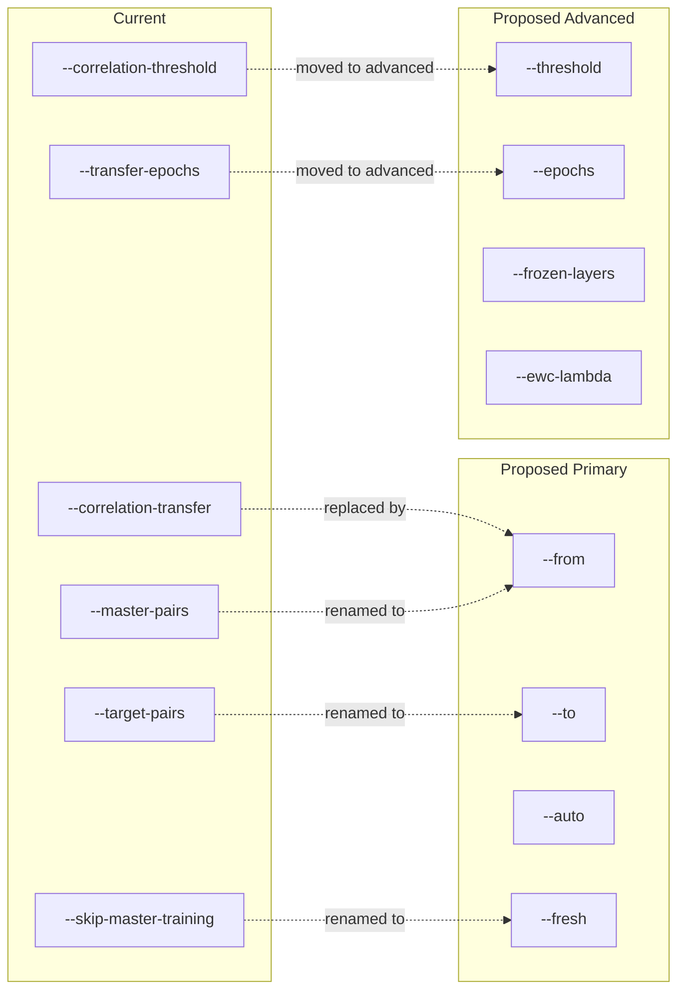
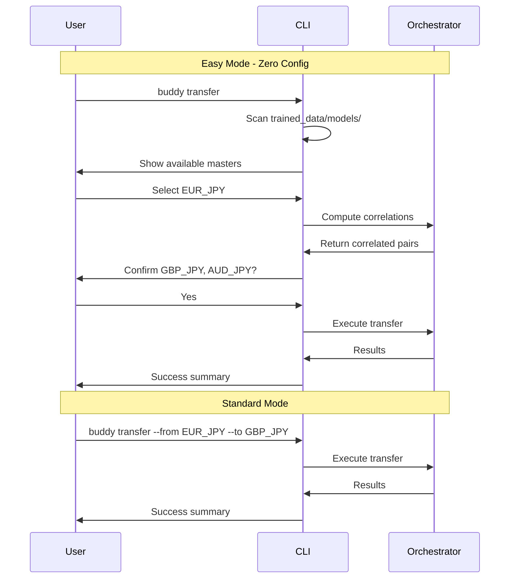

# Correlation Transfer CLI Simplification Design

## Executive Summary

This document proposes a simplified CLI interface for the `buddy train --correlation-transfer` command while maintaining backward compatibility and expert-level control.

---

## 1. Current State Analysis

### 1.1 Existing CLI Flags

#### Visible Flags (New Interface)
| Flag | Type | Default | Description |
|------|------|---------|-------------|
| `--from-pair` | string | None | Source pair to transfer FROM |
| `--to-pairs` | string | None | Target pairs (comma-separated) |
| `--auto` | boolean | False | Auto-detect correlated pairs |
| `--fresh` | boolean | False | Train source model fresh |

#### Hidden/Legacy Flags (argparse.SUPPRESS)
| Flag | Type | Default | Description |
|------|------|---------|-------------|
| `--correlation-transfer` | boolean | False | Enable transfer mode (legacy) |
| `--master-pairs` | string | None | Source pairs (legacy) |
| `--target-pairs` | string | None | Target pairs (legacy) |
| `--correlation-threshold` | float | 0.70 | Minimum correlation |
| `--skip-master-training` | boolean | False | Skip master training |
| `--transfer-epochs` | int | 50 | Epochs for transfer |

### 1.2 Internal Defaults (Hardcoded in [`CorrelationTransferConfig`](src/training/orchestrators/correlation_transfer.py:96))

```python
correlation_threshold: float = 0.70
lookback_periods: int = 100
transfer_lr_factor: float = 0.03      # 33x LR reduction
transfer_encoder_layers_to_freeze: int = 2
transfer_epochs: int = 50
transfer_patience: int = 15
use_ewc: bool = True
ewc_lambda: float = 100.0
gradual_unfreeze: bool = True
unfreeze_after_epochs: int = 10
save_dir: str = "trained_data/models/transfer"
```

### 1.3 Current Problems

1. **No dedicated command** - Uses `buddy train --correlation-transfer` which is awkward
2. **Required flags not obvious** - Users must specify either `--from-pair` or `--auto`
3. **No auto-detection of existing models** - System doesn't scan for trained models
4. **Too many flags for common case** - Simple transfer requires 3-4 flags
5. **Hidden defaults** - Users don't know about smart defaults like EWC and layer freezing

---

## 2. Simplified Design Proposal

### 2.1 New Command Structure



### 2.2 Proposed CLI Interface

#### Easy Mode (Zero Configuration)
```bash
# Simplest possible - auto-detect everything
buddy transfer

# With explicit target pairs
buddy transfer --to GBP_JPY,AUD_JPY
```

#### Standard Mode (Specify Master)
```bash
# Transfer from specific master
buddy transfer --from EUR_JPY

# Transfer to specific targets
buddy transfer --from EUR_JPY --to GBP_JPY,AUD_JPY
```

#### Expert Mode (Full Control)
```bash
# All options exposed via --advanced flag
buddy transfer --from EUR_JPY --to GBP_JPY \
    --advanced \
    --correlation-threshold 0.80 \
    --transfer-epochs 30 \
    --frozen-layers 3 \
    --ewc-lambda 200
```

### 2.3 Smart Defaults Strategy

| Scenario | Behavior |
|----------|----------|
| No flags | Scan `trained_data/models/` for existing models, prompt user to select master |
| `--auto` | Auto-select highest-liquidity pair with trained model as master |
| `--to` only | Use smart mode to find master, transfer to specified targets |
| `--from` only | Transfer to all correlated pairs above threshold |
| Both flags | Explicit master and targets (current behavior) |

### 2.4 Flag Consolidation



---

## 3. Progressive Disclosure Strategy

### 3.1 Tier 1: Zero-Config (New Users)

**Command:** `buddy transfer`

**Behavior:**
1. Scan `trained_data/models/` for existing trained models
2. Display list with accuracy metrics:
   ```
   Found 3 trained models:
     1. EUR_JPY  (direction_acc: 0.76, trained: 2 days ago)
   2. GBP_USD   (direction_acc: 0.73, trained: 5 days ago)
   3. USD_JPY   (direction_acc: 0.71, trained: 1 week ago)
   
   Select master model [1-3] or 'q' to quit: 
   ```
3. Auto-detect correlated pairs for selected master
4. Confirm and execute

### 3.2 Tier 2: Standard (Intermediate Users)

**Command:** `buddy transfer --from EUR_JPY --to GBP_JPY,AUD_JPY`

**Behavior:**
- Skip model scanning
- Use specified master
- Transfer only to specified targets
- Show progress bar and summary

### 3.3 Tier 3: Advanced (Expert Users)

**Command:** `buddy transfer --from EUR_JPY --advanced --threshold 0.80 --epochs 30`

**Behavior:**
- Access to all tuning parameters
- Expert flags only visible with `--advanced`
- Full control over transfer configuration

### 3.4 Help Text Strategy

```
Usage: buddy transfer [OPTIONS]

Transfer learning from a master model to correlated pairs.

Examples:
  buddy transfer                    # Interactive mode - select from existing models
  buddy transfer --auto             # Auto-select best master and targets
  buddy transfer --from EUR_JPY     # Transfer from EUR_JPY to all correlated pairs
  buddy transfer --from EUR_JPY --to GBP_JPY,AUD_JPY  # Explicit transfer

Options:
  --from PAIR       Source pair to transfer from (default: auto-detect)
  --to PAIRS        Target pairs, comma-separated (default: auto-detect correlated)
  --auto            Auto-select master and targets
  --fresh           Train master model from scratch
  --advanced        Show advanced options

Advanced Options (require --advanced):
  --threshold FLOAT     Correlation threshold (default: 0.70)
  --epochs INT          Transfer epochs (default: 50)
  --frozen-layers INT   Encoder layers to freeze (default: 2)
  --ewc-lambda FLOAT    EWC penalty strength (default: 100.0)
```

---

## 4. Concrete Examples

### 4.1 Before vs After

#### Scenario 1: Transfer to correlated JPY pairs

**Before (Current):**
```bash
buddy train --correlation-transfer \
    --master-pairs EUR_JPY \
    --target-pairs GBP_JPY,AUD_JPY \
    --skip-master-training \
    --correlation-threshold 0.75
```

**After (Proposed):**
```bash
buddy transfer --from EUR_JPY --to GBP_JPY,AUD_JPY
```

**Reduction:** 4 flags → 2 flags (50% reduction)

#### Scenario 2: Full auto transfer

**Before (Current):**
```bash
buddy train --correlation-transfer \
    --target-pairs GBP_JPY,AUD_JPY \
    --transfer-epochs 30
```

**After (Proposed):**
```bash
buddy transfer --auto
```

**Reduction:** 3 flags → 1 flag (67% reduction)

#### Scenario 3: Fresh training with custom settings

**Before (Current):**
```bash
buddy train --correlation-transfer \
    --master-pairs EUR_JPY,EUR_USD \
    --correlation-threshold 0.80 \
    --transfer-epochs 50
```

**After (Proposed):**
```bash
buddy transfer --from EUR_JPY --fresh --advanced --threshold 0.80
```

**Reduction:** Same number of flags, but clearer intent with `--fresh` and `--advanced`

### 4.2 User Experience Flow



---

## 5. Implementation Plan

### 5.1 Phase 1: New Command Alias

1. Add `transfer` to COMMANDS list in [`argparser.py`](cli/argparser.py:19)
2. Create new `_add_transfer_arguments()` function with simplified flags
3. Map new flags to existing orchestrator

### 5.2 Phase 2: Smart Defaults

1. Add model scanning utility in [`training_ops.py`](cli/training_ops.py)
2. Implement auto-detection of correlated pairs
3. Add interactive selection prompt

### 5.3 Phase 3: Progressive Disclosure

1. Add `--advanced` flag to show expert options
2. Update help text with examples
3. Add validation for flag combinations

### 5.4 Backward Compatibility

All legacy flags remain functional:
- `buddy train --correlation-transfer` still works
- `--master-pairs` maps to `--from`
- `--target-pairs` maps to `--to`
- Hidden flags remain for scripts

---

## 6. Configuration File Support (Future Enhancement)

For repeatable workflows, support a transfer config file:

```yaml
# transfer_config.yaml
master: EUR_JPY
targets:
  - GBP_JPY
  - AUD_JPY
  - EUR_USD
settings:
  threshold: 0.75
  epochs: 30
  frozen_layers: 2
```

Usage:
```bash
buddy transfer --config transfer_config.yaml
```

---

## 7. Summary

| Aspect | Current | Proposed |
|--------|---------|----------|
| Command | `buddy train --correlation-transfer` | `buddy transfer` |
| Min flags for basic use | 3-4 | 0-1 |
| Auto-detection | Partial | Full |
| Expert access | Mixed with basic | Separated via `--advanced` |
| Help clarity | Cluttered | Tiered examples |
| Backward compat | N/A | 100% maintained |

The proposed design reduces the cognitive load for new users while maintaining full power for experts through progressive disclosure.
