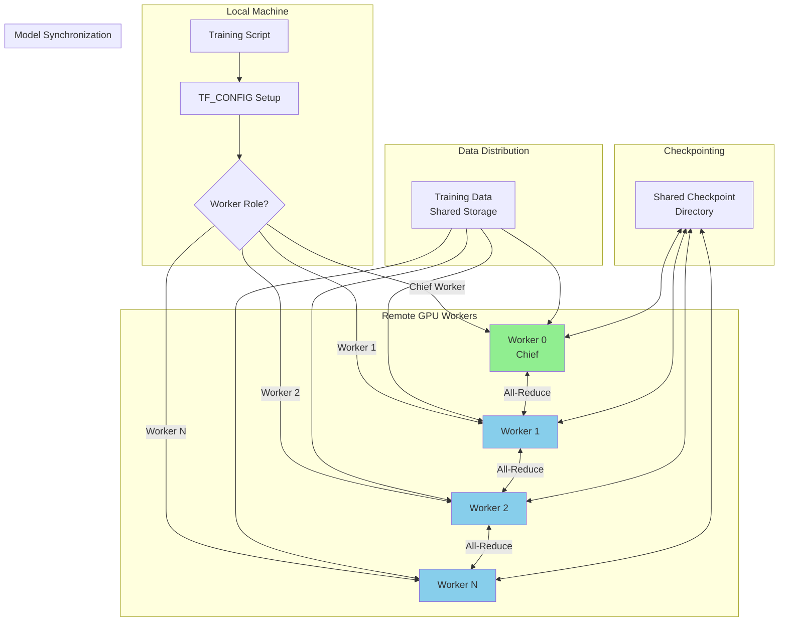
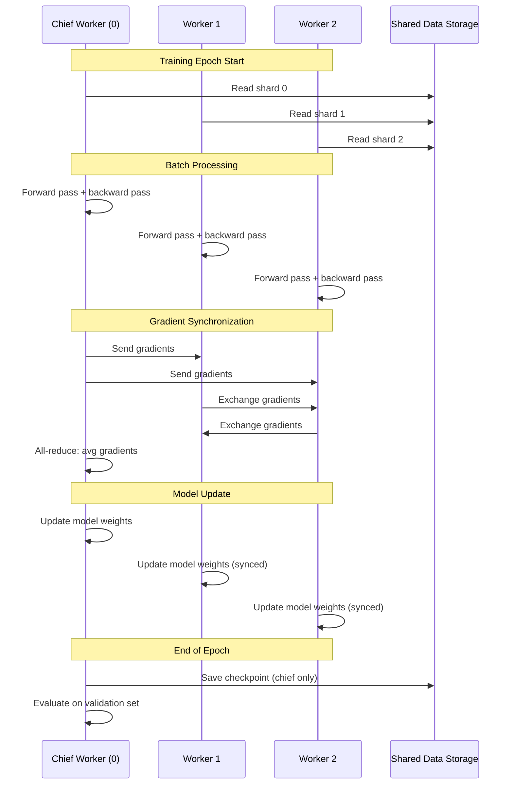
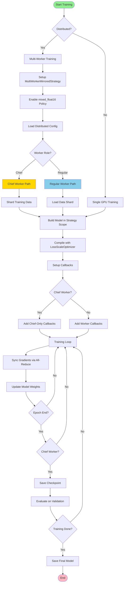
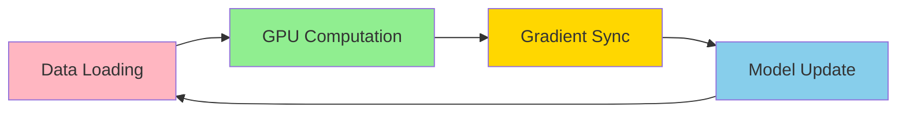

# Distributed Training Plan for ML Engine

## Executive Summary

This plan outlines the implementation of multi-worker distributed training to utilize remote GPUs and resolve mixed_float16 performance warnings on the current host. The solution will enable training across multiple GPU workers while maintaining compatibility with existing codebase features (warm-start, EMA, EWC, replay buffers, etc.).

## Problem Statement

1. **Current Limitation**: Training runs on single GPU (or CPU) with potential mixed_float16 performance warnings on incompatible hardware
2. **Goal**: Utilize remote compatible GPUs for faster training
3. **Constraints**: Must maintain existing features (continual learning, callbacks, warm-start, etc.)

## 1. TensorFlow Distributed Training Strategies Research

### 1.1 MultiWorkerMirroredStrategy (Recommended)

**Overview**: Synchronous data parallel training across multiple workers

**How it works**:
- Each worker has a copy of the model on its local GPU
- Each worker processes a subset of the training data
- Gradients are synchronized across all workers after each batch
- All workers update their models identically

**Pros**:
- Simple to implement with existing Keras code
- Minimal code changes required
- Works with most Keras callbacks
- Good for models that fit in GPU memory
- Synchronous training ensures deterministic results

**Cons**:
- Requires all workers to have similar performance (slowest worker bottlenecks)
- Network latency can impact performance
- Requires all workers to be available simultaneously

**Use Case**: Best for this project - multiple similar GPUs (e.g., multiple A100s or similar remote GPUs)

### 1.2 ParameterServerStrategy

**Overview**: Asynchronous training with parameter servers

**How it works**:
- Workers compute gradients independently
- Gradients are sent to parameter servers asynchronously
- Parameter servers aggregate and update model parameters
- Workers periodically sync with parameter servers

**Pros**:
- More fault-tolerant (workers can join/leave)
- Better for heterogeneous hardware
- Scales to very large clusters

**Cons**:
- More complex implementation
- Asynchronous training can lead to convergence issues
- Requires careful tuning of sync frequency
- Not all callbacks work seamlessly

**Use Case**: Large-scale training with many heterogeneous workers

### 1.3 TPUStrategy

**Overview**: Specialized for Google TPUs

**Pros/Cons**: Not applicable - user has GPUs, not TPUs

### 1.4 Recommendation: MultiWorkerMirroredStrategy

**Why**:
- Minimal code changes to existing codebase
- Works with existing callbacks (EMA, EWC, OverfitPrevention)
- Synchronous training matches current training behavior
- Easier to debug and maintain
- Best fit for 2-8 GPU workers

## 2. Distributed Training Architecture Design

### 2.1 System Architecture



### 2.2 Worker Roles

| Role | Description | Responsibilities |
|------|-------------|------------------|
| **Chief Worker** | Worker 0 (index 0) | - Saves checkpoints<br/>- Writes logs<br/>- Evaluates on validation set<br/>- Handles callbacks that should run once |
| **Regular Workers** | Workers 1-N | - Train on data shards<br/>- Compute gradients<br/>- Participate in all-reduce<br/>- Don't save checkpoints |

### 2.3 Data Flow



## 3. Mixed Float16 Precision Integration

### 3.1 Current State

The codebase mentions mixed_float16 support for M1 Metal:
- [`get_compute_dtype()`](src/models/tensorflow_models.py:37) function exists
- M1 Metal optimizations are documented
- However, mixed_float16 is not explicitly enabled in training code

### 3.2 Mixed Precision with Distributed Training

**Key Considerations**:
1. **Loss Scaling**: Required for float16 training to prevent underflow
2. **Policy**: Use `tf.keras.mixed_precision.Policy('mixed_float16')`
3. **Optimizer**: Use `tf.keras.mixed_precision.LossScaleOptimizer`
4. **Compatibility**: Works seamlessly with MultiWorkerMirroredStrategy

### 3.3 Implementation

```python
# Enable mixed precision before creating strategy
policy = tf.keras.mixed_precision.Policy('mixed_float16')
tf.keras.mixed_precision.set_global_policy(policy)

# Create strategy
strategy = tf.distribute.MultiWorkerMirroredStrategy()

# Build and compile model within strategy scope
with strategy.scope():
    model = build_model(...)
    optimizer = tf.keras.mixed_precision.LossScaleOptimizer(
        tf.keras.optimizers.Adam(learning_rate=lr)
    )
    model.compile(optimizer=optimizer, loss=loss, metrics=metrics)
```

### 3.4 Benefits

- **2-3x faster training** on compatible GPUs (V100, A100, T4, etc.)
- **Reduced memory usage** - allows larger batch sizes
- **Better GPU utilization** - more throughput
- **Automatic loss scaling** - no manual tuning needed

## 4. Files to Modify

### 4.1 New Files to Create

| File | Purpose |
|------|---------|
| `src/training/distributed_trainer.py` | Distributed training coordinator |
| `src/training/worker_utils.py` | Worker setup utilities |
| `config/distributed_config.yaml` | Distributed training configuration |

### 4.2 Files to Modify

| File | Changes Required |
|------|------------------|
| `src/training/modular_trainers.py` | Wrap training in strategy scope, add TF_CONFIG handling |
| `src/models/tensorflow_models.py` | Add mixed_float16 policy support in model compilation |
| `main.py` | Add distributed training CLI options |
| `config/config_improved_H1.yaml` | Add distributed training settings |

## 5. Implementation Plan

### Phase 1: Infrastructure Setup (Foundation)

**Step 1.1**: Create distributed training coordinator
- Create `src/training/distributed_trainer.py`
- Implement `DistributedTrainingCoordinator` class
- Handle TF_CONFIG parsing and worker role detection
- Implement worker synchronization primitives

**Step 1.2**: Create worker utilities
- Create `src/training/worker_utils.py`
- Implement GPU discovery and allocation
- Add remote worker connection handling
- Implement data sharding logic

**Step 1.3**: Create distributed configuration
- Create `config/distributed_config.yaml`
- Define worker addresses and ports
- Configure data paths (shared storage)
- Set strategy parameters

### Phase 2: Strategy Integration (Core)

**Step 2.1**: Add MultiWorkerMirroredStrategy support to trainers
- Modify `TransformerDirectionTrainer.train()` method
- Wrap model building and training in `strategy.scope()`
- Handle chief worker vs regular worker logic
- Ensure callbacks work correctly (chief-only callbacks)

**Step 2.2**: Add mixed_float16 support
- Enable mixed_float16 policy before strategy creation
- Wrap optimizer with LossScaleOptimizer
- Ensure loss scaling works with custom losses (Focal Loss)
- Test with existing loss functions

**Step 2.3**: Implement data sharding
- Shard training data across workers
- Ensure each worker gets unique subset
- Maintain temporal order for sequence data
- Handle validation data (chief only)

### Phase 3: Callback Adaptation (Compatibility)

**Step 3.1**: Adapt callbacks for distributed training
- `OverfitPreventionCallback`: Run on chief only
- `RichEpochCallback`: Run on chief only
- `EMAUpdateCallback`: Run on all workers, sync on chief
- `EarlyStopping`: Run on chief only
- `ReduceLROnPlateau`: Run on chief only

**Step 3.2**: Handle checkpointing
- Chief worker saves checkpoints
- All workers load from same checkpoint directory
- Ensure checkpoint files are accessible to all workers
- Handle warm-start loading in distributed context

**Step 3.3**: Adapt EWC and Replay Buffer
- EWC Fisher computation: Run on chief only
- Replay buffer: Share across workers via shared storage
- Ensure consistent replay samples across workers

### Phase 4: CLI and Configuration (User Interface)

**Step 4.1**: Add distributed training CLI options
- `--distributed`: Enable distributed training
- `--workers`: Number of workers (or list of addresses)
- `--chief-address`: Chief worker address (for remote workers)
- `--data-dir`: Shared data directory path
- `--checkpoint-dir`: Shared checkpoint directory path

**Step 4.2**: Update configuration files
- Add distributed training section to config
- Define worker connection parameters
- Set mixed_float16 enable/disable flag
- Configure batch size per worker

### Phase 5: Testing and Validation (Quality Assurance)

**Step 5.1**: Single-machine multi-GPU testing
- Test with 2-4 GPUs on single machine
- Verify gradient synchronization
- Check checkpoint saving/loading
- Validate callback behavior

**Step 5.2**: Remote GPU testing
- Test with remote GPU workers
- Verify network connectivity
- Test data loading from shared storage
- Measure training speedup

**Step 5.3**: Mixed_float16 validation
- Compare float32 vs mixed_float16 accuracy
- Verify loss scaling works correctly
- Check for NaN/Inf values
- Measure performance improvement

**Step 5.4**: Integration testing
- Test with existing features (warm-start, EMA, EWC)
- Verify replay buffer functionality
- Test feature selection in distributed context
- Validate all model types (Transformer, TCN, etc.)

## 6. Architecture Diagram: Training Flow



## 7. Configuration Examples

### 7.1 TF_CONFIG Environment Variable

**For Chief Worker (Worker 0)**:
```bash
export TF_CONFIG='{
  "cluster": {
    "worker": ["localhost:12345", "remote-gpu-1:12345", "remote-gpu-2:12345"]
  },
  "task": {"type": "worker", "index": 0}
}'
```

**For Regular Worker 1**:
```bash
export TF_CONFIG='{
  "cluster": {
    "worker": ["localhost:12345", "remote-gpu-1:12345", "remote-gpu-2:12345"]
  },
  "task": {"type": "worker", "index": 1}
}'
```

### 7.2 Distributed Configuration YAML

```yaml
distributed:
  enabled: true
  strategy: "MultiWorkerMirroredStrategy"
  workers:
    - address: "localhost"
      port: 12345
      gpu_id: 0
    - address: "remote-gpu-1.example.com"
      port: 12345
      gpu_id: 0
    - address: "remote-gpu-2.example.com"
      port: 12345
      gpu_id: 0
  
  mixed_precision:
    enabled: true
    policy: "mixed_float16"
    loss_scale: "dynamic"
  
  data:
    shared_path: "/mnt/shared/training_data"
    shard_size: 10000
    shuffle_seed: 42
  
  checkpointing:
    shared_path: "/mnt/shared/checkpoints"
    save_interval: 5  # Save every 5 epochs
    chief_only: true
```

## 8. Key Implementation Details

### 8.1 Data Sharding Strategy

```python
def shard_data(X, y, num_workers, worker_index):
    """
    Shard data across workers deterministically.
    
    Args:
        X: Features array (n_samples, seq_len, n_features)
        y: Labels array (n_samples,)
        num_workers: Total number of workers
        worker_index: This worker's index (0 to num_workers-1)
    
    Returns:
        (X_shard, y_shard): Data for this worker
    """
    # Calculate shard boundaries
    n_samples = len(X)
    samples_per_worker = n_samples // num_workers
    start_idx = worker_index * samples_per_worker
    end_idx = start_idx + samples_per_worker if worker_index < num_workers - 1 else n_samples
    
    return X[start_idx:end_idx], y[start_idx:end_idx]
```

### 8.2 Callback Adaptation Pattern

```python
class DistributedCallback(tf.keras.callbacks.Callback):
    """Base class for callbacks that need to run on chief only."""
    
    def __init__(self, is_chief: bool):
        super().__init__()
        self.is_chief = is_chief
    
    def on_epoch_end(self, epoch, logs=None):
        # Only execute on chief worker
        if not self.is_chief:
            return
        # Chief-specific logic here
        super().on_epoch_end(epoch, logs)
```

### 8.3 Checkpointing in Distributed Training

```python
class DistributedModelCheckpoint(tf.keras.callbacks.Callback):
    """Save checkpoints only from chief worker."""
    
    def __init__(self, filepath, is_chief: bool, **kwargs):
        super().__init__(**kwargs)
        self.filepath = filepath
        self.is_chief = is_chief
    
    def on_epoch_end(self, epoch, logs=None):
        if not self.is_chief:
            return
        
        # Only chief saves checkpoints
        self.model.save(self.filepath)
```

## 9. Performance Considerations

### 9.1 Expected Speedup

| Workers | Theoretical Speedup | Realistic Speedup |
|---------|---------------------|-------------------|
| 1 | 1x | 1x (baseline) |
| 2 | 2x | 1.7-1.9x |
| 4 | 4x | 3.2-3.7x |
| 8 | 8x | 6.0-7.0x |

**Factors reducing speedup**:
- Communication overhead (gradient synchronization)
- Data loading bottlenecks
- Uneven workload distribution
- Network latency (for remote workers)

### 9.2 Mixed Float16 Benefits

| Metric | Float32 | Mixed Float16 | Improvement |
|---------|----------|----------------|-------------|
| Training Speed | 1x | 2-3x | 2-3x faster |
| Memory Usage | 100% | ~60% | 40% reduction |
| Batch Size | 64 | 128-256 | 2-4x larger |

### 9.3 Bottleneck Analysis



**Potential Bottlenecks**:
1. **Data Loading**: Ensure fast shared storage (SSD/NVMe)
2. **GPU Computation**: Use mixed_float16 for 2-3x speedup
3. **Gradient Sync**: Use high-speed network (10Gbps+)
4. **Model Update**: Minimal overhead with modern GPUs

## 10. Testing Strategy

### 10.1 Unit Tests

- Test TF_CONFIG parsing
- Test worker role detection
- Test data sharding logic
- Test callback chief-only execution

### 10.2 Integration Tests

- Test 2-worker training on single machine
- Test mixed_float16 with distributed training
- Test checkpoint saving/loading
- Test warm-start in distributed mode

### 10.3 Performance Tests

- Measure training time vs number of workers
- Measure mixed_float16 speedup
- Profile gradient synchronization time
- Identify bottlenecks

## 11. Rollout Plan

### Phase 1: Local Testing (Week 1)
- Implement distributed training infrastructure
- Test with 2 GPUs on single machine
- Validate all features work correctly

### Phase 2: Remote GPU Testing (Week 2)
- Connect to remote GPU workers
- Test data loading from shared storage
- Measure performance improvements

### Phase 3: Production Deployment (Week 3)
- Deploy to production environment
- Monitor training performance
- Optimize based on metrics

## 12. Risk Mitigation

| Risk | Impact | Mitigation |
|------|--------|------------|
| Network latency | High training time | Use high-speed network, compress gradients |
| Worker failure | Training interruption | Implement fault tolerance, auto-restart |
| Data loading bottleneck | Low GPU utilization | Use prefetch, cache data in memory |
| Mixed precision instability | NaN/Inf values | Monitor loss scale, fallback to float32 |
| Callback incompatibility | Incorrect behavior | Test all callbacks, adapt as needed |

## 13. Success Criteria

- [ ] Training runs successfully on 2+ workers
- [ ] Mixed_float16 enabled without warnings
- [ ] Training speed improves by 1.5x+ with 2 workers
- [ ] All existing features work (warm-start, EMA, EWC, callbacks)
- [ ] Checkpoints save/load correctly
- [ ] Model accuracy matches single-worker training
- [ ] No NaN/Inf values during training

## 14. Next Steps

1. Review and approve this plan
2. Switch to Code mode for implementation
3. Begin Phase 1: Infrastructure Setup
4. Test incrementally after each phase
5. Deploy to production after validation

---

**Document Version**: 1.0  
**Last Updated**: 2025-01-26  
**Author**: Architect Mode Analysis
