# ML Engine Skill Architecture Design

## Executive Summary

This document outlines comprehensive skills designed to optimize the ML Engine FX trading system's operational efficiency, automation, and robustness. Each skill addresses specific workflow gaps identified through workspace analysis.

## Identified Operational Needs

### 1. Training Workflow Optimization
**Current State:**
- Complex modular ensemble training with 4 specialist models
- Advanced features (EMA, EWC, Replay Buffer) require manual configuration
- Overfitting detection is sophisticated but requires manual intervention
- Warm-start training needs careful hyperparameter tuning
- M1 Metal optimizations are platform-specific

**Gaps:**
- No automated hyperparameter search
- Manual warm-start configuration
- No automated overfitting recovery strategies
- Platform-specific optimizations are hardcoded

### 2. Model Evaluation and Diagnostics
**Current State:**
- Enterprise MLOps features (MLflow, walk-forward CV, bootstrap CI)
- Rich epoch callbacks with overfitting detection
- Model lineage tracking

**Gaps:**
- No automated model comparison across pairs
- Limited cross-validation visualization
- No automated failure analysis
- Missing model performance benchmarking

### 3. Configuration Management
**Current State:**
- YAML-based configuration with hierarchical sections
- Multiple config files for different scenarios
- Pair-specific model loading with fallback

**Gaps:**
- No configuration validation schema
- No environment-specific overrides
- No configuration versioning
- No automated config migration

### 4. FX Trading Guardrails
**Current State:**
- Session windows, daily circuit breakers, spread filters
- Position limits, confirmation requirements
- TCN volatility filter as entry timing gate

**Gaps:**
- No automated guardrail testing
- No guardrail violation logging
- No dynamic threshold adjustment
- No guardrail health monitoring

### 5. Data Pipeline Automation
**Current State:**
- OANDA v20 API integration
- 120+ technical indicators
- Normalized features for instrument-agnostic inference

**Gaps:**
- No automated data quality checks
- No feature importance tracking
- No data drift monitoring
- No automated data refresh scheduling

### 6. RL Training Integration
**Current State:**
- SAC-based gate threshold optimization
- PPO-based position sizing
- Lazy imports to avoid GPU conflicts

**Gaps:**
- No automated RL training triggers
- No RL model versioning
- No RL hyperparameter optimization
- No RL performance monitoring

### 7. Model Deployment and Monitoring
**Current State:**
- Pair-specific model storage
- Model metadata tracking
- MLflow experiment tracking

**Gaps:**
- No automated model promotion
- No A/B testing framework
- No model rollback mechanism
- No production monitoring dashboard

### 8. Debugging and Troubleshooting
**Current State:**
- Rich logging with color-coded output
- Diagnostic scripts in `scripts/` directory
- Comprehensive error handling

**Gaps:**
- No automated issue diagnosis
- No common error pattern matching
- No automated fix suggestions
- No debugging workflow templates

## Proposed Skills Architecture

### Skill 1: Training Workflow Optimizer
**Purpose:** Automate and optimize model training workflows

**Capabilities:**
- Automated hyperparameter search (Bayesian optimization)
- Warm-start configuration assistant
- Overfitting recovery automation
- Platform-specific optimization detection
- Training job scheduling and queueing

**Key Features:**
- Hyperparameter space definition for each model type
- Multi-objective optimization (accuracy vs training time vs overfitting)
- Warm-start strategy recommendation based on pair volatility
- Automated overfitting intervention (dropout, LR reduction, weight reset)
- M1 Metal optimization detection and application

**Bundled Resources:**
- `scripts/hyperparameter_search.py` - Bayesian optimization
- `scripts/warm_start_assistant.py` - Warm-start configuration
- `scripts/overfit_recovery.py` - Automated recovery
- `references/training_patterns.md` - Best practices

### Skill 2: Model Evaluation and Diagnostics
**Purpose:** Comprehensive model analysis and comparison

**Capabilities:**
- Cross-pair model comparison
- Bootstrap confidence interval visualization
- Walk-forward CV analysis
- Model failure pattern detection
- Performance benchmarking

**Key Features:**
- Automated model comparison dashboard
- Statistical significance testing
- Feature importance analysis
- Error pattern classification
- Model degradation detection

**Bundled Resources:**
- `scripts/model_comparison.py` - Cross-pair analysis
- `scripts/cv_visualization.py` - CV results plotting
- `scripts/failure_analysis.py` - Error pattern detection
- `references/evaluation_metrics.md` - Metric definitions

### Skill 3: Configuration Manager
**Purpose:** Centralized configuration management with validation

**Capabilities:**
- Configuration schema validation
- Environment-specific overrides
- Configuration versioning and migration
- Automated config generation

**Key Features:**
- Pydantic-based schema validation
- Environment variable injection
- Config diff and merge
- Automated migration between versions
- Config backup and rollback

**Bundled Resources:**
- `scripts/config_validator.py` - Schema validation
- `scripts/config_migrator.py` - Version migration
- `scripts/config_generator.py` - Automated generation
- `references/config_schema.json` - Schema definition

### Skill 4: FX Trading Guardrails
**Purpose:** Automated guardrail testing and monitoring

**Capabilities:**
- Guardrail violation detection and logging
- Dynamic threshold adjustment
- Guardrail health monitoring
- Automated guardrail testing

**Key Features:**
- Real-time guardrail monitoring
- Violation pattern analysis
- Adaptive threshold adjustment based on market conditions
- Guardrail stress testing
- Alert system for critical violations

**Bundled Resources:**
- `scripts/guardrail_monitor.py` - Real-time monitoring
- `scripts/guardrail_tester.py` - Stress testing
- `scripts/threshold_optimizer.py` - Dynamic adjustment
- `references/guardrail_rules.md` - Rule definitions

### Skill 5: Data Pipeline Automator
**Purpose:** Automated data quality and pipeline management

**Capabilities:**
- Data quality checks
- Feature importance tracking
- Data drift monitoring
- Automated data refresh scheduling

**Key Features:**
- Automated data validation (missing values, outliers, stationarity)
- Feature importance calculation and tracking
- Drift detection (feature distribution, prediction drift)
- Scheduled data refresh with retry logic
- Data pipeline health dashboard

**Bundled Resources:**
- `scripts/data_quality_check.py` - Quality validation
- `scripts/feature_importance.py` - Importance tracking
- `scripts/drift_monitor.py` - Drift detection
- `references/data_pipeline_schema.md` - Pipeline documentation

### Skill 6: RL Training Integrator
**Purpose:** Streamline RL training and deployment

**Capabilities:**
- Automated RL training triggers
- RL model versioning
- Hyperparameter optimization
- Performance monitoring

**Key Features:**
- Automated RL training based on performance degradation
- RL model A/B testing
- Hyperparameter search for RL agents
- RL performance tracking and comparison
- Automated model promotion

**Bundled Resources:**
- `scripts/rl_training_scheduler.py` - Automated training
- `scripts/rl_hyperopt.py` - Hyperparameter optimization
- `scripts/rl_version_manager.py` - Versioning
- `references/rl_best_practices.md` - Training guidelines

### Skill 7: Model Deployment Orchestrator
**Purpose:** Automated model deployment and monitoring

**Capabilities:**
- Automated model promotion
- A/B testing framework
- Model rollback mechanism
- Production monitoring dashboard

**Key Features:**
- Canary deployment strategy
- A/B test automation
- Automated rollback on performance degradation
- Real-time monitoring metrics
- Deployment pipeline orchestration

**Bundled Resources:**
- `scripts/deploy_model.py` - Deployment automation
- `scripts/ab_test_manager.py` - A/B testing
- `scripts/rollback_manager.py` - Rollback automation
- `references/deployment_checklist.md` - Deployment procedures

### Skill 8: Debugging Assistant
**Purpose:** Automated issue diagnosis and fix suggestions

**Capabilities:**
- Automated issue diagnosis
- Error pattern matching
- Fix suggestion engine
- Debugging workflow templates

**Key Features:**
- Error log analysis and pattern matching
- Knowledge base of common issues
- Automated fix suggestions
- Debugging workflow templates for common scenarios
- Issue tracking and resolution tracking

**Bundled Resources:**
- `scripts/error_analyzer.py` - Error pattern matching
- `scripts/fix_suggester.py` - Fix suggestions
- `scripts/debug_template.py` - Workflow templates
- `references/common_errors.md` - Error catalog

## Skill Integration Architecture

```mermaid
graph TB
    subgraph "Core ML Engine"
        A[Training Pipeline]
        B[Inference Pipeline]
        C[Data Pipeline]
        D[RL Components]
    end

    subgraph "Skills Layer"
        S1[Training Workflow Optimizer]
        S2[Model Evaluation & Diagnostics]
        S3[Configuration Manager]
        S4[FX Trading Guardrails]
        S5[Data Pipeline Automator]
        S6[RL Training Integrator]
        S7[Model Deployment Orchestrator]
        S8[Debugging Assistant]
    end

    S1 --> A
    S2 --> A
    S2 --> B
    S3 --> A
    S3 --> B
    S3 --> C
    S4 --> B
    S5 --> C
    S6 --> D
    S7 --> B
    S8 --> A
    S8 --> B
    S8 --> C
    S8 --> D

    subgraph "Shared Infrastructure"
        I1[Logging System]
        I2[Configuration Store]
        I3[Metrics Database]
        I4[Model Registry]
    end

    S1 --> I1
    S2 --> I1
    S3 --> I2
    S4 --> I1
    S5 --> I1
    S6 --> I1
    S7 --> I1
    S8 --> I1

    S2 --> I3
    S4 --> I3
    S5 --> I3
    S6 --> I3
    S7 --> I3

    S1 --> I4
    S2 --> I4
    S6 --> I4
    S7 --> I4
```

## Implementation Priority

### Phase 1: Core Automation (High Impact, Low Complexity)
1. **Configuration Manager** - Foundation for all other skills
2. **Debugging Assistant** - Immediate productivity boost
3. **Data Pipeline Automator** - Data quality foundation

### Phase 2: Training Optimization (High Impact, Medium Complexity)
4. **Training Workflow Optimizer** - Training efficiency
5. **Model Evaluation and Diagnostics** - Model quality

### Phase 3: Production Readiness (Medium Impact, High Complexity)
6. **FX Trading Guardrails** - Safety and compliance
7. **Model Deployment Orchestrator** - Production deployment

### Phase 4: Advanced Features (Medium Impact, Medium Complexity)
8. **RL Training Integrator** - RL optimization

## Skill Design Principles

1. **Progressive Disclosure**: Each skill provides metadata → overview → detailed implementation
2. **Error Resilience**: All skills have graceful degradation and fallback mechanisms
3. **Idempotency**: Skills can be run multiple times safely
4. **Observability**: Comprehensive logging and metrics for all operations
5. **Modularity**: Skills can be used independently or in combination
6. **Extensibility**: Clear extension points for future enhancements
7. **Documentation**: Self-documenting code with inline examples
8. **Testing**: All skills include test coverage

## Next Steps

1. Create skill directory structure under `.kilocode/skills/`
2. Implement Phase 1 skills (Configuration Manager, Debugging Assistant, Data Pipeline Automator)
3. Implement Phase 2 skills (Training Workflow Optimizer, Model Evaluation & Diagnostics)
4. Implement Phase 3 skills (FX Trading Guardrails, Model Deployment Orchestrator)
5. Implement Phase 4 skill (RL Training Integrator)
6. Package and validate all skills
7. Create integration documentation
8. Provide usage examples and tutorials
