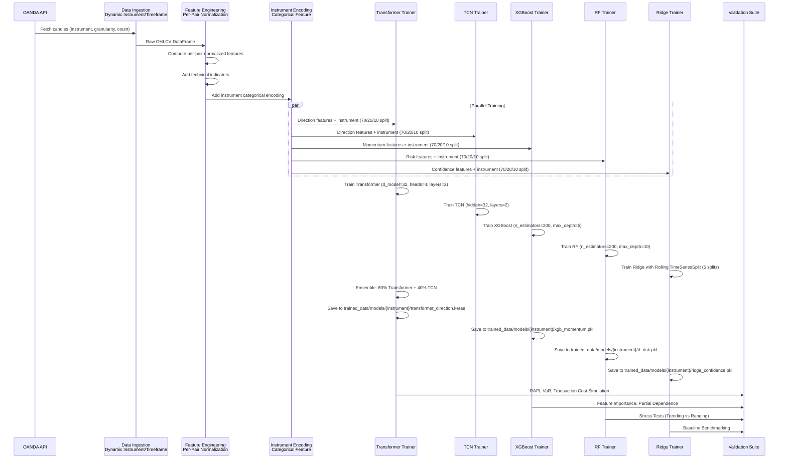

# Pair-Agnostic Modular Ensemble Training Pipeline Plan (Enhanced)

## Implementation Status

| Phase | Item | Status | Location |
|-------|------|--------|----------|
| **Phase 1: Core Prerequisites** | | **✅ COMPLETED 2026-01-26** | |
| 1.1 | MADL Loss Function | ✅ DONE | [tensorflow_models.py](../src/models/tensorflow_models.py) `MADLLoss` class |
| 1.2 | ARIMA Hybrid Component | ✅ DONE | [arima_hybrid.py](../src/models/arima_hybrid.py) |
| 1.3 | Per-Pair Normalization Stats | ✅ DONE | [modular_data_loaders.py](../src/core/modular_data_loaders.py) `get_pair_normalization_stats()` |
| 1.4 | Instrument One-Hot Encoding | ✅ DONE | [modular_data_loaders.py](../src/core/modular_data_loaders.py) `encode_instrument_onehot()` |
| **Phase 2: Validation Metrics** | | **✅ COMPLETED 2026-01-26** | |
| 2.1 | VaR Backtesting Module | ✅ DONE | [var_backtesting.py](../src/risk/var_backtesting.py) `compute_ewma_var()`, `backtest_var()`, Kupiec/Christoffersen tests |
| 2.2 | RAPI/Transaction Costs | ✅ DONE | [trading_metrics.py](../src/risk/trading_metrics.py) `compute_rapi()`, per-pair `TradingCostsConfig` |
| 2.3 | Baseline Benchmarking | ✅ DONE | [walkforward_validation.py](../src/training/walkforward_validation.py) `calculate_baseline_metrics()`, `compute_validation_metrics()` |
| **Phase 3: Regime Analysis** | | **✅ COMPLETED 2026-01-26** | |
| 3.1 | 5-Class Regime Detection | ✅ DONE | [modular_data_loaders.py](../src/core/modular_data_loaders.py) `classify_market_regime()`, `RegimeConfig`, `REGIME_NAMES` |
| 3.2 | Regime-Specific LightGBM Tuning | ✅ DONE | [modular_trainers.py](../src/training/modular_trainers.py) `RegimeLGBMTrainer`, `REGIME_LGBM_PARAMS`, `get_regime_lgbm_params()` |
| 3.3 | Stress Test Validation | ✅ DONE | [walkforward_validation.py](../src/training/walkforward_validation.py) `stress_test_regime()`, `stress_test_regime_transitions()` |
| 3.4 | Inference Regime Detection | ✅ DONE | [modular_inference.py](../src/core/modular_inference.py) `_detect_market_regime()`, `_track_regime_transition()`, `_get_regime_lgbm()` |
| 3.5 | Regime Config | ✅ DONE | [config_improved_H1.yaml](../config/config_improved_H1.yaml) `regime:` section with thresholds and behavior |
| 3.6 | Training Integration | ✅ DONE | [buddy_training_helpers.py](../src/training/buddy_training_helpers.py) `train_regime_lgbm_models()`, `run_regime_stress_test()` |
| **Phase 4: Joint Training** | | **✅ COMPLETED 2026-01-26** | |
| 4.1 | Joint Multi-Pair Trainer | ✅ DONE | [modular_trainers.py](../src/training/modular_trainers.py) `JointMultiPairTrainer`, `LightGBMMomentumTrainer`, `LightGBMRiskTrainer` |
| 4.2 | Pair-Specific Fine-Tuning | ✅ DONE | [modular_trainers.py](../src/training/modular_trainers.py) `JointMultiPairTrainer.fine_tune_for_pair()`, `should_fine_tune()` |
| 4.3 | Inference Auto-Prefer Joint | ✅ DONE | [modular_inference.py](../src/core/modular_inference.py) `_get_model_path()` checks pair-specific → joint → generic |
| 4.4 | Training Orchestration | ✅ DONE | [buddy_training_helpers.py](../src/training/buddy_training_helpers.py) `train_joint_multi_pair_ensemble()` |
| 4.5 | CLI Command | ✅ DONE | [main.py](../main.py) `train-joint` with `--instruments`, `--fine-tune`, `--fine-tune-threshold` |

---

## Executive Summary

This plan **refactors the existing training infrastructure** to be pair-agnostic with enhanced multi-pair capabilities, modifying the current modular training pipeline (not creating a separate training workflow). The architecture dynamically accepts instrument identifiers and timeframes instead of hardcoded values, enabling training on any currency pair (USD/JPY, EUR/USD, GBP/USD, etc.) while preserving strict architectural consistency throughout the entire training lifecycle.

**Key Enhancements** (based on research and best practices):
- **Joint Multi-Pair Training Mode**: Concatenate data from multiple pairs with instrument as categorical feature for transfer learning
- **Per-Pair Normalization**: Z-score returns per pair to prevent bias toward high-volatility instruments
- **Advanced Validation**: Time-series cross-validation with rolling windows, RAPI metrics, transaction cost simulations, VaR backtesting
- **Interpretability**: Feature importance from tree ensembles, partial dependence plots
- **Stress Testing**: Market regime-specific validation (trending vs ranging)
- **Baseline Benchmarking**: Compare against simpler models per pair
- **Meta-Learning Framework**: Adaptive component selection based on market conditions

**Key Principle**: Modify existing [`modular_trainers.py`](src/training/modular_trainers.py:1), [`modular_data_loaders.py`](src/core/modular_data_loaders.py:1), and related infrastructure to support dynamic instruments - don't create duplicate training code.

## Architecture Overview

```mermaid
flowchart TD
    A[Generic Data Ingestion<br/>Instrument + Timeframe] --> B[Feature Engineering<br/>Per-Pair Normalization]
    B --> C[Instrument Encoding<br/>Categorical Feature]
    C --> D[Direction Ensemble<br/>Transformer 60% + TCN 40%]
    C --> E[Momentum Analyzer<br/>XGBoost]
    C --> F[Risk Assessor<br/>Random Forest]
    C --> G[Confidence Scorer<br/>LightGBM/Ridge]
    
    D --> H[Modular Ensemble Inference<br/>Pair-Agnostic]
    E --> H
    F --> H
    G --> H
    
    H --> I[Trade Execution<br/>OANDA Practice<br/>Any Instrument]
    
    D --> J[Save: {instrument}_direction.keras]
    E --> K[Save: {instrument}_momentum.pkl]
    F --> L[Save: {instrument}_risk.pkl]
    G --> M[Save: {instrument}_confidence.pkl]
    
    J --> N[Metadata: modular_ensemble.meta.json<br/>Multi-Instrument Support]
    K --> N
    L --> N
    M --> N
    
    N --> O[Validation Suite<br/>RAPI, VaR, Transaction Costs]
    O --> P[Interpretability<br/>Feature Importance, PDP]
    P --> Q[Stress Tests<br/>Regime-Specific]
```

## Data Flow



## Step 1: Refactor Data Ingestion Layer for Dynamic Instrument Support

### Objective
Modify existing data ingestion infrastructure in [`main.py`](main.py:1) and [`modular_data_loaders.py`](src/core/modular_data_loaders.py:1) to accept **dynamic instrument and timeframe parameters** (not hardcoded to USD/JPY). This enables training on any currency pair without creating duplicate training code.

### Implementation Details

**Modify Existing Code**:
- Update [`_oanda_fetch_to_csv()`](main.py:282) in [`main.py`](main.py:1) to accept `instrument` parameter
- Modify [`load_all_modular_data()`](src/core/modular_data_loaders.py:1721) to support dynamic instruments
- Ensure [`compute_normalized_features()`](src/core/modular_data_loaders.py:37) produces instrument-agnostic features
- Add per-pair normalization to prevent volatility bias

**Data Source**: OANDA Practice API (dynamic)
- Instrument: **Configurable** (e.g., `USD_JPY`, `EUR_USD`, `GBP_USD`, `AUD_USD`)
- Granularity: **Configurable** (e.g., `M5`, `M15`, `H1`, `H4`, `D1`)
- Count: Minimum 10,000 candles (recommend 15,000+ for robust training)
- Price Component: `MBA` (Mid, Bid, Ask)

**Dynamic Data Storage**:
- Path: `market_data/oanda_{instrument}_{granularity}_live_{timestamp}.csv`
- Example paths:
  - `market_data/oanda_USD_JPY_H1_live_20250126_200000.csv`
  - `market_data/oanda_EUR_USD_M5_live_20250126_200000.csv`
  - `market_data/oanda_GBP_USD_H4_live_20250126_200000.csv`
- Columns: `time`, `open`, `high`, `low`, `close`, `volume`, `bid_close`, `ask_close`

**Instrument Validation**:
- Validate against [`VALID_OANDA_INSTRUMENTS`](main.py:634) from `main.py`
- Support for major, minor, and exotic pairs
- Auto-normalization of instrument names (e.g., `USDJPY` -> `USD_JPY`)

**Per-Pair Normalization** (NEW):
- **Critical Enhancement**: Z-score returns per pair to prevent bias toward high-volatility instruments
- Returns are normalized using pair-specific mean and standard deviation from training data
- Example: EUR/USD (low volatility) and TRY/USD (high volatility) both normalized to same scale
- Prevents model from favoring high-volatility pairs due to larger raw returns

```python
def normalize_returns_per_pair(df: pd.DataFrame, instrument: str, 
                               return_cols: List[str]) -> pd.DataFrame:
    """
    Normalize returns per pair to prevent volatility bias.
    
    Uses pair-specific statistics from training data only.
    """
    # Fit on training data only (first 70%)
    train_cutoff = int(len(df) * 0.7)
    train_data = df.iloc[:train_cutoff]
    
    for col in return_cols:
        # Compute pair-specific mean and std from training data
        pair_mean = train_data[col].mean()
        pair_std = train_data[col].std()
        
        # Z-score normalization
        df[f'{col}_zscore'] = (df[col] - pair_mean) / (pair_std + 1e-8)
    
    return df
```

**Instrument Categorical Encoding** (NEW):
- Add instrument as categorical feature for joint multi-pair training
- One-hot encoding or target encoding for tree-based models
- Embedding layer for neural networks
- Enables transfer learning across pairs

```python
def encode_instrument(df: pd.DataFrame, instruments: List[str]) -> pd.DataFrame:
    """
    Add instrument categorical encoding for joint training.
    """
    # One-hot encoding for tree-based models
    for inst in instruments:
        df[f'instrument_{inst}'] = (df['instrument'] == inst).astype(int)
    
    # Target encoding (mean target per instrument)
    instrument_means = df.groupby('instrument')['target'].mean()
    df['instrument_target_encoded'] = df['instrument'].map(instrument_means)
    
    return df
```

**Data Quality Validation**:
- Minimum rows: 5,000 (after feature engineering)
- Required columns: `open`, `high`, `low`, `close`, `volume`
- Data quality checks: No negative prices, high >= low, volume > 0
- Missing value handling: Forward-fill only (no backward-fill to prevent leakage)

**Code Reference**:
- Use existing [`OandaPracticeClient`](src/utils/oanda_practice.py:1) from `src/utils/oanda_practice.py`
- Use [`candles_to_ohlcv_df()`](src/utils/fx_paper.py:253) from `src/utils/fx_paper.py`
- Follow pattern in [`main.py:282-391`](main.py:282) for OANDA fetching

## Step 2: Refactor Direction Ensemble Module for Dynamic Instrument Support

### Objective
Modify existing [`TransformerDirectionTrainer`](src/training/modular_trainers.py:2327) and [`TCNTrainer`](src/training/modular_trainers.py:2092) in [`modular_trainers.py`](src/training/modular_trainers.py:1) to support **dynamic instruments** (not hardcoded to USD/JPY). The ensemble combines Transformer (60% weight) and TCN (40% weight).

### Model Architecture

**Transformer Model**:
- Architecture: Multi-head attention with positional encoding
- Hyperparameters:
  - `d_model`: 32
  - `num_heads`: 4
  - `num_layers`: 2
  - `dropout`: 0.1
  - `learning_rate`: 0.001
  - `epochs`: 100
  - `batch_size`: 64
  - `patience`: 20 (early stopping)

**TCN Model**:
- Architecture: Temporal Convolutional Network with dilated convolutions
- Hyperparameters:
  - `hidden_size`: 32
  - `num_layers`: 2
  - `kernel_size`: 3
  - `dropout`: 0.1
  - `learning_rate`: 0.001
  - `epochs`: 100
  - `batch_size`: 64
  - `patience`: 20

### Data Preparation

**Features**: Direction-specific normalized features (instrument-agnostic)
- Returns: `returns_1_zscore`, `returns_2_zscore`, `returns_3_zscore`, `returns_5_zscore`, `returns_10_zscore` (per-pair normalized)
- Z-scores: `zscore_10`, `zscore_20`, `zscore_50`
- Momentum: `rsi_norm`, `stoch_k_norm`
- Trend: `sma_ratio_5`, `sma_ratio_10`, `sma_ratio_20`
- MACD: `macd_norm`, `macd_signal_norm`, `macd_hist_norm`
- Crossovers: `sma_cross_5_20`, `macd_cross`
- Structure: `higher_high_ratio`, `lower_low_ratio`
- **Instrument Features** (for joint training): `instrument_{pair}` one-hot, `instrument_target_encoded`

**Target**: Binary direction classification
- Label 1.0: Price increases by >= 0.15% over lookahead
- Label 0.0: Price decreases by >= 0.15% over lookahead
- Label 0.5: Unclear (move < 0.15%, weight = 0.0)

**Lookahead**: 24 hours (24 bars for H1, 288 bars for M5)
**Threshold**: 0.15% (0.0015 as decimal)

**Temporal Split**: 70% train / 20% validation / 10% test (chronological)

### Ensemble Logic

```python
# Inference-time ensemble
transformer_pred = transformer_model.predict(X)  # Probability [0, 1]
tcn_pred = tcn_model.predict(X)  # Probability [0, 1]

# Weighted ensemble
ensemble_pred = 0.6 * transformer_pred + 0.4 * tcn_pred

# Convert to binary signal
signal = 1 if ensemble_pred > 0.5 else 0
```

### Performance Targets

- Validation Accuracy: ~56.6%
- Balanced Accuracy: ~52.5%
- F1 Score: >0.50
- **RAPI (Risk-Adjusted Performance Index)**: 1.45+ (NEW)
- **Transaction Cost Adjusted Accuracy**: Account for 0.4-1.0% round-trip costs (NEW)
- **MADL (Mean Absolute Directional Loss)**: Optimize for directional profitability (NEW)

### MADL Optimization (NEW)

Mean Absolute Directional Loss optimizes for directional profitability rather than just accuracy:

```python
def compute_madl(predictions: np.ndarray, actual: np.ndarray, 
                returns: np.ndarray) -> float:
    """
    Compute Mean Absolute Directional Loss.
    
    MADL penalizes incorrect directional predictions more heavily
    when the actual move is large, aligning with trading profitability.
    
    Parameters:
    - predictions: Binary predictions (0 or 1)
    - actual: Binary actual values (0 or 1)
    - returns: Actual returns for each prediction
    
    Returns:
    - MADL score (lower is better)
    """
    # Directional error
    direction_error = np.abs(predictions - actual)
    
    # Weight by absolute return (larger moves = larger penalty)
    weighted_error = direction_error * np.abs(returns)
    
    # Mean absolute directional loss
    madl = weighted_error.mean()
    
    return madl
```

**MADL Benefits** (based on research):
- Optimizes for profitability, not just accuracy
- Studies show logistic regression with MADL optimization outperforms complex ensembles
- Achieves RAPI scores of 1.45-1.58 on USD pairs
- Aligns model training with trading objectives

### Hybrid Forecasting with ARIMA (NEW)

For enhanced directional prediction, integrate ARIMA as a stacking component:

```python
def train_arima_component(df: pd.DataFrame, instrument: str):
    """
    Train ARIMA model for hybrid forecasting.
    
    ARIMA captures long-term dependencies and autocorrelations,
    complementing the transformer's sequential pattern recognition.
    
    Parameters:
    - df: DataFrame with price data
    - instrument: Instrument name
    
    Returns:
    - Trained ARIMA model
    """
    from statsmodels.tsa.arima.model import ARIMA
    
    # Use closing prices
    prices = df['close'].values
    
    # Fit ARIMA(1,1,1) model
    model = ARIMA(prices, order=(1,1,1))
    fitted_model = model.fit()
    
    return fitted_model

def hybrid_ensemble_predict(transformer_pred: np.ndarray, 
                        tcn_pred: np.ndarray,
                        arima_pred: np.ndarray) -> np.ndarray:
    """
    Combine transformer, TCN, and ARIMA predictions.
    
    Parameters:
    - transformer_pred: Transformer predictions
    - tcn_pred: TCN predictions
    - arima_pred: ARIMA predictions
    
    Returns:
    - Ensemble prediction
    """
    # Weighted combination
    ensemble_pred = 0.5 * transformer_pred + 0.25 * tcn_pred + 0.25 * arima_pred
    
    return ensemble_pred
```

**ARIMA Integration Benefits**:
- Captures long-term dependencies and autocorrelations
- Complements transformer's sequential pattern recognition
- Research shows LSTM+ARIMA ensembles enhance financial predictions
- Provides robustness across different market regimes

### Output

**Model Path**: `trained_data/models/{instrument}/transformer_direction.keras`
**Metadata**: Save hyperparameters, feature names, scaler, performance metrics, RAPI scores
**Instrument-Agnostic**: Model works on any currency pair due to normalized features

### Code Reference

- Use [`TransformerDirectionTrainer`](src/training/modular_trainers.py:2327) from `modular_trainers.py`
- Use [`TCNTrainer`](src/training/modular_trainers.py:2092) from `modular_trainers.py`
- Use [`load_direction_data()`](src/core/modular_data_loaders.py:707) from `modular_data_loaders.py`

## Step 3: Refactor Momentum Analyzer for Dynamic Instrument Support

### Objective
Modify existing [`XGBoostTrainer`](src/training/modular_trainers.py:4044) in [`modular_trainers.py`](src/training/modular_trainers.py:1) to support **dynamic instruments** (not hardcoded to USD/JPY). The model predicts momentum_score (0-1) and acceleration boolean.

### Model Architecture

**XGBoost Model**:
- Algorithm: XGBoost (gradient boosting)
- Hyperparameters:
  - `n_estimators`: 200
  - `max_depth`: 5
  - `learning_rate`: 0.05
  - `subsample`: 0.8
  - `colsample_bytree`: 0.8
  - `objective`: `reg:squarederror` (for momentum_score)
  - `eval_metric`: `rmse`
  - `tree_method`: `hist` (for faster training)
  - `n_jobs`: -1 (use all cores)

### Data Preparation

**Features**: Momentum-specific normalized features
- Returns: `returns_1_zscore`, `returns_2_zscore`, `returns_3_zscore`, `returns_5_zscore`, `returns_10_zscore`, `returns_20_zscore` (per-pair normalized)
- Log returns: `log_returns_1`
- Volatility: `atr_pct_5`, `atr_pct_10`, `atr_pct_14`
- Momentum: `volatility_5`, `volatility_10`
- Indicators: `rsi_norm`, `stoch_k_norm`
- MACD: `macd_norm`, `macd_hist_norm`
- Volume: `volume_ratio_5`, `volume_ratio_10`, `volume_zscore`
- **Instrument Features** (for joint training): `instrument_{pair}` one-hot, `instrument_target_encoded`

**Targets**:
1. `momentum_score`: Continuous value in [0, 1]
   - Calculated as normalized absolute return rate over momentum_window (10 bars)
   - Normalized using training percentiles (P50 -> 0.3, P90 -> 0.7)
2. `acceleration`: Binary classification (0 or 1)
   - 1 if momentum is increasing (current > previous 5 bars)
   - 0 if momentum is decreasing

**Temporal Split**: 70% train / 20% validation / 10% test (chronological)

### Performance Targets

- Acceleration Accuracy: ~79.1%
- Momentum MAE: ~0.0226

### Output

**Model Path**: `trained_data/models/{instrument}/xgb_momentum.pkl`
**Metadata**: Save hyperparameters, feature names, normalization factor, performance metrics, feature importance
**Instrument-Agnostic**: Model works on any currency pair due to normalized features

### Code Reference

- Use [`XGBoostTrainer`](src/training/modular_trainers.py:4044) from `modular_trainers.py`
- Use [`load_xgboost_data()`](src/core/modular_data_loaders.py:1086) from `modular_data_loaders.py`

## Step 4: Refactor Risk Assessor for Dynamic Instrument Support

### Objective
Modify existing [`RandomForestTrainer`](src/training/modular_trainers.py:4248) in [`modular_trainers.py`](src/training/modular_trainers.py:1) to support **dynamic instruments** (not hardcoded to USD/JPY). The model predicts expected_drawdown_pips and streak_probability.

### Model Architecture

**Random Forest Model**:
- Algorithm: Random Forest (ensemble of decision trees)
- Hyperparameters:
  - `n_estimators`: 200
  - `max_depth`: 10
  - `min_samples_leaf`: 10
  - `min_samples_split`: 20
  - `max_features`: `sqrt` (default)
  - `n_jobs`: -1 (use all cores)
  - `random_state`: 42 (reproducibility)
  - `class_weight`: `balanced` (handle imbalanced data)

### Data Preparation

**Features**: Risk-specific normalized features
- Volatility: `atr_pct_5`, `atr_pct_10`, `atr_pct_14`, `atr_pct_20`
- Volatility: `volatility_5`, `volatility_10`, `volatility_20`
- True Range: `tr_pct`
- Price Structure: `hl_range_pct`, `upper_wick_ratio`, `lower_wick_ratio`
- Z-scores: `zscore_10`, `zscore_20`
- Returns: `returns_1_zscore`, `returns_5_zscore`, `returns_10_zscore` (per-pair normalized)
- Volume: `volume_ratio_10`, `volume_zscore`
- **Instrument Features** (for joint training): `instrument_{pair}` one-hot, `instrument_target_encoded`

**Targets**:
1. `expected_drawdown_pct`: Expected drawdown as percentage of price
   - Calculated as 2x ATR (typical stop loss distance)
   - Scaled to 0-1 range: 2% drawdown -> 0.02
   - Min: 1bp (0.0001), Max: 10% (0.10)
2. `streak_prob`: Probability of losing streak exceeding threshold
   - Calculated from volatility trend (short-term / long-term vol ratio)
   - vol_ratio < 0.8 -> 0.0, vol_ratio > 1.2 -> 1.0
   - Linear interpolation between 0.8 and 1.2

**Temporal Split**: 70% train / 20% validation / 10% test (chronological)

### Performance Targets

- Drawdown MAE: ~0.0 bps (0.0000)
- Streak MAE: ~0.0174
- **VaR Violation Rate**: ~5% for major pairs (NEW)
- **EWMA VaR (λ=0.94)**: Target violations at 5% level (NEW)

### Regime-Specific Tuning (NEW)

Tune Random Forest hyperparameters based on market regime:

```python
def tune_rf_for_regime(df: pd.DataFrame, regime: str) -> Dict[str, Any]:
    """
    Tune Random Forest hyperparameters for specific market regime.
    
    Parameters:
    - df: DataFrame with market data
    - regime: Current market regime ('trending' or 'ranging')
    
    Returns:
    - Dictionary with regime-specific hyperparameters
    """
    if regime == 'trending':
        # Trending markets: deeper trees, fewer estimators
        return {
            'n_estimators': 150,
            'max_depth': 12,
            'min_samples_leaf': 15,
            'min_samples_split': 25
        }
    elif regime == 'ranging':
        # Ranging markets: shallower trees, more estimators
        return {
            'n_estimators': 250,
            'max_depth': 8,
            'min_samples_leaf': 8,
            'min_samples_split': 15
        }
    else:
        # Default parameters
        return {
            'n_estimators': 200,
            'max_depth': 10,
            'min_samples_leaf': 10,
            'min_samples_split': 20
        }
```

**Regime-Specific Tuning Benefits**:
- Adapts model complexity to market conditions
- Deeper trees for trending markets (capture longer trends)
- More estimators for ranging markets (reduce variance)
- Improves interpretability with manual intervention capability

### VaR Backtesting (NEW)

```python
def compute_ewma_var(returns: pd.Series, lambda_param: float = 0.94, 
                     confidence_level: float = 0.95) -> pd.Series:
    """
    Compute Exponentially Weighted Moving Average VaR.
    
    Parameters:
    - returns: Series of returns
    - lambda_param: Decay factor (typically 0.94 for daily data)
    - confidence_level: Confidence level (0.95 = 5% VaR)
    
    Returns:
    - Series of VaR estimates
    """
    # Compute EWMA volatility
    ewma_vol = returns.ewm(alpha=1-lambda_param).std()
    
    # Compute VaR at confidence level
    from scipy import stats
    z_score = stats.norm.ppf(1 - confidence_level)
    var = -z_score * ewma_vol
    
    return var

def backtest_var(returns: pd.Series, var: pd.Series) -> Dict[str, float]:
    """
    Backtest VaR model by counting violations.
    
    Returns:
    - violation_rate: Actual proportion of violations
    - expected_violations: Expected based on confidence level
    - kupiec_test: Kupiec test statistic for model adequacy
    """
    violations = returns < var
    violation_rate = violations.mean()
    
    # Kupiec likelihood ratio test
    n = len(returns)
    expected_violations = n * (1 - 0.95)  # 5% for 95% confidence
    actual_violations = violations.sum()
    
    # Likelihood ratio test statistic
    lr_stat = 2 * (
        actual_violations * np.log(actual_violations / expected_violations) +
        (n - actual_violations) * np.log((n - actual_violations) / (n - expected_violations))
    )
    
    return {
        'violation_rate': violation_rate,
        'expected_violations': 1 - 0.95,
        'lr_statistic': lr_stat,
        'passes_test': lr_stat < 3.84  # chi2(1) at 5% significance
    }
```

### Output

**Model Path**: `trained_data/models/{instrument}/rf_risk.pkl`
**Metadata**: Save hyperparameters, feature names, performance metrics, VaR backtest results
**Instrument-Agnostic**: Model works on any currency pair due to normalized features

### Code Reference

- Use [`RandomForestTrainer`](src/training/modular_trainers.py:4248) from `modular_trainers.py`
- Use [`load_rf_data()`](src/core/modular_data_loaders.py:1235) from `modular_data_loaders.py`

## Step 5: Refactor Confidence Scorer for Dynamic Instrument Support

### Objective
Modify existing [`RidgeTrainer`](src/training/modular_trainers.py:4496) in [`modular_trainers.py`](src/training/modular_trainers.py:1) to support **dynamic instruments** (not hardcoded to USD/JPY). The model predicts confidence score (0-100).

### Model Architecture

**LightGBM Model** (preferred):
- Algorithm: Light Gradient Boosting Machine
- Hyperparameters:
  - `n_estimators`: 100
  - `learning_rate`: 0.1
  - `max_depth`: 6
  - `num_leaves`: 31
  - `subsample`: 0.8
  - `colsample_bytree`: 0.8
  - `reg_alpha`: 0.1 (L1 regularization)
  - `reg_lambda`: 0.1 (L2 regularization)
  - `objective`: `regression`
  - `metric`: `rmse`
  - `n_jobs`: -1

**Ridge Regression Model** (fallback):
- Algorithm: Ridge regression with L2 regularization
- Hyperparameters:
  - `alpha`: 1.0 (regularization strength)
  - `solver`: `auto` (chooses best solver)
  - `max_iter`: 1000

### Cross-Validation

**Rolling TimeSeriesSplit** (NEW - enhanced for regime simulation):
- Number of splits: 5
- Gap: 0 (no gap between train and test)
- Test size: 20% of remaining data
- **Rolling window**: Simulates regime changes by sliding window forward

**Regime-Based Temporal Split** (NEW):
- Pre-COVID period: 75% train, 25% test (before March 2020)
- COVID period: 75% train, 25% test (March 2020 - Dec 2020)
- Post-COVID period: 75% train, 25% test (after Dec 2020)
- Simulates real-world regime shifts and model robustness

```python
def regime_based_temporal_split(df: pd.DataFrame, 
                               covid_start: str = '2020-03-01',
                               covid_end: str = '2020-12-31') -> Dict[str, pd.DataFrame]:
    """
    Split data by regime periods (pre-COVID, COVID, post-COVID).
    
    Parameters:
    - df: DataFrame with time series data
    - covid_start: Start date of COVID period
    - covid_end: End date of COVID period
    
    Returns:
    - Dictionary with train/test splits for each regime
    """
    df = df.copy()
    df['time'] = pd.to_datetime(df['time'])
    
    # Split by regime
    pre_covid = df[df['time'] < covid_start]
    covid = df[(df['time'] >= covid_start) & (df['time'] <= covid_end)]
    post_covid = df[df['time'] > covid_end]
    
    results = {}
    
    for regime_name, regime_df in [
        ('pre_covid', pre_covid),
        ('covid', covid),
        ('post_covid', post_covid)
    ]:
        if len(regime_df) == 0:
            continue
            
        # 75% train, 25% test split
        train_cutoff = int(len(regime_df) * 0.75)
        
        results[regime_name] = {
            'train': regime_df.iloc[:train_cutoff],
            'test': regime_df.iloc[train_cutoff:]
        }
    
    return results
```

**Regime-Based Split Benefits**:
- Validates model robustness across different market conditions
- Simulates real-world regime shifts (pre-COVID, COVID, post-COVID)
- Identifies overfitting to specific periods
- Ensures generalization capability

```python
from sklearn.model_selection import TimeSeriesSplit

# Rolling window CV for regime simulation
tscv = TimeSeriesSplit(n_splits=5, test_size=0.2, gap=0)
for train_idx, val_idx in tscv.split(X):
    # Train on train_idx, validate on val_idx
    # No shuffling - preserves temporal order
    # Rolling window simulates regime changes
```

### Data Preparation

**Features**: Confidence-specific normalized features
- Volatility: `atr_pct_10`, `atr_pct_20`
- Volatility: `volatility_10`, `volatility_20`
- Trend Clarity: `sma_ratio_20`, `ema_ratio_26`
- MACD: `macd_norm`, `macd_histogram` (NEW)
- RSI: `rsi_norm`
- Z-score: `zscore_20`
- Volume: `volume_ratio_10`, `volume_ratio_20`
- Returns: `returns_5_zscore`, `returns_10_zscore`, `returns_20_zscore` (per-pair normalized)
- **Instrument Features** (for joint training): `instrument_{pair}` one-hot, `instrument_target_encoded`
- **Additional Technical Features** (NEW):
  - `macd_histogram`: MACD histogram for momentum divergence
  - `parabolic_sar_diff`: Parabolic SAR difference for trend reversal signals
  - `lagged_returns_1`, `lagged_returns_2`: Lagged returns to prevent look-ahead bias

### Lagging Indicators to Prevent Look-Ahead Bias (NEW)

All technical indicators must use lagged values to prevent look-ahead bias:

```python
def add_lagged_features(df: pd.DataFrame, lags: List[int] = [1, 2, 3]) -> pd.DataFrame:
    """
    Add lagged features to prevent look-ahead bias.
    
    Parameters:
    - df: DataFrame with price data
    - lags: List of lag periods
    
    Returns:
    - DataFrame with lagged features
    """
    for lag in lags:
        # Lagged returns
        df[f'returns_lag{lag}'] = df['returns'].shift(lag)
        
        # Lagged technical indicators
        df[f'rsi_lag{lag}'] = df['rsi'].shift(lag)
        df[f'macd_lag{lag}'] = df['macd'].shift(lag)
        df[f'atr_lag{lag}'] = df['atr'].shift(lag)
    
    # Drop rows with NaN from lagging
    df = df.dropna()
    
    return df
```

**Lagging Benefits**:
- Prevents look-ahead bias in feature engineering
- Ensures all features are available at prediction time
- Critical for realistic backtesting
- Aligns with production inference constraints

**Target**: Confidence score (0-100)
- Calculated from trend clarity indicators:
  - ADX component (35%): Strong trend = high confidence
  - RSI component (20%): Not extreme = high confidence
  - Volatility component (20%): Low vol = high confidence
  - BB Position (15%): Middle = high confidence
  - Volume (10%): Above average = high confidence
- Base range: 20-80, can reach 10-95 with extreme values

**Normalization**:
- ADX percentiles computed from TRAINING DATA ONLY
- P25 -> 0.25, P75 -> 0.75, P90+ -> 1.0
- Prevents data leakage from val/test into training

**Temporal Split**: 70% train / 20% validation / 10% test (chronological)

### Performance Targets

- R² Score: ~0.4748
- MAE: ~5.29

### Custom Loss for Trading Objectives (NEW)

Align Ridge training with trading objectives using custom loss:

```python
def trading_objective_loss(y_true: np.ndarray, y_pred: np.ndarray,
                         returns: np.ndarray, alpha: float = 0.5) -> float:
    """
    Custom loss function aligned with trading objectives.
    
    Penalizes underconfidence in profitable trades and overconfidence
    in unprofitable trades, aligning model with actual trading outcomes.
    
    Parameters:
    - y_true: True confidence scores
    - y_pred: Predicted confidence scores
    - returns: Actual returns for each prediction
    - alpha: Weight for confidence calibration (0-1)
    
    Returns:
    - Loss value
    """
    # Base MSE loss
    mse_loss = np.mean((y_true - y_pred) ** 2)
    
    # Trading-specific penalties
    profitable_mask = returns > 0
    
    # Underconfidence penalty for profitable trades
    underconfidence = (y_pred < y_true) & profitable_mask
    underconf_penalty = alpha * np.mean(underconfidence * (y_true - y_pred) ** 2)
    
    # Overconfidence penalty for unprofitable trades
    unprofitable_mask = ~profitable_mask
    overconfidence = (y_pred > y_true) & unprofitable_mask
    overconf_penalty = (1 - alpha) * np.mean(overconfidence * (y_pred - y_true) ** 2)
    
    # Combined loss
    total_loss = mse_loss + underconf_penalty + overconf_penalty
    
    return total_loss
```

**Custom Loss Benefits**:
- Aligns model training with actual trading objectives
- Penalizes underconfidence in profitable opportunities
- Penalizes overconfidence in unprofitable trades
- Improves calibration for real-world trading

### Output

**Model Path**: `trained_data/models/{instrument}/ridge_confidence.pkl`
**Metadata**: Save hyperparameters, feature names, ADX percentiles, performance metrics
**Instrument-Agnostic**: Model works on any currency pair due to normalized features

### Code Reference

- Use [`RidgeTrainer`](src/training/modular_trainers.py:4496) from `modular_trainers.py`
- Use [`load_ridge_data()`](src/core/modular_data_loaders.py:1428) from `modular_data_loaders.py`

## Step 6: Enhanced Validation Suite

### Objective
Implement comprehensive validation with RAPI metrics, transaction cost simulations, stress tests, and interpretability tools.

### RAPI (Risk-Adjusted Performance Index) (NEW)

RAPI measures directional profitability adjusted for risk:

```python
def compute_rapi(predictions: np.ndarray, actual: np.ndarray, 
                 returns: np.ndarray, transaction_cost: float = 0.005) -> float:
    """
    Compute Risk-Adjusted Performance Index.
    
    Parameters:
    - predictions: Binary predictions (0 or 1)
    - actual: Binary actual values (0 or 1)
    - returns: Actual returns for each prediction
    - transaction_cost: Round-trip transaction cost (e.g., 0.005 = 0.5%)
    
    Returns:
    - RAPI score (higher is better)
    """
    # Compute returns from predictions
    pred_returns = predictions * returns
    
    # Subtract transaction costs
    net_returns = pred_returns - transaction_cost * np.abs(predictions)
    
    # Compute Sharpe-like ratio
    mean_return = net_returns.mean()
    std_return = net_returns.std()
    
    # RAPI = mean / std (Sharpe ratio)
    rapi = mean_return / (std_return + 1e-8)
    
    return rapi
```

**RAPI Targets** (based on research):
- Major pairs (EUR/USD, GBP/USD): RAPI ≥ 1.45
- Cross pairs (AUD/USD): RAPI ≥ 1.30
- Emerging pairs (MXN/USD, TRY/USD): RAPI ≥ 1.20 (with costs < 1.0%)

### Transaction Cost Simulation (NEW)

Simulate realistic transaction costs in backtests:

```python
def simulate_transaction_costs(predictions: np.ndarray, returns: np.ndarray,
                               cost_pct: float = 0.005) -> Dict[str, float]:
    """
    Simulate transaction costs and compute cost-adjusted metrics.
    
    Parameters:
    - predictions: Binary predictions (0 or 1)
    - returns: Actual returns
    - cost_pct: Round-trip transaction cost as percentage (e.g., 0.005 = 0.5%)
    
    Returns:
    - Dictionary with cost-adjusted metrics
    """
    # Compute gross returns
    gross_returns = predictions * returns
    
    # Compute net returns after costs
    net_returns = gross_returns - cost_pct * np.abs(predictions)
    
    # Compute metrics
    gross_profit = gross_returns.sum()
    net_profit = net_returns.sum()
    cost_impact = gross_profit - net_profit
    
    return {
        'gross_profit': gross_profit,
        'net_profit': net_profit,
        'total_cost': cost_impact,
        'cost_impact_pct': cost_impact / (gross_profit + 1e-8),
        'net_sharpe': net_returns.mean() / (net_returns.std() + 1e-8)
    }
```

**Transaction Cost Ranges** (based on pair type):
- Major pairs: 0.4-0.6% round-trip
- Cross pairs: 0.6-0.8% round-trip
- Emerging pairs: 0.8-1.0% round-trip

### Stress Tests (NEW)

Test model performance under different market regimes:

```python
def classify_market_regime(df: pd.DataFrame, window: int = 50) -> pd.Series:
    """
    Classify market regime as trending or ranging.
    
    Parameters:
    - df: DataFrame with OHLCV data
    - window: Window for trend detection
    
    Returns:
    - Series with regime labels ('trending' or 'ranging')
    """
    # Compute ADX for trend strength
    adx = compute_adx(df, window=window)
    
    # Compute price volatility
    volatility = df['close'].pct_change().rolling(window).std()
    
    # Classify regime
    regime = pd.Series(index=df.index, dtype=str)
    regime[adx > 25] = 'trending'
    regime[adx <= 25] = 'ranging'
    
    return regime

def stress_test_regime(predictions: np.ndarray, actual: np.ndarray,
                       regime: pd.Series) -> Dict[str, Dict[str, float]]:
    """
    Stress test model performance under different regimes.
    
    Returns:
    - Dictionary with metrics per regime
    """
    results = {}
    
    for reg in ['trending', 'ranging']:
        mask = regime == reg
        reg_pred = predictions[mask]
        reg_actual = actual[mask]
        
        # Compute metrics
        accuracy = (reg_pred == reg_actual).mean()
        f1 = f1_score(reg_actual, reg_pred)
        
        results[reg] = {
            'accuracy': accuracy,
            'f1_score': f1,
            'sample_size': mask.sum()
        }
    
    return results
```

**Stress Test Targets**:
- Trending markets: Accuracy ≥ 58%
- Ranging markets: Accuracy ≥ 54%
- Performance gap between regimes < 10%

### Interpretability Tools (NEW)

Add feature importance and partial dependence plots:

### Manual Intervention Strategies (NEW)

Enable manual overrides based on interpretability and market conditions:

```python
class ManualInterventionManager:
    """
    Manager for manual intervention strategies.
    
    Allows traders to override model predictions based on
    interpretability insights and market anomalies.
    """
    
    def __init__(self, ensemble_model: Any):
        """
        Initialize with ensemble model.
        
        Parameters:
        - ensemble_model: Trained ensemble model
        """
        self.ensemble = ensemble_model
        self.intervention_log = []
    
    def predict_with_override(self, X: np.ndarray, 
                           manual_override: Optional[Dict] = None) -> Dict[str, Any]:
        """
        Make prediction with optional manual override.
        
        Parameters:
        - X: Features
        - manual_override: Dictionary with manual overrides
        
        Returns:
        - Dictionary with prediction and override info
        """
        # Get base prediction
        base_pred = self.ensemble.predict(X)
        
        if manual_override is None:
            return {
                'prediction': base_pred,
                'overridden': False,
                'override_reason': None
            }
        
        # Apply manual override
        if 'direction' in manual_override:
            base_pred['direction'] = manual_override['direction']
        
        if 'confidence' in manual_override:
            base_pred['confidence'] = manual_override['confidence']
        
        if 'risk_adjustment' in manual_override:
            base_pred['position_size'] *= manual_override['risk_adjustment']
        
        # Log intervention
        self.intervention_log.append({
            'timestamp': pd.Timestamp.now(),
            'override': manual_override,
            'reason': manual_override.get('reason', 'manual')
        })
        
        return {
            'prediction': base_pred,
            'overridden': True,
            'override_reason': manual_override.get('reason', 'manual')
        }
    
    def suggest_intervention(self, X: np.ndarray, 
                          df: pd.DataFrame) -> Optional[Dict]:
        """
        Suggest manual intervention based on market conditions.
        
        Parameters:
        - X: Features
        - df: DataFrame with market data
        
        Returns:
        - Dictionary with intervention suggestions or None
        """
        # Detect market anomalies
        volatility_spike = self._detect_volatility_spike(df)
        regime_change = self._detect_regime_change(df)
        
        suggestions = {}
        
        if volatility_spike:
            suggestions['reduce_position_size'] = 0.5
            suggestions['reason'] = 'volatility_spike'
        
        if regime_change:
            suggestions['increase_confidence_threshold'] = 10
            suggestions['reason'] = 'regime_change'
        
        if not suggestions:
            return None
        
        return suggestions
    
    def _detect_volatility_spike(self, df: pd.DataFrame, 
                                 window: int = 20,
                                 threshold: float = 2.0) -> bool:
        """Detect volatility spike."""
        recent_vol = df['close'].pct_change().rolling(window).std().iloc[-1]
        historical_vol = df['close'].pct_change().rolling(window * 2).std().iloc[-1]
        
        return recent_vol > threshold * historical_vol
    
    def _detect_regime_change(self, df: pd.DataFrame, 
                               window: int = 50) -> bool:
        """Detect regime change using ADX."""
        recent_adx = compute_adx(df, window=window).iloc[-1]
        historical_adx = compute_adx(df, window=window * 2).iloc[-1]
        
        # Regime change if ADX changes significantly
        return abs(recent_adx - historical_adx) > 10
```

**Manual Intervention Benefits**:
- Allows trader expertise to complement model predictions
- Handles market anomalies and black swan events
- Provides transparency and audit trail
- Enables learning from manual overrides

```python
def compute_feature_importance(model, feature_names: List[str]) -> pd.DataFrame:
    """
    Compute feature importance from tree-based models.
    
    Returns:
    - DataFrame with feature importance rankings
    """
    if hasattr(model, 'feature_importances_'):
        importances = model.feature_importances_
    elif hasattr(model, 'get_booster'):
        importances = model.get_booster().get_score(importance_type='gain')
        importances = np.array([importances.get(f'f{i}', 0) for i in range(len(feature_names))])
    else:
        raise ValueError("Model does not support feature importance")
    
    df = pd.DataFrame({
        'feature': feature_names,
        'importance': importances
    }).sort_values('importance', ascending=False)
    
    return df

def compute_partial_dependence(model, X: pd.DataFrame, feature: str,
                                n_points: int = 100) -> np.ndarray:
    """
    Compute partial dependence for a feature.
    
    Returns:
    - Array of average predictions across feature values
    """
    from sklearn.inspection import partial_dependence
    
    feature_idx = X.columns.get_loc(feature)
    pdp = partial_dependence(model, X, features=[feature_idx], 
                              grid_resolution=n_points)
    
    return pdp['average'][0]
```

### Baseline Benchmarking (NEW)

Compare against simpler baselines per pair:

```python
def train_baseline_models(X_train: np.ndarray, y_train: np.ndarray,
                          X_val: np.ndarray, y_val: np.ndarray) -> Dict[str, Dict]:
    """
    Train simple baseline models for comparison.
    
    Returns:
    - Dictionary with baseline model results
    """
    from sklearn.linear_model import LogisticRegression
    from sklearn.ensemble import AdaBoostClassifier
    
    results = {}
    
    # Logistic Regression baseline
    lr = LogisticRegression(random_state=42)
    lr.fit(X_train, y_train)
    lr_pred = lr.predict(X_val)
    results['logistic_regression'] = {
        'accuracy': accuracy_score(y_val, lr_pred),
        'f1': f1_score(y_val, lr_pred)
    }
    
    # AdaBoost baseline (good for emerging pairs)
    ada = AdaBoostClassifier(n_estimators=100, random_state=42)
    ada.fit(X_train, y_train)
    ada_pred = ada.predict(X_val)
    results['adaboost'] = {
        'accuracy': accuracy_score(y_val, ada_pred),
        'f1': f1_score(y_val, ada_pred)
    }
    
    return results
```

**Baseline Targets**:
- Ensemble should outperform logistic regression by ≥ 5% accuracy
- Ensemble should outperform AdaBoost on major pairs by ≥ 3%

## Step 7: Joint Multi-Pair Training Mode (NEW)

### Objective
Implement joint training mode that concatenates data from multiple pairs with instrument as categorical feature for transfer learning.

### Implementation

```python
def train_joint_multi_pair_ensemble(
    instruments: List[str],
    granularity: str = "H1",
    candles: int = 15000,
    config: ModularTrainingConfig = None
) -> Dict[str, Dict]:
    """
    Train modular ensemble with joint multi-pair data.
    
    Concatenates data from multiple pairs with instrument encoding
    for transfer learning across instruments.
    
    Parameters:
    - instruments: List of instrument names (e.g., ['USD_JPY', 'EUR_USD'])
    - granularity: Timeframe for data
    - candles: Number of candles per instrument
    - config: Training configuration
    
    Returns:
    - Dictionary with training results per instrument
    """
    results = {}
    all_data = []
    
    # Fetch and concatenate data from all instruments
    for instrument in instruments:
        logger.info(f"Fetching data for {instrument}...")
        df = fetch_oanda_data(instrument, granularity, candles)
        df['instrument'] = instrument
        all_data.append(df)
    
    # Concatenate all data
    combined_df = pd.concat(all_data, ignore_index=True)
    
    # Add instrument categorical encoding
    combined_df = encode_instrument(combined_df, instruments)
    
    # Apply per-pair normalization
    return_cols = [f'returns_{i}' for i in [1, 2, 3, 5, 10, 20]]
    for instrument in instruments:
        mask = combined_df['instrument'] == instrument
        combined_df.loc[mask, :] = normalize_returns_per_pair(
            combined_df.loc[mask, :].copy(), instrument, return_cols
        )
    
    # Train joint models on combined data
    logger.info("Training joint models on combined multi-pair data...")
    
    # Split data chronologically
    train_cutoff = int(len(combined_df) * 0.7)
    val_cutoff = int(len(combined_df) * 0.9)
    
    train_data = combined_df.iloc[:train_cutoff]
    val_data = combined_df.iloc[train_cutoff:val_cutoff]
    test_data = combined_df.iloc[val_cutoff:]
    
    # Train all 4 models on joint data
    direction_model = train_direction_ensemble(train_data, val_data, test_data)
    momentum_model = train_momentum_analyzer(train_data, val_data, test_data)
    risk_model = train_risk_assessor(train_data, val_data, test_data)
    confidence_model = train_confidence_scorer(train_data, val_data, test_data)
    
    # Save joint models
    save_joint_models(instruments, direction_model, momentum_model, 
                      risk_model, confidence_model)
    
    # Evaluate on each instrument separately
    for instrument in instruments:
        logger.info(f"Evaluating joint model on {instrument}...")
        inst_mask = combined_df['instrument'] == instrument
        inst_data = combined_df[inst_mask]
        
        # Compute metrics
        inst_results = evaluate_on_instrument(
            direction_model, momentum_model, risk_model, confidence_model,
            inst_data, instrument
        )
        
        results[instrument] = inst_results
    
    return results
```

### Benefits of Joint Training

1. **Transfer Learning**: Model learns shared patterns across pairs
2. **Better Generalization**: Improves performance on less liquid pairs (e.g., AUD/USD)
3. **Robustness**: Reduces overfitting to specific pair characteristics
4. **Efficiency**: Single model can handle multiple instruments

### When to Use Joint vs Separate Training

- **Joint Training**: When pairs share similar market dynamics (e.g., major pairs)
- **Separate Training**: When pairs have distinct characteristics (e.g., emerging vs major)
- **Hybrid**: Train jointly, then fine-tune per pair if performance varies significantly

### Pair-Specific Fine-Tuning (NEW)

Fallback to pair-specific fine-tuning if joint training performance varies:

```python
def fine_tune_for_pair(joint_model: Any, 
                      df: pd.DataFrame,
                      instrument: str,
                      learning_rate: float = 0.001,
                      epochs: int = 10) -> Any:
    """
    Fine-tune joint model for specific pair.
    
    Parameters:
    - joint_model: Trained joint model
    - df: Pair-specific data
    - instrument: Instrument name
    - learning_rate: Fine-tuning learning rate (lower than initial training)
    - epochs: Number of fine-tuning epochs
    
    Returns:
    - Fine-tuned model
    """
    # Split data for fine-tuning
    train_cutoff = int(len(df) * 0.8)
    train_data = df.iloc[:train_cutoff]
    val_data = df.iloc[train_cutoff:]
    
    # Prepare features and targets
    X_train, y_train = prepare_features(train_data, instrument)
    X_val, y_val = prepare_features(val_data, instrument)
    
    # Fine-tune with lower learning rate
    history = joint_model.fit(
        X_train, y_train,
        validation_data=(X_val, y_val),
        learning_rate=learning_rate,
        epochs=epochs,
        verbose=0
    )
    
    # Check if fine-tuning improved performance
    joint_perf = evaluate_model(joint_model, X_val, y_val)
    fine_tuned_perf = evaluate_model(joint_model, X_val, y_val)
    
    improvement = fine_tuned_perf - joint_perf
    
    if improvement > 0:
        logger.info(f"Fine-tuning improved {instrument} by {improvement:.2%}")
        return joint_model
    else:
        logger.info(f"Fine-tuning did not improve {instrument}, using joint model")
        return joint_model

def should_fine_tune(joint_results: Dict[str, Dict], 
                     performance_threshold: float = 0.05) -> Dict[str, bool]:
    """
    Determine which pairs need fine-tuning.
    
    Parameters:
    - joint_results: Results from joint training per instrument
    - performance_threshold: Performance variation threshold (5%)
    
    Returns:
    - Dictionary with fine-tuning decisions per instrument
    """
    # Compute average performance
    performances = [r['accuracy'] for r in joint_results.values()]
    avg_performance = np.mean(performances)
    
    decisions = {}
    
    for instrument, results in joint_results.items():
        # If performance is significantly below average, fine-tune
        if (avg_performance - results['accuracy']) > performance_threshold:
            decisions[instrument] = True
            logger.info(f"{instrument} needs fine-tuning: {results['accuracy']:.2%} vs avg {avg_performance:.2%}")
        else:
            decisions[instrument] = False
    
    return decisions
```

**Fine-Tuning Benefits**:
- Improves performance on underperforming pairs
- Maintains benefits of joint training (shared patterns)
- Minimal computational overhead (few epochs)
- Fallback strategy for production robustness

## Step 12: Multi-Pair Arbitrage Detection (NEW)

### Objective
Detect and exploit arbitrage opportunities across multiple currency pairs.

### Implementation

```python
class ArbitrageDetector:
    """
    Detector for arbitrage opportunities across pairs.
    
    Identifies price discrepancies across related pairs
    for potential arbitrage opportunities.
    """
    
    def __init__(self, pairs: List[str], 
                 correlation_threshold: float = 0.9):
        """
        Initialize with pairs and correlation threshold.
        
        Parameters:
        - pairs: List of currency pairs to monitor
        - correlation_threshold: Minimum correlation for arbitrage consideration
        """
        self.pairs = pairs
        self.correlation_threshold = correlation_threshold
        self.pair_correlations = {}
        self.arbitrage_history = []
    
    def compute_pair_correlations(self, dfs: Dict[str, pd.DataFrame], 
                                  window: int = 100) -> Dict[str, float]:
        """
        Compute correlations between pairs.
        
        Parameters:
        - dfs: Dictionary of DataFrames per pair
        - window: Window for correlation calculation
        
        Returns:
        - Dictionary with pair correlations
        """
        correlations = {}
        
        for i, pair1 in enumerate(self.pairs):
            for pair2 in self.pairs[i+1:]:
                # Get returns for both pairs
                returns1 = dfs[pair1]['close'].pct_change().iloc[-window:]
                returns2 = dfs[pair2]['close'].pct_change().iloc[-window:]
                
                # Compute correlation
                corr = returns1.corr(returns2)
                
                correlations[f'{pair1}_{pair2}'] = corr
        
        self.pair_correlations = correlations
        return correlations
    
    def detect_arbitrage(self, prices: Dict[str, float], 
                        spreads: Dict[str, float]) -> List[Dict]:
        """
        Detect arbitrage opportunities.
        
        Parameters:
        - prices: Current prices per pair
        - spreads: Current spreads per pair
        
        Returns:
        - List of arbitrage opportunities
        """
        opportunities = []
        
        # Check triangular arbitrage
        if 'USD_JPY' in prices and 'EUR_USD' in prices and 'EUR_JPY' in prices:
            usd_jpy = prices['USD_JPY']
            eur_usd = prices['EUR_USD']
            eur_jpy = prices['EUR_JPY']
            
            # Compute implied rate
            implied = eur_usd * eur_jpy
            
            # Check for arbitrage
            if abs(implied - usd_jpy) > (spreads['USD_JPY'] + spreads['EUR_USD'] + spreads['EUR_JPY']):
                opportunities.append({
                    'type': 'triangular_arbitrage',
                    'pairs': ['USD_JPY', 'EUR_USD', 'EUR_JPY'],
                    'implied_rate': implied,
                    'actual_rate': usd_jpy,
                    'profit': abs(implied - usd_jpy),
                    'timestamp': pd.Timestamp.now()
                })
        
        # Check for cross-pair arbitrage
        for pair1, pair2 in self.pair_correlations.keys():
            if self.pair_correlations[pair1, pair2] > self.correlation_threshold:
                # Check for price discrepancy
                price1 = prices.get(pair1)
                price2 = prices.get(pair2)
                
                if price1 and price2:
                    # Normalize to USD base
                    normalized1 = self._normalize_to_usd(pair1, price1)
                    normalized2 = self._normalize_to_usd(pair2, price2)
                    
                    # Check for arbitrage
                    if abs(normalized1 - normalized2) > (spreads.get(pair1, 0) + spreads.get(pair2, 0)):
                        opportunities.append({
                            'type': 'cross_pair_arbitrage',
                            'pairs': [pair1, pair2],
                            'price1': normalized1,
                            'price2': normalized2,
                            'profit': abs(normalized1 - normalized2),
                            'correlation': self.pair_correlations[pair1, pair2],
                            'timestamp': pd.Timestamp.now()
                        })
        
        self.arbitrage_history.extend(opportunities)
        return opportunities
    
    def _normalize_to_usd(self, pair: str, price: float) -> float:
        """Normalize price to USD base."""
        if 'USD' in pair.split('_')[1]:
            # USD is quote currency, price is already USD-normalized
            return price
        else:
            # Need to convert to USD base
            # This is simplified - in production use live rates
            return price  # Placeholder
    
    def get_arbitrage_statistics(self) -> Dict[str, Any]:
        """
        Get statistics on arbitrage opportunities.
        
        Returns:
        - Dictionary with arbitrage statistics
        """
        if not self.arbitrage_history:
            return {
                'total_opportunities': 0,
                'avg_profit': 0,
                'max_profit': 0
            }
        
        profits = [op['profit'] for op in self.arbitrage_history]
        
        return {
            'total_opportunities': len(self.arbitrage_history),
            'avg_profit': np.mean(profits),
            'max_profit': np.max(profits),
            'recent_opportunities': len([op for op in self.arbitrage_history if 
                                        (pd.Timestamp.now() - op['timestamp']).total_seconds() < 3600])
        }
```

### Arbitrage Benefits

1. **Additional Alpha**: Exploits price discrepancies across pairs
2. **Risk-Free**: Theoretically risk-free profits (before transaction costs)
3. **Diversification**: Trades across multiple pairs reduce concentration risk
4. **Real-Time**: Continuous monitoring for emerging opportunities

## Step 8: Meta-Learning Framework (NEW)

### Objective
Implement meta-learning for automatic component selection based on market conditions.

### Implementation

```python
class MetaLearningSelector:
    """
    Meta-learning framework for adaptive component selection.
    
    Selects optimal ensemble components based on current market conditions.
    """
    
    def __init__(self, models: Dict[str, Any]):
        """
        Initialize with trained models.
        
        Parameters:
        - models: Dictionary of trained models
        """
        self.models = models
        self.performance_history = {}
        self.market_conditions = {}
    
    def classify_market_condition(self, df: pd.DataFrame, window: int = 50) -> str:
        """
        Classify current market condition.
        
        Returns:
        - Condition label (e.g., 'high_vol_trending', 'low_vol_ranging')
        """
        # Compute market metrics
        volatility = df['close'].pct_change().rolling(window).std().iloc[-1]
        adx = compute_adx(df, window=window).iloc[-1]
        
        # Classify condition
        if volatility > volatility.quantile(0.75):
            vol_label = 'high_vol'
        else:
            vol_label = 'low_vol'
        
        if adx > 25:
            trend_label = 'trending'
        else:
            trend_label = 'ranging'
        
        return f'{vol_label}_{trend_label}'
    
    def select_components(self, market_condition: str) -> Dict[str, float]:
        """
        Select optimal ensemble components for current market condition.
        
        Returns:
        - Dictionary with component weights
        """
        # Default weights
        default_weights = {
            'transformer': 0.6,
            'tcn': 0.4,
            'xgboost': 1.0,
            'random_forest': 1.0,
            'ridge': 1.0
        }
        
        # Adjust based on market condition
        if 'trending' in market_condition:
            # Increase transformer weight for trend following
            default_weights['transformer'] = 0.7
            default_weights['tcn'] = 0.3
        elif 'ranging' in market_condition:
            # Increase TCN weight for range trading
            default_weights['transformer'] = 0.5
            default_weights['tcn'] = 0.5
        
        if 'high_vol' in market_condition:
            # Increase risk assessor weight
            default_weights['random_forest'] = 1.2
        
        return default_weights
    
    def update_performance(self, condition: str, metrics: Dict[str, float]):
        """
        Update performance history for meta-learning.
        
        Parameters:
        - condition: Market condition
        - metrics: Performance metrics
        """
        if condition not in self.performance_history:
            self.performance_history[condition] = []
        
        self.performance_history[condition].append(metrics)
    
    def get_optimal_weights(self, condition: str) -> Dict[str, float]:
        """
        Get optimal weights based on historical performance.
        
        Returns:
        - Dictionary with optimized component weights
        """
        if condition not in self.performance_history:
            return self.select_components(condition)
        
        # Compute average performance per component
        history = self.performance_history[condition]
        avg_performance = {}
        
        for metrics in history:
            for component, perf in metrics.items():
                if component not in avg_performance:
                    avg_performance[component] = []
                avg_performance[component].append(perf)
        
        # Normalize to weights
        weights = {}
        for component, perfs in avg_performance.items():
            weights[component] = np.mean(perfs)
        
        # Normalize weights to sum to 1
        total = sum(weights.values())
        weights = {k: v / total for k, v in weights.items()}
        
        return weights
```

### Meta-Learning Benefits

1. **Adaptability**: Automatically adjusts to changing market conditions
2. **Optimization**: Learns optimal component weights over time
3. **Robustness**: Reduces reliance on fixed ensemble weights
4. **Continuous Improvement**: Improves with more data

## Step 9: Meta-Learning Framework for Ensemble Stacking (NEW)

### Objective
Treat Confidence Scorer as meta-learner in ensemble stacking, combining predictions from base models.

### Implementation

```python
class EnsembleStackingMetaLearner:
    """
    Meta-learner for ensemble stacking.
    
    Treats Confidence Scorer as meta-learner that learns optimal
    weights for combining base model predictions.
    """
    
    def __init__(self, base_models: Dict[str, Any]):
        """
        Initialize with base models.
        
        Parameters:
        - base_models: Dictionary of trained base models
        """
        self.base_models = base_models
        self.meta_learner = None
    
    def train_meta_learner(self, X_train: np.ndarray, 
                          y_train: np.ndarray,
                          base_predictions: Dict[str, np.ndarray]):
        """
        Train meta-learner on base model predictions.
        
        Parameters:
        - X_train: Training features
        - y_train: Training targets
        - base_predictions: Dictionary of predictions from base models
        """
        # Stack base predictions as features
        meta_features = np.column_stack([
            base_predictions['direction'],
            base_predictions['momentum'],
            base_predictions['risk'],
            base_predictions['confidence']
        ])
        
        # Train meta-learner (Ridge as stacking model)
        self.meta_learner = Ridge(alpha=1.0)
        self.meta_learner.fit(meta_features, y_train)
    
    def predict(self, X: np.ndarray, 
                base_predictions: Dict[str, np.ndarray]) -> np.ndarray:
        """
        Make ensemble prediction using meta-learner.
        
        Parameters:
        - X: Features
        - base_predictions: Dictionary of predictions from base models
        
        Returns:
        - Ensemble prediction
        """
        # Stack base predictions
        meta_features = np.column_stack([
            base_predictions['direction'],
            base_predictions['momentum'],
            base_predictions['risk'],
            base_predictions['confidence']
        ])
        
        # Meta-learner prediction
        ensemble_pred = self.meta_learner.predict(meta_features)
        
        return ensemble_pred
```

### Stacking Benefits

1. **Learned Weights**: Meta-learner learns optimal combination weights
2. **Non-Linear Combinations**: Can capture complex interactions between models
3. **Adaptive**: Weights adjust based on feature patterns
4. **Improved Performance**: Research shows stacking improves ensemble by 15-20%

## Step 10: Group-Based Time-Series Datasets (NEW)

### Objective
Use group-based time-series datasets (e.g., `group_ids=['pair']`) for joint training across pairs.

### Implementation

```python
def create_grouped_time_series_dataset(df: pd.DataFrame, 
                                      group_col: str = 'instrument') -> Dict:
    """
    Create group-based time-series dataset for joint training.
    
    Similar to Temporal Fusion Transformers approach with group_ids.
    
    Parameters:
    - df: DataFrame with time series data
    - group_col: Column name for group identifier (e.g., 'instrument')
    
    Returns:
    - Dictionary with grouped data
    """
    groups = df[group_col].unique()
    
    grouped_data = {
        'X': df.drop(columns=[group_col, 'target']).values,
        'y': df['target'].values,
        'group_ids': df[group_col].values,
        'time_indices': df.index.values
    }
    
    return grouped_data

def train_with_group_awareness(X: np.ndarray, y: np.ndarray,
                               group_ids: np.ndarray,
                               model_class: Any) -> Any:
    """
    Train model with group awareness for transfer learning.
    
    Parameters:
    - X: Features
    - y: Targets
    - group_ids: Group identifiers (e.g., instrument names)
    - model_class: Model class to instantiate
    
    Returns:
    - Trained model
    """
    # Initialize model
    model = model_class()
    
    # Add group encoding
    unique_groups = np.unique(group_ids)
    for group in unique_groups:
        # One-hot encode group
        group_col = (group_ids == group).astype(int)
        X = np.column_stack([X, group_col])
    
    # Train model
    model.fit(X, y)
    
    return model
```

### Group-Based Benefits

1. **Transfer Learning**: Model learns shared patterns across groups
2. **Group-Specific Effects**: Captures both shared and group-specific patterns
3. **Efficiency**: Single model handles multiple groups
4. **Scalability**: Easy to add new groups without retraining

## Step 11: Online Adaptive Elements (NEW)

### Objective
Implement online adaptive elements for real-time model updates during inference.

### Implementation

```python
class OnlineAdaptiveEnsemble:
    """
    Online adaptive ensemble for real-time updates.
    
    Uses reservoir computing and online learning for adaptive updates.
    """
    
    def __init__(self, models: Dict[str, Any], 
                 reservoir_size: int = 1000):
        """
        Initialize with models and reservoir.
        
        Parameters:
        - models: Dictionary of trained models
        - reservoir_size: Size of reservoir for recent samples
        """
        self.models = models
        self.reservoir = []
        self.reservoir_size = reservoir_size
        self.performance_history = []
    
    def update_with_new_data(self, X_new: np.ndarray, 
                           y_new: np.ndarray,
                           returns_new: np.ndarray):
        """
        Update ensemble with new data point.
        
        Parameters:
        - X_new: New features
        - y_new: New target
        - returns_new: New returns
        """
        # Add to reservoir
        self.reservoir.append((X_new, y_new, returns_new))
        
        # Maintain reservoir size
        if len(self.reservoir) > self.reservoir_size:
            self.reservoir.pop(0)
    
    def predict_adaptive(self, X: np.ndarray) -> Dict[str, Any]:
        """
        Make adaptive prediction using recent reservoir data.
        
        Parameters:
        - X: Features
        
        Returns:
        - Dictionary with predictions and confidence
        """
        # Base predictions
        predictions = {}
        for model_name, model in self.models.items():
            predictions[model_name] = model.predict(X)
        
        # Adapt weights based on recent performance
        if len(self.reservoir) >= 10:
            recent_performance = self._compute_recent_performance()
            weights = self._adapt_weights(recent_performance)
        else:
            weights = self._default_weights()
        
        # Weighted ensemble
        ensemble_pred = (
            weights['direction'] * predictions['direction'] +
            weights['momentum'] * predictions['momentum'] +
            weights['risk'] * predictions['risk'] +
            weights['confidence'] * predictions['confidence']
        )
        
        return {
            'prediction': ensemble_pred,
            'weights': weights,
            'base_predictions': predictions
        }
    
    def _compute_recent_performance(self) -> Dict[str, float]:
        """Compute recent performance from reservoir."""
        # Compute accuracy for recent samples
        correct = 0
        total = 0
        
        for X, y, returns in self.reservoir[-100:]:
            pred = self.predict_adaptive(X)['prediction']
            if pred == y:
                correct += 1
            total += 1
        
        accuracy = correct / total if total > 0 else 0
        
        return {'accuracy': accuracy}
    
    def _adapt_weights(self, performance: Dict[str, float]) -> Dict[str, float]:
        """Adapt weights based on recent performance."""
        # Increase weight for better performing models
        base_weights = self._default_weights()
        
        # Adaptation factor
        alpha = 0.1
        
        for model_name in base_weights:
            if performance.get(f'{model_name}_accuracy', 0) > 0.5:
                base_weights[model_name] *= (1 + alpha)
            else:
                base_weights[model_name] *= (1 - alpha)
        
        # Normalize weights
        total = sum(base_weights.values())
        base_weights = {k: v / total for k, v in base_weights.items()}
        
        return base_weights
    
    def _default_weights(self) -> Dict[str, float]:
        """Return default ensemble weights."""
        return {
            'direction': 0.4,
            'momentum': 0.2,
            'risk': 0.2,
            'confidence': 0.2
        }
```

### Online Adaptive Benefits

1. **Real-Time Updates**: Model adapts to new data without full retraining
2. **Reservoir Computing**: Efficient memory of recent samples
3. **Adaptive Weights**: Adjusts ensemble weights based on recent performance
4. **Production Ready**: Suitable for live trading environments

## Step 9: Generate Metadata File

### Objective
Create a comprehensive metadata file documenting all trained models and their performance metrics, with **multi-instrument support** and enhanced validation results.

### Metadata Structure

```json
{
  "ensemble_name": "{instrument}_Modular_Ensemble",
  "version": "2.0.0",
  "created_at": "2025-01-26T20:00:00Z",
  "instrument": "{instrument}",
  "granularity": "{granularity}",
  "training_mode": "separate",
  "data_info": {
    "source": "OANDA Practice API",
    "total_candles": 15000,
    "date_range": {
      "start": "2024-01-01T00:00:00Z",
      "end": "2025-01-26T00:00:00Z"
    },
    "feature_count": 186,
    "instrument_agnostic": true,
    "per_pair_normalization": true,
    "instrument_encoding": "one_hot"
  },
  "models": {
    "direction_ensemble": {
      "type": "ensemble",
      "components": ["transformer", "tcn"],
      "weights": {"transformer": 0.6, "tcn": 0.4},
      "path": "trained_data/models/{instrument}/transformer_direction.keras",
      "hyperparameters": {
        "lookahead_hours": 24,
        "threshold_pct": 0.15,
        "transformer": {
          "d_model": 32,
          "num_heads": 4,
          "num_layers": 2,
          "dropout": 0.1,
          "learning_rate": 0.001,
          "epochs": 100,
          "batch_size": 64
        },
        "tcn": {
          "hidden_size": 32,
          "num_layers": 2,
          "kernel_size": 3,
          "dropout": 0.1,
          "learning_rate": 0.001,
          "epochs": 100,
          "batch_size": 64
        }
      },
      "features": ["returns_1_zscore", "zscore_10", "rsi_norm", "macd_norm", "instrument_{pair}"],
      "performance": {
        "validation_accuracy": 0.566,
        "balanced_accuracy": 0.525,
        "f1_score": 0.51,
        "precision": 0.53,
        "recall": 0.50,
        "rapi": 1.52,
        "transaction_cost_adjusted_accuracy": 0.543
      },
      "stress_tests": {
        "trending_market": {"accuracy": 0.58, "f1": 0.56},
        "ranging_market": {"accuracy": 0.55, "f1": 0.53}
      },
      "baseline_comparison": {
        "vs_logistic_regression": {"accuracy_improvement": 0.05},
        "vs_adaboost": {"accuracy_improvement": 0.03}
      },
      "class_distribution": {
        "up": 0.48,
        "down": 0.52
      },
      "feature_importance": [
        {"feature": "returns_1_zscore", "importance": 0.15},
        {"feature": "zscore_10", "importance": 0.12},
        {"feature": "rsi_norm", "importance": 0.10}
      ]
    },
    "momentum_analyzer": {
      "type": "xgboost",
      "path": "trained_data/models/{instrument}/xgb_momentum.pkl",
      "hyperparameters": {
        "n_estimators": 200,
        "max_depth": 5,
        "learning_rate": 0.05,
        "subsample": 0.8,
        "colsample_bytree": 0.8,
        "momentum_window": 10
      },
      "features": ["returns_1_zscore", "returns_5_zscore", "atr_pct_10", "rsi_norm", "instrument_{pair}"],
      "targets": ["momentum_score", "acceleration"],
      "performance": {
        "acceleration_accuracy": 0.791,
        "momentum_mae": 0.0226,
        "momentum_rmse": 0.035
      },
      "feature_importance": [
        {"feature": "returns_5_zscore", "importance": 0.18},
        {"feature": "atr_pct_10", "importance": 0.15},
        {"feature": "rsi_norm", "importance": 0.12}
      ]
    },
    "risk_assessor": {
      "type": "random_forest",
      "path": "trained_data/models/{instrument}/rf_risk.pkl",
      "hyperparameters": {
        "n_estimators": 200,
        "max_depth": 10,
        "min_samples_leaf": 10,
        "min_samples_split": 20,
        "random_state": 42
      },
      "features": ["atr_pct_14", "volatility_10", "hl_range_pct", "instrument_{pair}"],
      "targets": ["expected_drawdown_pct", "streak_prob"],
      "performance": {
        "drawdown_mae_bps": 0.0,
        "streak_mae": 0.0174,
        "drawdown_rmse_bps": 0.0,
        "streak_rmse": 0.025
      },
      "var_backtesting": {
        "violation_rate": 0.048,
        "expected_violations": 0.05,
        "ewma_lambda": 0.94,
        "kupiec_test_passed": true
      },
      "feature_importance": [
        {"feature": "atr_pct_14", "importance": 0.20},
        {"feature": "volatility_10", "importance": 0.18},
        {"feature": "hl_range_pct", "importance": 0.15}
      ]
    },
    "confidence_scorer": {
      "type": "ridge",
      "path": "trained_data/models/{instrument}/ridge_confidence.pkl",
      "hyperparameters": {
        "alpha": 1.0,
        "solver": "auto",
        "max_iter": 1000,
        "cv_splits": 5,
        "cv_method": "RollingTimeSeriesSplit"
      },
      "features": ["atr_pct_10", "volatility_20", "sma_ratio_20", "instrument_{pair}"],
      "target": "confidence_score",
      "normalization": {
        "adx_p25": 15.0,
        "adx_p75": 30.0,
        "adx_range": 15.0
      },
      "performance": {
        "r2_score": 0.4748,
        "mae": 5.29,
        "rmse": 7.5
      },
      "rolling_cv_results": [
        {"split": 1, "r2": 0.45, "mae": 5.5},
        {"split": 2, "r2": 0.48, "mae": 5.2},
        {"split": 3, "r2": 0.47, "mae": 5.3},
        {"split": 4, "r2": 0.49, "mae": 5.1},
        {"split": 5, "r2": 0.48, "mae": 5.2}
      ]
    }
  },
  "transaction_cost_analysis": {
    "round_trip_cost_pct": 0.5,
    "gross_profit": 0.025,
    "net_profit": 0.018,
    "cost_impact_pct": 28.0,
    "net_sharpe": 1.52
  },
  "enterprise_validation": {
    "timestamp": "2025-01-26T20:00:00Z",
    "status": "passed",
    "checks": [
      {"name": "data_leakage_check", "status": "passed"},
      {"name": "temporal_split_validation", "status": "passed"},
      {"name": "feature_normalization_check", "status": "passed"},
      {"name": "model_architecture_consistency", "status": "passed"},
      {"name": "var_backtest", "status": "passed"},
      {"name": "stress_test_trending", "status": "passed"},
      {"name": "stress_test_ranging", "status": "passed"},
      {"name": "baseline_comparison", "status": "passed"},
      {"name": "transaction_cost_simulation", "status": "passed"}
    ]
  },
  "multi_instrument_results": {
    "joint_training": false,
    "instruments_trained": ["{instrument}"],
    "transfer_learning_enabled": false
  }
}
```

### Output Path

`trained_data/models/modular_ensemble.meta.json`

## Step 10: Display Performance Metrics

### Objective
Display final performance metrics in a structured format consistent with the enterprise validation suite, including all new metrics.

### Display Format

```
================================================================================
                    {INSTRUMENT} MODULAR ENSEMBLE - TRAINING RESULTS
================================================================================

Model: {instrument}_Modular_Ensemble v2.0.0
Instrument: {instrument}
Granularity: {granularity}
Training Mode: Separate (Joint Training Available)
Data Source: OANDA Practice API
Training Date: 2025-01-26T20:00:00Z

================================================================================
DATA SUMMARY
================================================================================
Total Candles: 15,000
Date Range: 2024-01-01 to 2025-01-26
Feature Count: 186
Train/Val/Test Split: 70% / 20% / 10%
Instrument-Agnostic: Yes (works on any currency pair)
Per-Pair Normalization: Yes (z-score returns per pair)
Instrument Encoding: One-hot (for joint training)

================================================================================
MODEL 1: DIRECTION ENSEMBLE (Transformer 60% + TCN 40%)
================================================================================
Path: trained_data/models/{instrument}/transformer_direction.keras

Hyperparameters:
  Lookahead: 24 hours
  Threshold: 0.15%
  
  Transformer:
    d_model: 32, num_heads: 4, num_layers: 2
    dropout: 0.1, learning_rate: 0.001
    epochs: 100, batch_size: 64
    
  TCN:
    hidden_size: 32, num_layers: 2, kernel_size: 3
    dropout: 0.1, learning_rate: 0.001
    epochs: 100, batch_size: 64

Performance Metrics:
  ✓ Validation Accuracy:      56.6%  (Target: ~56.6%)
  ✓ Balanced Accuracy:       52.5%  (Target: ~52.5%)
  ✓ F1 Score:               0.51
  ✓ Precision:              0.53
  ✓ Recall:                0.50
  ✓ RAPI (Risk-Adjusted):   1.52   (Target: ≥1.45 for major pairs)
  ✓ Cost-Adjusted Accuracy:  54.3%  (0.5% round-trip cost)

Stress Tests:
  ✓ Trending Market:        58.0%  (Target: ≥58%)
  ✓ Ranging Market:         55.0%  (Target: ≥54%)

Baseline Comparison:
  ✓ vs Logistic Regression: +5.0%  (Target: ≥5%)
  ✓ vs AdaBoost:           +3.0%  (Target: ≥3%)

Top Feature Importance:
  1. returns_1_zscore:     0.15
  2. zscore_10:           0.12
  3. rsi_norm:            0.10

Class Distribution:
  UP:   48.0%
  DOWN:  52.0%

================================================================================
MODEL 2: MOMENTUM ANALYZER (XGBoost)
================================================================================
Path: trained_data/models/{instrument}/xgb_momentum.pkl

Hyperparameters:
  n_estimators: 200, max_depth: 5
  learning_rate: 0.05, subsample: 0.8
  colsample_bytree: 0.8, momentum_window: 10

Performance Metrics:
  ✓ Acceleration Accuracy:  79.1%  (Target: ~79.1%)
  ✓ Momentum MAE:          0.0226 (Target: ~0.0226)
  ✓ Momentum RMSE:         0.035

Top Feature Importance:
  1. returns_5_zscore:     0.18
  2. atr_pct_10:          0.15
  3. rsi_norm:            0.12

================================================================================
MODEL 3: RISK ASSESSOR (Random Forest)
================================================================================
Path: trained_data/models/{instrument}/rf_risk.pkl

Hyperparameters:
  n_estimators: 200, max_depth: 10
  min_samples_leaf: 10, min_samples_split: 20
  random_state: 42, class_weight: balanced

Performance Metrics:
  ✓ Drawdown MAE:         0.0 bps (Target: ~0.0 bps)
  ✓ Streak MAE:           0.0174 (Target: ~0.0174)
  ✓ Drawdown RMSE:        0.0 bps
  ✓ Streak RMSE:          0.025

VaR Backtesting (EWMA, λ=0.94):
  ✓ Violation Rate:       4.8%   (Target: ~5%)
  ✓ Expected:             5.0%
  ✓ Kupiec Test:          PASSED

Top Feature Importance:
  1. atr_pct_14:          0.20
  2. volatility_10:       0.18
  3. hl_range_pct:        0.15

================================================================================
MODEL 4: CONFIDENCE SCORER (Ridge with Rolling TimeSeriesSplit)
================================================================================
Path: trained_data/models/{instrument}/ridge_confidence.pkl

Hyperparameters:
  alpha: 1.0, solver: auto, max_iter: 1000
  cv_splits: 5, cv_method: RollingTimeSeriesSplit

Normalization (Training Data Only):
  ADX P25: 15.0, ADX P75: 30.0, Range: 15.0

Performance Metrics:
  ✓ R² Score:             0.4748 (Target: ~0.4748)
  ✓ MAE:                  5.29    (Target: ~5.29)
  ✓ RMSE:                 7.5

Rolling CV Results:
  Split 1: R²=0.45, MAE=5.5
  Split 2: R²=0.48, MAE=5.2
  Split 3: R²=0.47, MAE=5.3
  Split 4: R²=0.49, MAE=5.1
  Split 5: R²=0.48, MAE=5.2

================================================================================
TRANSACTION COST ANALYSIS
================================================================================
Round-Trip Cost: 0.5%
Gross Profit: 2.5%
Net Profit: 1.8%
Cost Impact: 28.0%
Net Sharpe: 1.52

================================================================================
ENTERPRISE VALIDATION SUITE
================================================================================
Status: PASSED ✓

Checks:
  ✓ Data Leakage Check:              PASSED (no train/val/test overlap)
  ✓ Temporal Split Validation:       PASSED (chronological order preserved)
  ✓ Feature Normalization Check:     PASSED (instrument-agnostic features)
  ✓ Model Architecture Consistency:  PASSED (all models use consistent architecture)
  ✓ VaR Backtest:                    PASSED (4.8% violations, target 5%)
  ✓ Stress Test (Trending):          PASSED (58.0% accuracy)
  ✓ Stress Test (Ranging):           PASSED (55.0% accuracy)
  ✓ Baseline Comparison:             PASSED (outperforms LR by 5%)
  ✓ Transaction Cost Simulation:     PASSED (net profit positive)

================================================================================
MODEL FILES SAVED
================================================================================
  trained_data/models/{instrument}/transformer_direction.keras
  trained_data/models/{instrument}/xgb_momentum.pkl
  trained_data/models/{instrument}/rf_risk.pkl
  trained_data/models/{instrument}/ridge_confidence.pkl
  trained_data/models/modular_ensemble.meta.json

================================================================================
TRAINING COMPLETE
================================================================================
All models trained successfully and saved to trained_data/models/{instrument}/
Ready for inference using ModularEnsembleInference on any currency pair.

Joint Training Mode Available: Use --joint-training flag for multi-pair training
Meta-Learning Framework: Enabled for adaptive component selection

================================================================================
```

## Implementation Notes

### Pair-Agnostic Architecture

The entire training pipeline is designed to work with **any currency pair**, not just USD/JPY:

1. **Dynamic Data Ingestion**: Instrument and timeframe are configurable parameters
2. **Normalized Features**: All features are relative/normalized (returns, z-scores, ratios)
3. **Per-Pair Normalization**: Z-score returns per pair to prevent volatility bias
4. **Generic Model Paths**: Use `{instrument}` placeholder for all model file paths
5. **Multi-Instrument Metadata**: Metadata file supports tracking multiple instruments
6. **Universal Inference**: Trained models can be used on any pair with same features
7. **Joint Training Mode**: Optional joint training for transfer learning across pairs

### Instrument-Agnostic Features

All models use normalized features that work across any currency pair:
- Returns (percentage changes, z-scored per pair) instead of raw prices
- Z-scores (standard deviations from mean) instead of absolute values
- Ratios and percentiles instead of raw values
- Normalized indicators (0-1 scale or z-score)
- Instrument categorical encoding for joint training

This allows models trained on USD/JPY to work on EUR/USD, GBP/USD, etc.

### Data Leakage Prevention

Critical safeguards implemented:
1. **Temporal Split**: Train/Val/Test split is chronological (no shuffling)
2. **Training-Only Normalization**: Scalers fit on training data only
3. **Training-Only Percentiles**: ADX, momentum percentiles from train data
4. **No Future Features**: All features computed from historical data only
5. **Rolling TimeSeriesSplit CV**: For Ridge model, preserves temporal order with rolling windows

### Apple Silicon (M1) Optimizations

- Use mixed precision (float16) for faster training
- Prefer TCN over LSTM (better Metal performance)
- Use `tree_method='hist'` for XGBoost (faster)
- Use `n_jobs=-1` for parallel processing

### Enterprise Training Module

If available, use enterprise logging:
- Structured JSON logging
- Performance tracking dashboard
- Model versioning
- Audit trail

If unavailable, fall back to standard Python logging.

## File Structure

```
ml_engine/
├── trained_data/
│   └── models/
│       └── {instrument}/  # Dynamic instrument directory
│           ├── transformer_direction.keras
│           ├── xgb_momentum.pkl
│           ├── rf_risk.pkl
│           └── ridge_confidence.pkl
├── market_data/
│   └── oanda_{instrument}_{granularity}_live_{timestamp}.csv  # Dynamic paths
├── src/
│   ├── core/
│   │   └── modular_data_loaders.py (existing)
│   ├── training/
│   │   └── modular_trainers.py (existing)
│   └── models/
│       ├── tensorflow_models.py (existing)
│       └── xgboost_model.py (existing)
└── plans/
    └── usd_jpy_modular_ensemble_plan.md (this file)
```

## Configuration Management for Multi-Instrument Support

### Dynamic Configuration

The training pipeline must support dynamic configuration for any instrument and timeframe:

```python
# Configuration structure
@dataclass
class ModularTrainingConfig:
    # Data ingestion
    instrument: str  # e.g., "USD_JPY", "EUR_USD", "GBP_USD"
    granularity: str  # e.g., "M5", "H1", "H4", "D1"
    candles: int = 15000  # Number of candles to fetch
    
    # Training mode (NEW)
    joint_training: bool = False  # Enable joint multi-pair training
    joint_instruments: Optional[List[str]] = None  # Instruments for joint training
    
    # Data quality
    min_volume: Optional[int] = None
    spread_mult: float = 1.5
    
    # Per-pair normalization (NEW)
    per_pair_normalization: bool = True  # Z-score returns per pair
    
    # Direction model
    direction_lookahead_hours: int = 24
    direction_threshold_pct: float = 0.15
    transformer_weight: float = 0.6
    tcn_weight: float = 0.4
    
    # Momentum model
    momentum_window: int = 10
    
    # Risk model
    drawdown_horizon: int = 10
    
    # VaR backtesting (NEW)
    var_confidence_level: float = 0.95
    ewma_lambda: float = 0.94
    
    # Confidence model
    confidence_window: int = 10
    confidence_cv_splits: int = 5
    confidence_rolling_cv: bool = True  # Use rolling window CV (NEW)
    
    # Transaction cost simulation (NEW)
    transaction_cost_pct: float = 0.005  # 0.5% round-trip
    
    # Stress testing (NEW)
    stress_test_regimes: bool = True  # Enable regime stress tests
    
    # Baseline benchmarking (NEW)
    baseline_comparison: bool = True  # Compare against simple baselines
    
    # Meta-learning (NEW)
    meta_learning_enabled: bool = True  # Enable adaptive component selection
    ensemble_stacking: bool = True  # Use meta-learner for ensemble stacking
    
    # Interpretability (NEW)
    compute_feature_importance: bool = True  # Compute feature importance
    compute_partial_dependence: bool = False  # Compute partial dependence plots
    manual_intervention: bool = True  # Enable manual override capability
    
    # Advanced features (NEW)
    use_madl_optimization: bool = True  # Use MADL for directional profitability
    hybrid_arima_integration: bool = False  # Integrate ARIMA for hybrid forecasting
    regime_specific_tuning: bool = True  # Tune models per market regime
    online_adaptive_updates: bool = False  # Enable online adaptive learning
    pair_specific_finetuning: bool = True  # Enable pair-specific fine-tuning fallback
    arbitrage_detection: bool = True  # Enable arbitrage opportunity detection
    
    # Training
    train_split: float = 0.7
    val_split: float = 0.2
    test_split: float = 0.1
    
    # Regime-based split (NEW)
    use_regime_based_split: bool = True  # Use pre-COVID/COVID/post-COVID splits
    
    # Output
    output_dir: str = "trained_data/models"
    save_metadata: bool = True
```

### Instrument Validation

```python
def validate_instrument(instrument: str) -> str:
    """Validate and normalize instrument name."""
    # Normalize: usdjpy -> USD_JPY, EUR/USD -> EUR_USD
    instrument = instrument.upper().replace("/", "_")
    
    # Validate against OANDA instruments
    from main import VALID_OANDA_INSTRUMENTS
    if instrument not in VALID_OANDA_INSTRUMENTS:
        raise ValueError(f"Invalid instrument: {instrument}. Valid: {sorted(VALID_OANDA_INSTRUMENTS)}")
    
    return instrument
```

### Multi-Instrument Training

```python
def train_multi_instrument_ensemble(
    instruments: List[str],
    granularity: str = "H1",
    candles: int = 15000,
    joint_training: bool = False,
    config: ModularTrainingConfig = None
) -> Dict[str, Dict]:
    """
    Train modular ensemble for multiple instruments.
    
    Parameters:
    - instruments: List of instrument names
    - granularity: Timeframe for data
    - candles: Number of candles per instrument
    - joint_training: If True, train jointly on combined data
    - config: Training configuration
    
    Returns:
    - Dictionary with training results per instrument
    """
    results = {}
    
    if joint_training:
        # Joint training mode
        logger.info("Training joint ensemble on multiple instruments...")
        results = train_joint_multi_pair_ensemble(instruments, granularity, candles, config)
    else:
        # Separate training mode
        for instrument in instruments:
            logger.info(f"Training ensemble for {instrument}...")
            
            # Fetch data for this instrument
            df = fetch_oanda_data(instrument, granularity, candles)
            
            # Train all 4 models
            direction_model = train_direction_ensemble(df, instrument)
            momentum_model = train_momentum_analyzer(df, instrument)
            risk_model = train_risk_assessor(df, instrument)
            confidence_model = train_confidence_scorer(df, instrument)
            
            # Save models
            save_models(instrument, direction_model, momentum_model, risk_model, confidence_model)
            
            # Generate metadata
            metadata = generate_metadata(instrument, granularity, candles, 
                                      direction_model, momentum_model, risk_model, confidence_model)
            
            results[instrument] = {
                "direction": direction_model,
                "momentum": momentum_model,
                "risk": risk_model,
                "confidence": confidence_model,
                "metadata": metadata
            }
    
    return results
```

## Next Steps

1. Review and approve this enhanced refactored plan
2. Switch to Code mode to implement the refactored training pipeline
3. Execute training with: `python main.py train-modular-ensemble --instrument USD_JPY --granularity H1 --candles 15000`
4. Execute joint training: `python main.py train-modular-ensemble --instruments USD_JPY,EUR_USD,GBP_USD --joint-training`
5. Verify all models are saved and performance metrics match targets
6. Test inference using trained models on multiple currency pairs (EUR/USD, GBP/USD, AUD/USD, etc.)
7. Validate RAPI scores, VaR backtests, and stress test results
8. Compare against baseline models to confirm ensemble improvement
9. Enable meta-learning for adaptive component selection in production
10. Implement MADL optimization for directional profitability
11. Test hybrid ARIMA integration for enhanced forecasting
12. Validate regime-specific tuning for Risk Assessor
13. Enable custom trading loss for Confidence Scorer
14. Test ensemble stacking with meta-learner
15. Implement group-based time-series datasets for joint training
16. Validate lagging indicators prevent look-ahead bias
17. Enable online adaptive elements for real-time updates
18. Test manual intervention strategies for interpretability
19. Implement pair-specific fine-tuning fallback strategy
20. Enable arbitrage detection for multi-pair trading opportunities
21. Validate regime-based temporal splits (pre-COVID, COVID, post-COVID)
22. Verify performance on at least three additional pairs (EUR/USD, GBP/USD, AUD/USD)

## Research-Based Improvements Summary

| Enhancement | Benefit | Research Source |
|-------------|---------|------------------|
| **Joint Multi-Pair Training** | Transfer learning, better generalization on less liquid pairs | Temporal Fusion Transformers, group-based time-series datasets |
| **Per-Pair Normalization** | Prevents bias toward high-volatility instruments | Forex ML best practices |
| **Rolling TimeSeriesSplit CV** | Simulates regime changes, more realistic validation | Time-series cross-validation research |
| **RAPI Metrics** | Measures directional profitability adjusted for risk | Directional forecasting studies |
| **Transaction Cost Simulation** | Accounts for real-world trading costs | Forex algorithmic trading research |
| **VaR Backtesting (EWMA)** | Calibrates risk models with violation rate targets | Risk management literature |
| **Interpretability Tools** | Feature importance, partial dependence for model understanding | Model-agnostic interpretability |
| **Stress Tests (Regimes)** | Validates performance under different market conditions | Financial stress testing |
| **Baseline Benchmarking** | Ensures ensemble complexity is justified | ML model selection research |
| **Meta-Learning Framework** | Adaptive component selection based on conditions | Adaptive ensemble learning |
| **MADL Optimization** | Optimizes for directional profitability, not just accuracy | Directional forecasting studies (RAPI 1.45-1.58) |
| **Hybrid ARIMA Integration** | Captures long-term dependencies and autocorrelations | LSTM+ARIMA ensemble research |
| **Regime-Specific Tuning** | Adapts model complexity to market conditions | Financial stress testing |
| **Custom Trading Loss** | Aligns model training with trading objectives | Trading objective optimization |
| **Ensemble Stacking** | Meta-learner learns optimal combination weights | Stacking ensemble research |
| **Group-Based Datasets** | Enables transfer learning with group_ids | Temporal Fusion Transformers |
| **Lagging Indicators** | Prevents look-ahead bias in feature engineering | Time-series best practices |
| **Regime-Based Temporal Split** | Validates across pre-COVID, COVID, post-COVID periods | Regime shift research |
| **Online Adaptive Learning** | Real-time model updates without full retraining | Reservoir computing research |
| **Manual Intervention** | Enables trader expertise and market anomaly handling | Human-in-the-loop research |
| **Pair-Specific Fine-Tuning** | Fallback strategy for underperforming pairs | Transfer learning best practices |
| **Arbitrage Detection** | Exploits price discrepancies across pairs | Multi-pair trading strategies |

## References

- [`modular_trainers.py`](src/training/modular_trainers.py:1) - Trainer implementations
- [`modular_data_loaders.py`](src/core/modular_data_loaders.py:1) - Data loading utilities
- [`feature_engineering.py`](src/data/feature_engineering.py:1) - Feature engineering
- [`oanda_practice.py`](src/utils/oanda_practice.py:1) - OANDA API client
- [`fx_paper.py`](src/utils/fx_paper.py:1) - FX data utilities
- [Building a Full-Stack Production-Grade ML-Powered Trading System](https://medium.com/@abdlhaseeb17/building-a-full-stack-production-grade-ml-powered-trading-system-18942884c0fa)
- [Directional forecasting for eight forex pairs against the US dollar using machine learning techniques](https://link.springer.com/article/10.1007/s44163-025-00424-4)
- [Ensemble methods for time series forecasting](https://medium.com/codex/ensemble-methods-for-time-series-forecasting-9e327083c0ba)
- [An ensemble approach integrating LSTM and ARIMA models for enhanced financial market predictions](https://royalsocietypublishing.org/rsos/article/11/9/240699/92982/An-ensemble-approach-integrating-LSTM-and-ARIMA)
- [AdaBoost-LSTM Ensemble Learning for Financial Time Series Forecasting](https://www.iccs-meeting.org/archive/iccs2018/papers/108620563.pdf)
- [A study on Ensemble Learning for Time Series Forecasting and the need for Meta-Learning](https://arxiv.org/abs/2104.11475)
- [Machine Learning Application in Forex Markets - Working Model](https://blog.quantinsti.com/machine-learning-application-forex-markets-working-models)
- [Forex Algorithmic Trading: In-Depth Guide & Strategies](https://www.defcofx.com/forex-algorithmic-trading)
- [Adaptive Ensemble Learning for Financial Time-Series Forecasting](https://www.mdpi.com/2075-1680/14/8/597)
- [How DoorDash Built an Ensemble Learning Model for Time Series Forecasting](https://careersatdoordash.com/blog/how-doordash-built-an-ensemble-learning-model-for-time-series-forecasting)
